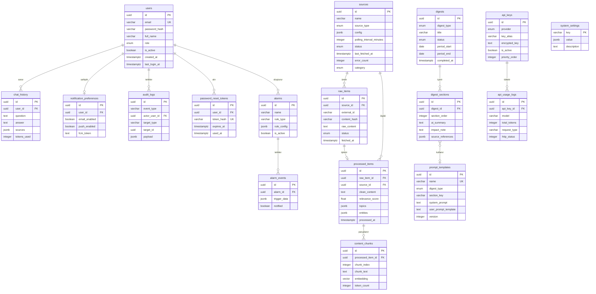
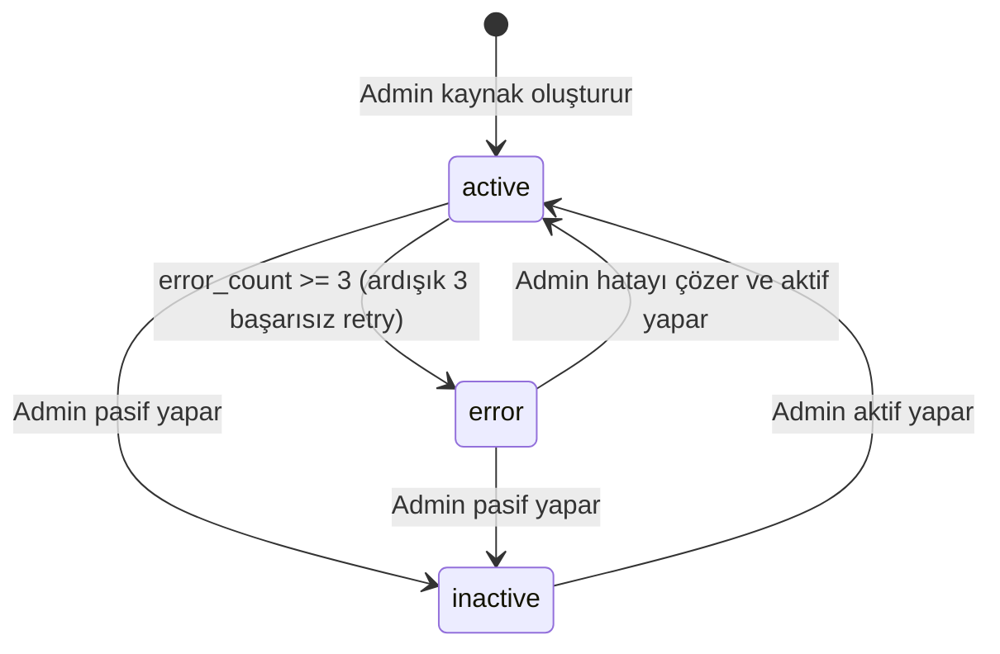
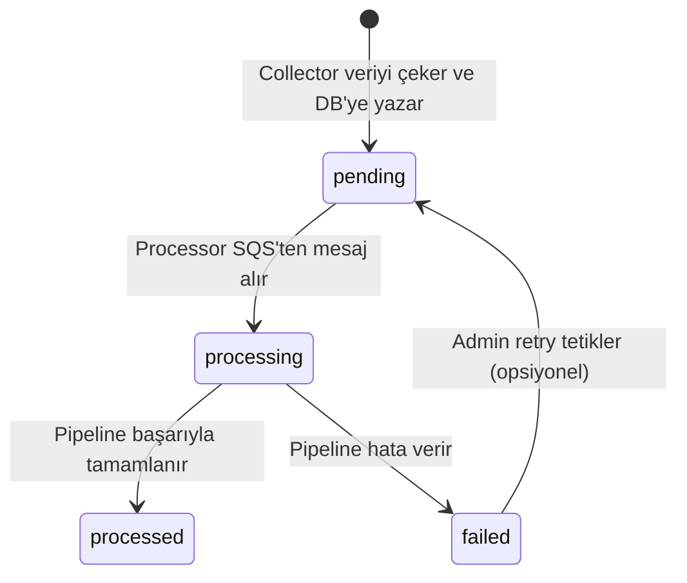
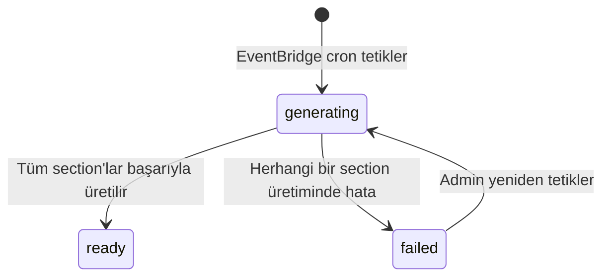
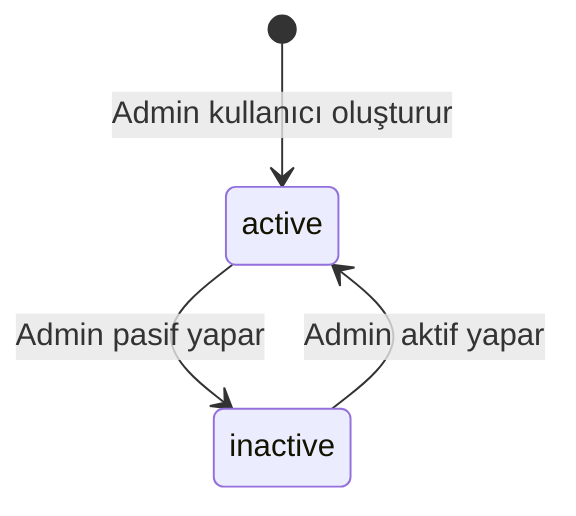
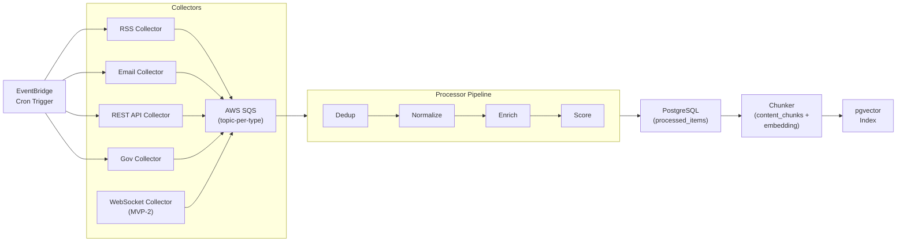
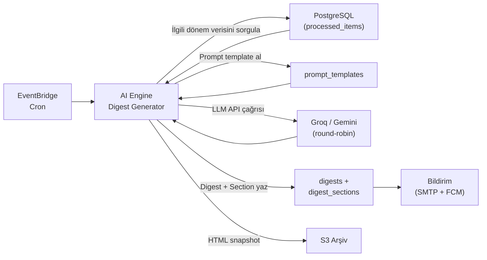
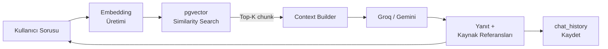

# 01 — Domain Model

## 1. Domain Genel Bakış

YGIP, dış kaynaklardan toplanan ham veriyi bir işleme pipeline'ından geçirerek yapılandırılmış bilgiye dönüştüren, bu bilgiyi AI ile özetleyerek üst yönetime bülten (digest) olarak sunan ve RAG tabanlı chatbot ile sorgulanabilir kılan bir kurumsal istihbarat platformudur. Temel döngü: **toplama → işleme → özetleme → sunum → sorgulama** şeklindedir.

---

## 2. Entity Kataloğu

### 2.1 User

Sistem kullanıcısını temsil eder. Self-servis kayıt yoktur; her kullanıcı admin tarafından oluşturulur.

| Attribute | Tip | Kısıt | Açıklama |
|-----------|-----|-------|----------|
| `id` | UUID | PK, auto-generated | Tekil tanımlayıcı |
| `email` | VARCHAR(255) | UNIQUE, NOT NULL | Login identifier |
| `password_hash` | VARCHAR(255) | NOT NULL | bcrypt hash (min cost 12) |
| `full_name` | VARCHAR(255) | NOT NULL | Görünen ad |
| `role` | ENUM('admin', 'viewer') | NOT NULL, DEFAULT 'viewer' | Sistem rolü |
| `is_active` | BOOLEAN | NOT NULL, DEFAULT true | Pasif kullanıcı login yapamaz |
| `created_at` | TIMESTAMPTZ | NOT NULL, DEFAULT now() | Oluşturulma zamanı |
| `last_login_at` | TIMESTAMPTZ | NULLABLE | Son başarılı login |

### 2.2 Source

Veri kaynağını temsil eder. Her kaynak bir collector tipi ile ilişkilidir.

| Attribute | Tip | Kısıt | Açıklama |
|-----------|-----|-------|----------|
| `id` | UUID | PK | Tekil tanımlayıcı |
| `name` | VARCHAR(255) | NOT NULL | İnsan okunabilir kaynak adı |
| `source_type` | ENUM('rss', 'email', 'rest_api', 'websocket', 'gov') | NOT NULL | Collector tipi |
| `config` | JSONB | NOT NULL | Tipe göre değişen yapılandırma (URL, IMAP ayarları, API endpoint vb.) |
| `polling_interval_minutes` | INTEGER | NOT NULL | Sorgulama aralığı (dakika) |
| `status` | ENUM('active', 'inactive', 'error') | NOT NULL, DEFAULT 'active' | Kaynak durumu |
| `last_fetched_at` | TIMESTAMPTZ | NULLABLE | Son başarılı veri çekimi |
| `error_count` | INTEGER | NOT NULL, DEFAULT 0 | Ardışık hata sayısı |
| `category` | ENUM('turkish_media', 'fmcg', 'strategy', 'official', 'market', 'geo', 'transport') | NOT NULL | Bülten/schema eşleştirmesi |
| `target_phase` | VARCHAR(10) | NOT NULL | Hangi MVP fazında aktif ('mvp-0', 'mvp-1', vb.) |
| `created_at` | TIMESTAMPTZ | NOT NULL, DEFAULT now() | — |
| `updated_at` | TIMESTAMPTZ | NOT NULL | — |

`config` JSONB yapısı tipe göre değişir. Tüm MVP-0 kaynaklarında ortak alanlar:

| Alan | Tip | Açıklama |
| ---- | --- | -------- |
| `ingest_mode` | `"all"` \| `"filtered"` | `"all"`: tüm makaleler kabul; `"filtered"`: keyword gate zorunlu (`Docs/04` §8.3) |
| `default_category` | string | Kategori eşitliği tie-break ve `ingest_mode: "all"` routing |

Tip-spesifik alanlar:
- **rss:** `{"feed_url": "https://...", "language": "tr", "ingest_mode": "all", "default_category": "fmcg"}`
- **email:** `{"imap_host": "imap.gmail.com", "sender_filter": "newsletter@economist.com", "folder": "INBOX", "ingest_mode": "filtered", "default_category": "strategy"}`
- **rest_api:** `{"endpoint": "https://...", "auth_type": "api_key", "headers": {}, "ingest_mode": "filtered", "default_category": "finance"}`
- **websocket:** `{"ws_url": "wss://...", "reconnect_interval_seconds": 30}`
- **gov:** `{"feed_url": "https://...", "parser": "tcmb|kap|resmi_gazete", "ingest_mode": "all", "default_category": "macro"}`

### 2.3 RawItem

Collector'ın dış kaynaktan çektiği ham veri birimini temsil eder. Dedup kontrolü bu entity üzerinde yapılır.

| Attribute | Tip | Kısıt | Açıklama |
|-----------|-----|-------|----------|
| `id` | UUID | PK | Tekil tanımlayıcı |
| `source_id` | UUID | FK → sources.id, NOT NULL | Hangi kaynaktan geldi |
| `external_id` | VARCHAR(512) | NOT NULL | Kaynak tarafındaki benzersiz tanımlayıcı (URL, message-id vb.) |
| `content_hash` | VARCHAR(64) | NOT NULL, INDEX | SHA-256 hash — dedup anahtarı |
| `title` | TEXT | NULLABLE | Başlık (varsa) |
| `raw_content` | TEXT | NOT NULL | Ham içerik (HTML, plain text, JSON) |
| `raw_metadata` | JSONB | NULLABLE | Kaynak bazlı ek veriler (yazar, tarih, etiketler) |
| `fetched_at` | TIMESTAMPTZ | NOT NULL | Çekilme zamanı |
| `status` | ENUM('pending', 'processing', 'processed', 'failed') | NOT NULL, DEFAULT 'pending' | İşleme durumu |
| `error_message` | TEXT | NULLABLE | Hata durumunda açıklama |

`(source_id, content_hash)` üzerinde UNIQUE constraint uygulanır — aynı kaynaktan aynı içerik tekrar yazılamaz.

### 2.4 ProcessedItem

Pipeline'dan geçmiş, normalize ve zenginleştirilmiş veri birimi.

| Attribute | Tip | Kısıt | Açıklama |
|-----------|-----|-------|----------|
| `id` | UUID | PK | Tekil tanımlayıcı |
| `raw_item_id` | UUID | FK → raw_items.id, UNIQUE, NOT NULL | Kaynak ham veri |
| `source_id` | UUID | FK → sources.id, NOT NULL | Denormalize — sorgu kolaylığı |
| `title` | TEXT | NOT NULL | Normalize edilmiş başlık |
| `clean_content` | TEXT | NOT NULL | Temizlenmiş düz metin (HTML tag'ler, reklam blokları çıkarılmış) |
| `summary` | TEXT | NULLABLE | Kısa AI özeti (1-2 cümle) |
| `language` | VARCHAR(5) | NOT NULL | Tespit edilen dil kodu (tr, en, vb.) |
| `relevance_score` | FLOAT | NOT NULL, CHECK (0..1) | İçerik alaka skoru (0: alakasız, 1: çok alakalı) |
| `topics` | JSONB | NOT NULL, DEFAULT '[]' | Tespit edilen konu etiketleri |
| `entities` | JSONB | NOT NULL, DEFAULT '[]' | Tespit edilen named entity'ler (şirket, kişi, ülke) |
| `published_at` | TIMESTAMPTZ | NULLABLE | Orijinal yayın tarihi |
| `processed_at` | TIMESTAMPTZ | NOT NULL | İşlenme zamanı |
| `schema_category` | VARCHAR(50) | NOT NULL | DB schema bölümleme kategorisi (news, market, geo, transport, fmcg) |

### 2.5 ContentChunk

RAG pipeline için embedding'e dönüştürülmüş metin parçası.

| Attribute | Tip | Kısıt | Açıklama |
|-----------|-----|-------|----------|
| `id` | UUID | PK | Tekil tanımlayıcı |
| `processed_item_id` | UUID | FK → processed_items.id, NOT NULL | Kaynak işlenmiş veri |
| `chunk_index` | INTEGER | NOT NULL | Parça sırası (0-based) |
| `chunk_text` | TEXT | NOT NULL | Parça içeriği |
| `token_count` | INTEGER | NOT NULL | Parçadaki token sayısı |
| `embedding` | VECTOR(1536) | NOT NULL | pgvector embedding (boyut modele göre değişir) |
| `created_at` | TIMESTAMPTZ | NOT NULL | Oluşturulma zamanı |

`(processed_item_id, chunk_index)` üzerinde UNIQUE constraint uygulanır.

### 2.6 Digest

AI tarafından üretilen bülten.

| Attribute | Tip | Kısıt | Açıklama |
|-----------|-----|-------|----------|
| `id` | UUID | PK | Tekil tanımlayıcı |
| `digest_type` | ENUM('turkish_media_weekly', 'fmcg_weekly', 'strategy_weekly') | NOT NULL | Bülten tipi |
| `title` | VARCHAR(500) | NOT NULL | Bülten başlığı |
| `status` | ENUM('generating', 'ready', 'failed') | NOT NULL, DEFAULT 'generating' | Üretim durumu |
| `period_start` | DATE | NOT NULL | Kapsanan dönem başlangıcı |
| `period_end` | DATE | NOT NULL | Kapsanan dönem sonu |
| `s3_archive_key` | VARCHAR(1024) | NULLABLE | HTML snapshot'ın S3 path'i (arşiv amaçlı) |
| `total_sources_used` | INTEGER | NOT NULL, DEFAULT 0 | Bültende kullanılan kaynak sayısı |
| `generation_metadata` | JSONB | NULLABLE | Üretim metrikleri (süre, token kullanımı, model) |
| `error_message` | TEXT | NULLABLE | Hata durumunda açıklama |
| `created_at` | TIMESTAMPTZ | NOT NULL | Üretim başlangıcı |
| `completed_at` | TIMESTAMPTZ | NULLABLE | Üretim tamamlanma zamanı |

### 2.7 DigestSection

Bültenin içindeki her bölüm. Bir digest birden çok section içerir.

| Attribute | Tip | Kısıt | Açıklama |
|-----------|-----|-------|----------|
| `id` | UUID | PK | Tekil tanımlayıcı |
| `digest_id` | UUID | FK → digests.id, NOT NULL, ON DELETE CASCADE | Ait olduğu bülten |
| `section_order` | INTEGER | NOT NULL | Bölüm sırası |
| `section_title` | VARCHAR(500) | NOT NULL | Bölüm başlığı |
| `ai_summary` | TEXT | NOT NULL | AI tarafından üretilen özet metin |
| `impact_note` | TEXT | NULLABLE | "Yıldız için" etki notu |
| `source_references` | JSONB | NOT NULL, DEFAULT '[]' | Kullanılan haber/kaynak referansları (processed_item_id + URL + başlık) |
| `prompt_template_id` | UUID | FK → prompt_templates.id, NULLABLE | Kullanılan prompt şablonu |

### 2.8 PromptTemplate

Bülten bölümü için AI prompt şablonu. Admin panelinden düzenlenir.

| Attribute | Tip | Kısıt | Açıklama |
|-----------|-----|-------|----------|
| `id` | UUID | PK | Tekil tanımlayıcı |
| `name` | VARCHAR(255) | NOT NULL, UNIQUE | Şablon adı (örn: "FMCG Haftalık — Global Trendler") |
| `digest_type` | ENUM('turkish_media_weekly', 'fmcg_weekly', 'strategy_weekly') | NOT NULL | Hangi bülten tipi |
| `section_key` | VARCHAR(100) | NOT NULL | Bölüm tanımlayıcı (örn: "global_trends", "local_developments") |
| `system_prompt` | TEXT | NOT NULL | LLM system prompt |
| `user_prompt_template` | TEXT | NOT NULL | LLM user prompt şablonu (placeholder'lı) |
| `model_preference` | VARCHAR(50) | NULLABLE | Tercih edilen model (null ise round-robin) |
| `is_active` | BOOLEAN | NOT NULL, DEFAULT true | Aktif/pasif |
| `version` | INTEGER | NOT NULL, DEFAULT 1 | Versiyon numarası (her düzenlemede artar) |
| `created_at` | TIMESTAMPTZ | NOT NULL | — |
| `updated_at` | TIMESTAMPTZ | NOT NULL | — |

### 2.9 ApiKey

LLM API key kaydı. Admin panelinden yönetilir.

| Attribute | Tip | Kısıt | Açıklama |
|-----------|-----|-------|----------|
| `id` | UUID | PK | Tekil tanımlayıcı |
| `provider` | ENUM('groq', 'gemini') | NOT NULL | LLM sağlayıcı |
| `key_alias` | VARCHAR(100) | NOT NULL | İnsan okunabilir takma ad |
| `encrypted_key` | TEXT | NOT NULL | Şifrelenmiş API key değeri |
| `is_active` | BOOLEAN | NOT NULL, DEFAULT true | Aktif/pasif |
| `priority_order` | INTEGER | NOT NULL | Round-robin sırası |
| `created_at` | TIMESTAMPTZ | NOT NULL | — |

### 2.10 ApiUsageLog

Token bazlı LLM API kullanım metrikleri.

| Attribute | Tip | Kısıt | Açıklama |
|-----------|-----|-------|----------|
| `id` | UUID | PK | Tekil tanımlayıcı |
| `api_key_id` | UUID | FK → api_keys.id, NOT NULL | Kullanılan key |
| `provider` | VARCHAR(50) | NOT NULL | Denormalize — sorgu kolaylığı |
| `model` | VARCHAR(100) | NOT NULL | Kullanılan model adı |
| `prompt_tokens` | INTEGER | NOT NULL | Gönderilen token sayısı |
| `completion_tokens` | INTEGER | NOT NULL | Üretilen token sayısı |
| `total_tokens` | INTEGER | NOT NULL | Toplam token |
| `request_type` | VARCHAR(50) | NOT NULL | İstek tipi (digest_generation, chatbot, embedding, summary) |
| `http_status` | INTEGER | NOT NULL | API yanıt status kodu |
| `latency_ms` | INTEGER | NULLABLE | Yanıt süresi (ms) |
| `created_at` | TIMESTAMPTZ | NOT NULL | — |

### 2.11 ChatHistory

Chatbot soru/yanıt kaydı.

| Attribute | Tip | Kısıt | Açıklama |
|-----------|-----|-------|----------|
| `id` | UUID | PK | Tekil tanımlayıcı |
| `user_id` | UUID | FK → users.id, NOT NULL | Soruyu soran kullanıcı |
| `question` | TEXT | NOT NULL | Kullanıcı sorusu |
| `answer` | TEXT | NOT NULL | AI yanıtı |
| `sources` | JSONB | NOT NULL, DEFAULT '[]' | RAG kaynak referansları (chunk_id, processed_item_id, skor) |
| `tokens_used` | INTEGER | NOT NULL | Toplam token kullanımı |
| `model` | VARCHAR(100) | NOT NULL | Kullanılan LLM model |
| `created_at` | TIMESTAMPTZ | NOT NULL | — |

### 2.12 AuditLog

Sistem olayı kaydı.

| Attribute | Tip | Kısıt | Açıklama |
|-----------|-----|-------|----------|
| `id` | UUID | PK | Tekil tanımlayıcı |
| `event_type` | VARCHAR(100) | NOT NULL, INDEX | Olay tipi (aşağıda listelenmiştir) |
| `actor_user_id` | UUID | FK → users.id, NULLABLE | Olayı tetikleyen kullanıcı (sistem olaylarında NULL) |
| `target_type` | VARCHAR(100) | NULLABLE | Etkilenen entity tipi |
| `target_id` | UUID | NULLABLE | Etkilenen entity ID'si |
| `payload` | JSONB | NULLABLE | Olay detayları |
| `created_at` | TIMESTAMPTZ | NOT NULL, INDEX | Olay zamanı |

Loglanacak `event_type` değerleri: `user.login`, `user.logout`, `user.created`, `user.deleted`, `user.role_changed`, `user.deactivated`, `source.created`, `source.deleted`, `source.status_changed`, `prompt_template.updated`, `api_key.created`, `api_key.deleted`, `digest.started`, `digest.completed`, `digest.failed`, `system.error`, `password.reset_initiated`, `password.reset_completed`.

Retention: 90 gün aktif tabloda, sonra S3 arşivine taşınır.

### 2.13 NotificationPreference

Bildirim ayarları. Admin tarafından yönetilir; viewer değiştiremez.

| Attribute | Tip | Kısıt | Açıklama |
|-----------|-----|-------|----------|
| `id` | UUID | PK | Tekil tanımlayıcı |
| `user_id` | UUID | FK → users.id, UNIQUE, NOT NULL | İlgili kullanıcı |
| `email_enabled` | BOOLEAN | NOT NULL, DEFAULT true | E-posta bildirimi al |
| `push_enabled` | BOOLEAN | NOT NULL, DEFAULT true | Push bildirimi al |
| `fcm_token` | TEXT | NULLABLE | Firebase Cloud Messaging device token |
| `updated_at` | TIMESTAMPTZ | NOT NULL | — |

### 2.14 PasswordResetToken

Admin tarafından tetiklenen şifre sıfırlama token'ı.

| Attribute | Tip | Kısıt | Açıklama |
|-----------|-----|-------|----------|
| `id` | UUID | PK | Tekil tanımlayıcı |
| `user_id` | UUID | FK → users.id, NOT NULL | Hedef kullanıcı |
| `token_hash` | VARCHAR(255) | NOT NULL, UNIQUE | Tek kullanımlık token (bcrypt hash) |
| `expires_at` | TIMESTAMPTZ | NOT NULL | 24 saat geçerlilik |
| `used_at` | TIMESTAMPTZ | NULLABLE | Kullanıldıysa zaman damgası |
| `created_at` | TIMESTAMPTZ | NOT NULL | — |

### 2.15 SystemSetting

Admin panelinden düzenlenebilir sistem parametreleri (JWT süreleri, bildirim zamanlaması vb.).

| Attribute | Tip | Kısıt | Açıklama |
|-----------|-----|-------|----------|
| `key` | VARCHAR(100) | PK | Parametre anahtarı |
| `value` | JSONB | NOT NULL | Parametre değeri |
| `description` | TEXT | NULLABLE | Açıklama |
| `updated_at` | TIMESTAMPTZ | NOT NULL | — |
| `updated_by` | UUID | FK → users.id, NULLABLE | Son güncelleyen admin |

Öntanımlı key'ler: `jwt_access_token_minutes` (60), `jwt_refresh_token_days` (30), `digest_schedule_strategy_weekly` (cron ifadesi), `digest_schedule_turkish_media_weekly` (cron ifadesi), `digest_schedule_fmcg_weekly` (cron ifadesi), `embedding_model` ("openai/text-embedding-3-small"), `embedding_chunk_size` (512), `embedding_chunk_overlap` (64).

### 2.16 Alarm (MVP-1)

Kural tabanlı eşik tanımı.

| Attribute | Tip | Kısıt | Açıklama |
|-----------|-----|-------|----------|
| `id` | UUID | PK | Tekil tanımlayıcı |
| `name` | VARCHAR(255) | NOT NULL | Alarm adı |
| `rule_type` | VARCHAR(100) | NOT NULL | Kural tipi (threshold, keyword, anomaly) |
| `rule_config` | JSONB | NOT NULL | Kural parametreleri (eşik değeri, kaynak filtresi vb.) |
| `is_active` | BOOLEAN | NOT NULL, DEFAULT true | — |
| `created_by` | UUID | FK → users.id, NOT NULL | — |
| `created_at` | TIMESTAMPTZ | NOT NULL | — |

### 2.17 AlarmEvent (MVP-1)

Tetiklenen alarm olayı.

| Attribute | Tip | Kısıt | Açıklama |
|-----------|-----|-------|----------|
| `id` | UUID | PK | Tekil tanımlayıcı |
| `alarm_id` | UUID | FK → alarms.id, NOT NULL | Tetiklenen alarm |
| `trigger_data` | JSONB | NOT NULL | Tetikleyici veri detayı |
| `notified` | BOOLEAN | NOT NULL, DEFAULT false | Bildirim gönderildi mi |
| `created_at` | TIMESTAMPTZ | NOT NULL | Tetiklenme zamanı |

---

## 3. Entity İlişki Diyagramı

---

## 4. İş Kuralları

### User

- Kullanıcı yalnızca admin tarafından oluşturulur. Self-servis kayıt yoktur.
- Kullanıcı kendi rolünü değiştiremez; rol ataması yalnızca admin yapar.
- `is_active = false` olan kullanıcı login yapamaz; mevcut JWT token'ları geçersiz sayılmaz ancak refresh token yenilenemez.
- Şifre bcrypt (min cost 12) ile hash'lenir. Plain-text şifre hiçbir zaman loglanmaz.
- Şifre politikası: minimum 8 karakter, en az 1 büyük harf + 1 rakam.
- Şifre sıfırlama admin tarafından tetiklenir; kullanıcıya e-posta ile tek kullanımlık link gönderilir. Link 24 saat geçerlidir, kullanıldıktan sonra expire olur.

### Source

- Her source bir `source_type`'a sahiptir ve ilgili collector bu type'a göre çalışır.
- `status = inactive` olan kaynak collector tarafından atlanır; veri çekilmez.
- `status = error` olan kaynak collector tarafından atlanır; admin müdahalesi beklenir.
- Bir source'a erişim başarısız olduğunda exponential backoff ile 3 retry yapılır. 3 deneme sonunda `error_count` artırılır, hata loglanır ve admin'e mail bildirimi gönderilir.
- `error_count` 3'e ulaştığında source otomatik olarak `status = error`'a geçer.
- Tek kaynak hatası digest üretimini durdurmaz; sistem diğer aktif kaynaklardan beslemeye devam eder.
- Source'a kayıt ekleme veya silme kullanıcı (admin) onayı gerektirir; agent otomatik yapamaz.

### RawItem

- Aynı source'tan aynı `content_hash`'e sahip ikinci bir kayıt yazılamaz (dedup).
- Dedup kontrolü önce Redis hash set'te yapılır (hızlı yol); cache miss durumunda DB'ye sorgulanır.
- `status = pending` olan item'lar SQS mesajı ile processor'a iletilir.
- Processor item'ı başarıyla işlediğinde `status = processed`, hata durumunda `status = failed` ve `error_message` doldurulur.

### ProcessedItem

- Her ProcessedItem tam olarak bir RawItem'dan üretilir (1:1 ilişki).
- `relevance_score` 0-1 aralığındadır; 0 = düşük öncelik, 1 = yüksek öncelik. Skor pipeline enrich aşamasında deterministik formülle hesaplanır (`keyword_intensity * 0.6 + freshness * 0.4`; `Docs/04` §8.4). Gate'i geçemeyen makaleler için `processed_items` oluşturulmaz.
- `schema_category` alanı DB schema bölümleme kategorisine karşılık gelir (news, market, geo, transport, fmcg).
- İşlenmiş item üzerinden content chunk'lar oluşturulur.

### ContentChunk

- Chunk size: 512 token. Overlap: 64 token. Chunking yöntemi: RecursiveCharacterTextSplitter (LangChain).
- Her chunk `processed_item_id` ile kaynak item'a bağlıdır.
- Embedding boyutu kullanılan modele göre değişir (OpenAI text-embedding-3-small: 1536, Cohere embed-v3: 1024). pgvector VECTOR tipi kullanılır.
- Embedding modeli admin panelinden (`system_settings` tablosu, key: `embedding_model`) değiştirilebilir. Model değişikliğinde tüm mevcut chunk embedding'leri yeniden hesaplanır (reindex job).

### Digest

- Digest üretimi EventBridge cron trigger ile başlar.
- Üretim başladığında `status = generating`; tüm section'lar başarıyla oluştuğunda `status = ready`; herhangi bir hata durumunda `status = failed`.
- Bir digest'in tüm DigestSection'ları aynı transaction'da oluşur. Kısmi digest yayınlanmaz.
- Digest içeriği `digests` + `digest_sections` tablolarında structured JSON olarak saklanır. Frontend bu veriden render eder.
- Ek olarak HTML snapshot S3'e arşiv amaçlı yazılır (`s3_archive_key`). Bu HTML serve edilmez; canlı içerik her zaman API üzerinden gelir.
- Digest üretimi tamamlandığında (status = ready) tüm alıcılara "yeni rapor hazır" bildirimi gönderilir (e-posta + push).

### DigestSection

- Her section bir prompt template ile ilişkilendirilebilir. Template yoksa (NULL) section elle veya farklı bir pipeline ile üretilmiş demektir.
- `source_references` JSONB dizisi şu yapıdadır: `[{"processed_item_id": "...", "url": "...", "title": "..."}]`.

### PromptTemplate

- Her düzenlemede `version` alanı otomatik artırılır. Önceki versiyon silinmez; ancak yalnızca en güncel versiyon aktif olarak kullanılır.
- Prompt template'i production'a almak kullanıcı onayı gerektirir; agent otomatik yapamaz.

### ApiKey

- Key değerleri `encrypted_key` alanında şifreli saklanır; plain-text hiçbir zaman loglanmaz veya API response'ta dönmez.
- Token tükenmesi veya kota hatası (HTTP 429, 503) alındığında sistem `priority_order` sırasına göre bir sonraki aktif key'e geçer (round-robin fallback).
- Tüm aktif key'ler tükendiğinde digest üretimi `failed` statüsüne geçer ve admin'e hata bildirimi gönderilir.

### ChatHistory

- Her chatbot soru/yanıt çifti `chat_history` tablosuna yazılır.
- `sources` JSONB dizisi RAG kaynak referanslarını içerir: `[{"chunk_id": "...", "processed_item_id": "...", "score": 0.87}]`.
- Admin panelinde kullanıcı bazlı filtrelenebilir liste olarak görüntülenir. Viewer kendi geçmişini göremez (admin-only).

### AuditLog

- Audit log yalnızca admin rolüne görünürdür. Viewer erişimi yoktur.
- 90 gün aktif tabloda tutulur; sonra S3 arşivine taşınır.
- Sistem olaylarında (digest hata, kaynak erişim hatası) `actor_user_id` NULL olur.

### NotificationPreference

- Admin tarafından yönetilir; viewer kullanıcılar bildirim tercihlerini değiştiremez.
- FCM token mobil uygulama ilk login'inde kaydedilir ve her uygulama açılışında güncellenir.

### SystemSetting

- JWT access token süresi ve refresh token süresi bu tablodan okunur. Varsayılan: access token 60 dk, refresh token 30 gün.
- Embedding model seçimi bu tablodan okunur. Model değişikliğinde reindex job tetiklenir.

---

## 5. State Machine'ler

### 5.1 Source Status

Geçiş kuralları:
- `active → inactive`: Admin panelinden manuel. Collector bu kaynağı atlar.
- `active → error`: Collector ardışık 3 başarısız retry sonrası otomatik. Admin'e mail bildirimi gönderilir.
- `error → active`: Admin hatayı inceleyip düzelttikten sonra manuel aktif yapar. `error_count` sıfırlanır.
- Herhangi bir başarılı fetch `error_count`'u sıfırlar (error state'e düşmeden önce).

### 5.2 RawItem Status

Geçiş kuralları:
- `pending → processing`: Processor SQS mesajını consume ettiğinde.
- `processing → processed`: Dedup, normalize, enrich, score adımları başarılı. ProcessedItem oluşturulur.
- `processing → failed`: Herhangi bir pipeline adımında hata. `error_message` doldurulur.
- `failed → pending`: Opsiyonel admin retry. Yeniden SQS'e mesaj gönderilir.

### 5.3 Digest Status

Geçiş kuralları:
- `generating → ready`: Tüm DigestSection'lar aynı transaction'da başarıyla oluşur. Bildirim gönderilir.
- `generating → failed`: LLM API hatası, tüm key'ler tükenmiş, veya kaynak veri yetersiz. Admin'e hata bildirimi gönderilir.
- `failed → generating`: Admin panelinden veya CLI'dan manuel yeniden tetikleme.

### 5.4 User Status

`inactive` kullanıcı login yapamaz. Mevcut access token süresi dolana kadar geçerli kalır ancak refresh token yenilenemez.

---

## 6. Veri Akışı

### 6.1 Veri Toplama ve İşleme Akışı

### 6.2 Digest Üretim Akışı

### 6.3 RAG Chatbot Akışı

---

## 7. Chunk Stratejisi

RAG pipeline'ı için her ProcessedItem metin parçalarına ayrılır ve embedding'e dönüştürülür.

| Parametre | Değer | Yapılandırma |
|-----------|-------|-------------|
| Chunk size | 512 token | `system_settings.embedding_chunk_size` |
| Overlap | 64 token | `system_settings.embedding_chunk_overlap` |
| Chunking yöntemi | RecursiveCharacterTextSplitter (LangChain) | Hardcoded |
| Embedding model | OpenAI text-embedding-3-small (varsayılan) veya Cohere embed-v3 | `system_settings.embedding_model` |
| Embedding boyutu | 1536 (OpenAI) / 1024 (Cohere) | Model'e bağlı |
| Similarity metric | Cosine similarity | pgvector `<=>` operatörü |

Chunking işlem sırası:
1. ProcessedItem'ın `clean_content` alanı alınır.
2. RecursiveCharacterTextSplitter ile 512 token'lık, 64 token overlap'li parçalara ayrılır.
3. Her parça seçili embedding modeline gönderilir.
4. Dönen embedding vektörü `content_chunks` tablosuna `chunk_index` sırasıyla yazılır.

Embedding modeli değiştiğinde tüm mevcut chunk embedding'leri yeniden hesaplanır. Bu işlem background job olarak çalışır ve mevcut chunk'lar üzerine yazılır.

---

## 8. Digest Üretim ve Servis Modeli

Digest üretimi tek bir atomik işlemdir:

1. EventBridge cron tetikler → AI Engine `generating` statüsünde yeni Digest kaydı oluşturur.
2. İlgili dönemin (period_start – period_end) ProcessedItem'ları sorgulanır. Kategori ve relevance_score filtresi uygulanır.
3. Her bölüm için ilgili PromptTemplate alınır. Template'deki placeholder'lar context verisi ile doldurulur.
4. LLM API'ye çağrı yapılır (Groq/Gemini, round-robin fallback). Token kullanımı `api_usage_logs`'a yazılır.
5. Tüm section'lar başarılıysa tek transaction'da `digest_sections` tablosuna yazılır ve Digest `status = ready` olur.
6. HTML snapshot S3'e arşiv amaçlı yazılır (`s3://prod-ygip-digests/{digest_type}/{YYYY}/{MM}/{digest_id}.html`).
7. Bildirim tetiklenir — tüm aktif kullanıcılara (notification_preference'a göre) SMTP mail + FCM push gönderilir.

Frontend, digest içeriğini her zaman API üzerinden (`GET /api/v1/digests/{id}`) alır ve `digest_sections` JSON yapısından render eder. S3'teki HTML hiçbir zaman doğrudan serve edilmez.

---

## 9. Faz Bazlı Entity Aktivasyon Tablosu

| Entity | MVP-0 | MVP-1 | MVP-2 | MVP-3 |
|--------|-------|-------|-------|-------|
| User | ✅ | ✅ | ✅ | ✅ |
| Source | ✅ (rss, email, gov) | ✅ (+rest_api) | ✅ (+websocket) | ✅ (+ücretli API) |
| RawItem | ✅ | ✅ | ✅ | ✅ |
| ProcessedItem | ✅ | ✅ | ✅ | ✅ |
| ContentChunk | ✅ | ✅ | ✅ | ✅ |
| Digest | ✅ | ✅ | ✅ | ✅ |
| DigestSection | ✅ | ✅ | ✅ | ✅ |
| PromptTemplate | ✅ | ✅ | ✅ | ✅ |
| ApiKey | ✅ | ✅ | ✅ | ✅ |
| ApiUsageLog | ✅ | ✅ | ✅ | ✅ |
| ChatHistory | ✅ | ✅ | ✅ | ✅ |
| AuditLog | ✅ | ✅ | ✅ | ✅ |
| NotificationPreference | ✅ | ✅ | ✅ | ✅ |
| PasswordResetToken | ✅ | ✅ | ✅ | ✅ |
| SystemSetting | ✅ | ✅ | ✅ | ✅ |
| Alarm | — | ✅ | ✅ | ✅ |
| AlarmEvent | — | ✅ | ✅ | ✅ |
