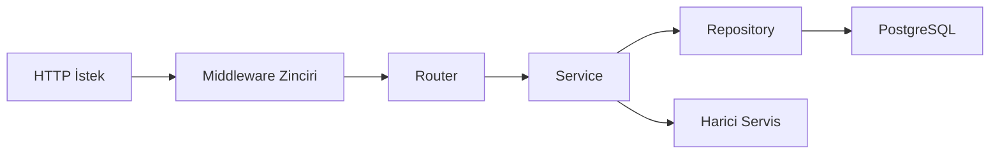
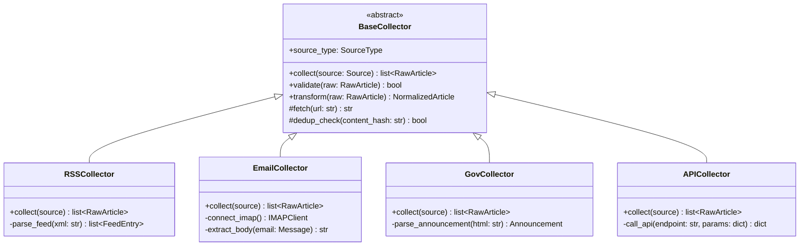
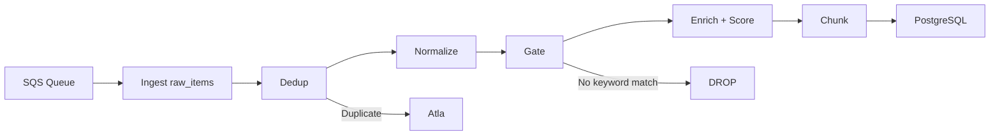

# 04 — Backend Spesifikasyonu

> **Platform:** YıldızHolding Global Intelligence Platform (YGIP)
> **Kapsam:** FastAPI backend, collector framework, processor pipeline, AI engine, job scheduling, bildirim servisi — MVP-0 implementasyon detayı

---

## 1. Genel Mimari

Backend Python 3.12+ üzerinde FastAPI framework ile çalışır. Uygulama üç çalışma zamanına ayrılır:

- **API sunucusu** (`/apps/api/`): Kullanıcı isteklerini karşılayan HTTP servisi. Uvicorn ASGI server ile çalışır.
- **Collector worker'lar** (`/services/collectors/`): Dış kaynaklardan veri çeken Lambda fonksiyonları. EventBridge cron trigger ile tetiklenir.
- **Processor pipeline** (`/services/processor/`): SQS mesajlarını tüketen, veriyi normalize/enrich/score eden Lambda fonksiyonları.
- **AI engine** (`/services/ai-engine/`): Digest üretimi, RAG pipeline ve chatbot yanıt üretimi. Hem scheduled (digest) hem on-demand (chatbot) çalışır.

Katmanlı mimari uygulanır. API sunucusunda istek akışı:



Her katmanın sorumluluğu kesin sınırlarla ayrılır:

- **Router:** HTTP request/response dönüşümü, Pydantic schema validation, dependency injection çağrısı. İş mantığı içermez.
- **Service:** İş kuralları, transaction orchestration, harici servis çağrıları. Doğrudan DB erişimi yapmaz.
- **Repository:** SQLAlchemy sorguları, DB okuma/yazma. İş mantığı içermez, sadece veri erişim operasyonları.

Tüm I/O operasyonları async yapılır. SQLAlchemy async session, httpx async client ve aiobotocore kullanılır. CPU-bound işlemler (embedding hesaplama gibi) `asyncio.to_thread()` ile thread pool'a delege edilir.

### Uygulama Yaşam Döngüsü

FastAPI `lifespan` context manager ile uygulama başlatma ve kapatma işlemleri yönetilir:

```python
from contextlib import asynccontextmanager
from fastapi import FastAPI

@asynccontextmanager
async def lifespan(app: FastAPI):
    # Startup
    await init_db_pool()
    await init_redis()
    yield
    # Shutdown
    await close_db_pool()
    await close_redis()

app = FastAPI(lifespan=lifespan)
```

Startup sırasında DB connection pool ve Redis bağlantısı açılır. Shutdown sırasında her ikisi graceful olarak kapatılır. Startup başarısız olursa uygulama ayağa kalkmaz — health check fail döner ve deploy rollback tetiklenir.

---

## 2. Klasör Yapısı

Monorepo içinde backend ile ilgili üç ana dizin bulunur:

```
/apps/api/                          → FastAPI HTTP sunucusu
    main.py                         → App factory, lifespan, middleware mount
    /routers/
        auth.py                     → Login, token refresh, logout, password reset
        users.py                    → Kullanıcı CRUD (admin-only) + profil (viewer)
        sources.py                  → Kaynak yönetimi CRUD (admin-only)
        prompt_templates.py         → Prompt şablon CRUD (admin-only)
        api_keys.py                 → LLM API key CRUD + kullanım metrikleri (admin-only)
        digests.py                  → Digest listeleme/detay + manuel tetikleme
        pipeline.py                 → Pipeline run tetikleme/listeleme/detay/iptal (admin-only, Faz 6.1)
        chatbot.py                  → Soru gönderme + sohbet geçmişi
        notifications.py            → Bildirim alıcı yönetimi + FCM token kayıt
        audit_logs.py               → Audit log listeleme (admin-only)
        settings.py                 → Sistem ayarları okuma/güncelleme (admin-only)
        health.py                   → /health ve /ready endpoint'leri
    /middleware/
        cors.py                     → CORS konfigürasyonu
        auth.py                     → JWT decode, current user injection
        rate_limiter.py             → Redis sliding window rate limiter
        request_logger.py           → Request/response structured logging
        request_id.py               → X-Request-ID header injection
        error_handler.py            → Global exception handler
    /core/
        config.py                   → Pydantic BaseSettings, env loading
        security.py                 → JWT encode/decode, bcrypt hash/verify
        deps.py                     → FastAPI Depends() factory fonksiyonları
        exceptions.py               → Exception hierarchy
        pagination.py               → Cursor pagination helper
    /schemas/                       → Pydantic request/response modelleri
        auth.py
        user.py
        source.py
        digest.py
        chatbot.py
        common.py                   → PaginatedResponse, ErrorResponse, vb.

/services/collectors/               → Veri toplama worker'ları
    base_collector.py               → BaseCollector abstract class
    rss_collector.py                → RSS/Atom feed collector
    email_collector.py              → Gmail IMAP newsletter collector
    gov_collector.py                → TCMB, KAP, Resmi Gazete collector
    api_collector.py                → REST API collector (MVP-1)
    handler.py                      → Lambda handler wrapper
    /utils/
        dedup.py                    → Redis hash-based dedup check
        retry.py                    → Exponential backoff wrapper

/services/processor/                → Veri işleme pipeline
    consumer.py                     → SQS consumer (Lambda handler)
    dedup.py                        → İçerik dedup (hash + fuzzy)
    normalizer.py                   → Metin temizleme, dil algılama, metadata çıkarma
    enricher.py                     → Keyword/rules zenginleştirme (MVP-0); LLM swap MVP-1
    scorer.py                       → Haber önem skoru hesaplama
    chunker.py                      → pgvector embedding chunk üretimi

/services/ai-engine/                → AI işlemleri
    digest_generator.py             → Bülten üretim orchestrator
    rag_pipeline.py                 → RAG sorgu → yanıt akışı
    chatbot_service.py              → Chatbot session yönetimi
    llm_client.py                   → Multi-provider LLM client (Groq, Gemini)
    embedding_client.py             → Embedding API client
    prompt_renderer.py              → Jinja2 prompt template rendering

/services/orchestrator/             → Pipeline orkestrasyon (Faz 6.1)
    pipeline_orchestrator.py        → Run state machine: aşamaları ilerletir, step durumu kalıcılaştırır
    stage_executors.py              → Collect/Ingest/Process/Digest stage executor'ları
    run_repository.py               → pipeline_runs / pipeline_run_steps CRUD + status transition
    handler.py                      → Orkestratör worker entry point (async run driver)

/packages/shared/                   → Ortak modüller
    /models/                        → SQLAlchemy ORM modelleri
        base.py                     → DeclarativeBase, ortak mixin'ler
        user.py
        source.py
        article.py
        digest.py
        chat_history.py
        audit_log.py
        api_usage_log.py
        system_setting.py
        prompt_template.py
        notification.py
        content_chunk.py
    /enums/                         → Python enum tanımları
        user_role.py                → UserRole(admin, viewer)
        source_type.py              → SourceType(rss, email, api, gov, websocket)
        digest_type.py              → DigestType(turkish_media, fmcg, strategy)
        article_status.py           → ArticleStatus(raw, processed, enriched, archived)
        event_type.py               → AuditEventType enum
    /utils/
        datetime.py                 → Timezone-aware datetime helpers (Europe/Istanbul)
        hashing.py                  → Content hash fonksiyonları
```

### İsimlendirme Kuralları

- Klasör ve dosya adları `kebab-case` yerine Python convention gereği `snake_case` kullanır (Python modül import'u tire kabul etmez).
- Class ve Type isimleri `PascalCase`: `RSSCollector`, `DigestService`, `UserRepository`.
- Fonksiyon ve değişken isimleri `snake_case`: `get_active_sources()`, `user_id`.
- Env var ve sabitler `UPPER_SNAKE_CASE`: `DATABASE_URL`, `JWT_SECRET_KEY`.
- SQLAlchemy model class'ı tekil (`User`, `Source`), DB tablo adı çoğul (`users`, `sources`).

---

## 3. Middleware Katmanı

Middleware'ler FastAPI app'e ekleme sırasına göre çalışır. Sıralama kritiktir — her middleware kendisinden sonra gelen middleware ve endpoint'lere etki eder.

Ekleme sırası (ilk eklenen en dışta çalışır):

```python
# main.py — middleware mount sırası
app.add_middleware(RequestIDMiddleware)          # 1. Her isteğe UUID ata
app.add_middleware(RequestLoggerMiddleware)      # 2. Request/response logla
app.add_middleware(RateLimiterMiddleware)        # 3. Rate limit kontrolü
app.add_middleware(                              # 4. CORS
    CORSMiddleware,
    allow_origins=settings.CORS_ORIGINS,
    allow_credentials=True,
    allow_methods=["GET", "POST", "PUT", "DELETE", "PATCH"],
    allow_headers=["*"],
)
# Auth middleware Depends() ile router seviyesinde uygulanır, global middleware değildir.
# Error handler @app.exception_handler ile kaydedilir.
```

### 3.1 Request ID Middleware

Her gelen isteğe `X-Request-ID` header'ı atar (yoksa UUID4 üretir, varsa korur). Bu ID tüm log satırlarında, downstream servis çağrılarında ve hata yanıtlarında taşınır. Response header'ına da eklenir.

### 3.2 Request Logger Middleware

Her isteğin başlangıç ve bitiş zamanını, HTTP method, path, status code, süre (ms) ve request ID bilgisini structured JSON formatında loglar. Request body loglanmaz (güvenlik). Response body yalnızca 4xx/5xx durumlarında loglanır.

### 3.3 Rate Limiter Middleware

Redis sliding window counter kullanır. Limitler endpoint kategorisine göre uygulanır:

| Kategori | Limit | Anahtar |
|----------|-------|---------|
| Auth endpoint'leri (`/api/v1/auth/*`) | 10 req/dk | IP adresi |
| Chatbot (`/api/v1/chatbot/ask`) | 20 req/dk | User ID |
| Genel (diğer tüm endpoint'ler) | 100 req/dk | User ID |
| Sağlık kontrolü (`/health`, `/ready`) | Limitsiz | — |

Limit aşıldığında `429 Too Many Requests` döner. Response body:

```json
{
  "error": {
    "code": "RATE_LIMIT_EXCEEDED",
    "message": "İstek limiti aşıldı. Lütfen bekleyiniz.",
    "details": {
      "retry_after_seconds": 32
    }
  }
}
```

`Retry-After` header'ı da set edilir.

### 3.4 CORS Middleware

İzin verilen origin'ler:

- Production: `https://ygip.yildizholding.com`
- Development: `http://localhost:3000`

Wildcard (`*`) kullanılmaz. `allow_credentials: true` — JWT token cookie veya Authorization header ile taşınır. Preflight cache: `max_age=600` (10 dk).

### 3.5 Global Exception Handler

Tüm yakalanmamış exception'lar merkezi handler tarafından tutarlı formata dönüştürülür:

```python
@app.exception_handler(AppException)
async def app_exception_handler(request: Request, exc: AppException):
    return JSONResponse(
        status_code=exc.status_code,
        content={
            "error": {
                "code": exc.error_code,
                "message": exc.message,
                "details": exc.details or {},
            }
        },
        headers={"X-Request-ID": request.state.request_id},
    )
```

Beklenmeyen exception'lar (`Exception` base) 500 döner, detay production'da gizlenir (yalnızca `INTERNAL_ERROR` kodu ve genel mesaj), development'ta stack trace `details` içinde döner.

---

## 4. Dependency Injection

FastAPI `Depends()` mekanizması ile ortak bağımlılıklar router fonksiyonlarına enjekte edilir. Tüm dependency factory'leri `/apps/api/core/deps.py` içinde tanımlanır.

### 4.1 DB Session

```python
async def get_db() -> AsyncGenerator[AsyncSession, None]:
    async with async_session_factory() as session:
        try:
            yield session
            await session.commit()
        except Exception:
            await session.rollback()
            raise
```

Her request tek bir session alır. Transaction commit/rollback otomatiktir — servis katmanında explicit `commit()` çağrılmaz. Nested transaction gerekiyorsa `session.begin_nested()` (savepoint) kullanılır.

### 4.2 Current User

```python
async def get_current_user(
    token: str = Depends(oauth2_scheme),
    db: AsyncSession = Depends(get_db),
) -> User:
    payload = decode_jwt(token)  # Geçersizse 401 fırlatır
    user = await user_repo.get_by_id(db, payload["sub"])
    if not user or not user.is_active:
        raise UnauthorizedException("Kullanıcı bulunamadı veya pasif.")
    return user
```

JWT payload'dan user ID çözümlenir. Token expired, invalid veya kullanıcı pasif ise `401 Unauthorized` döner.

### 4.3 Role Guard

```python
def require_role(role: UserRole):
    def guard(current_user: User = Depends(get_current_user)) -> User:
        if current_user.role != role and current_user.role != UserRole.ADMIN:
            raise ForbiddenException("Bu işlem için yetkiniz yok.")
        return current_user
    return guard

require_admin = require_role(UserRole.ADMIN)
require_authenticated = get_current_user  # Rol fark etmez, giriş yeterli
```

Router'da kullanımı:

```python
@router.post("/users", dependencies=[Depends(require_admin)])
async def create_user(body: CreateUserRequest, db: AsyncSession = Depends(get_db)):
    ...
```

Admin rolü tüm endpoint'lere erişir. Viewer rolü yalnızca okuma endpoint'lerine erişir; yönetim endpoint'lerinde `403 Forbidden` alır.

### 4.4 Pagination Params

```python
async def pagination_params(
    cursor: str | None = Query(None),
    limit: int = Query(20, ge=1, le=100),
) -> PaginationParams:
    return PaginationParams(cursor=cursor, limit=limit)
```

Cursor değeri opaque string'tir (base64 encoded `id` veya `created_at`). Client cursor'ı olduğu gibi geri gönderir, decode etmez.

---

## 5. Servis Katmanı (Business Logic)

Her domain alanı için bir servis class'ı bulunur: `UserService`, `SourceService`, `DigestService`, `ChatbotService`, `NotificationService`, `AuditService`, `SettingsService`, `ApiKeyService`, `PromptTemplateService`.

### Kurallar

**Transaction boundary servis katmanındadır.** Bir servis metodu tek bir iş birimini temsil eder. DB session dependency injection ile gelir ve request sonunda otomatik commit/rollback olur. Servis metodu içinde explicit `session.commit()` çağrılmaz — bu, dependency'nin sorumluluğundadır.

**Servisler arası bağımlılık constructor injection ile sağlanır.** Bir servis başka bir servisi doğrudan import etmez; dependency injection ile alır. Circular dependency yasaktır.

```python
class DigestService:
    def __init__(
        self,
        digest_repo: DigestRepository,
        notification_service: NotificationService,
        ai_engine: DigestGenerator,
    ):
        self.digest_repo = digest_repo
        self.notification_service = notification_service
        self.ai_engine = ai_engine
```

**Harici servis çağrıları wrapper üzerinden yapılır.** LLM API, SMTP, FCM gibi dış servisler doğrudan çağrılmaz; `llm_client`, `smtp_client`, `fcm_client` wrapper'ları kullanılır. Bu wrapper'lar retry, timeout, error mapping ve metrik loglama sağlar.

**Audit log yazmak servis katmanının sorumluluğundadır.** State değiştiren her servis operasyonunda (kullanıcı oluşturma, kaynak silme, prompt güncelleme, API key ekleme, digest tetikleme) audit log kaydı yazılır. Audit log yazma işlemi ana transaction'ın parçasıdır — ayrı transaction açılmaz.

```python
async def create_user(self, db: AsyncSession, data: CreateUserRequest, actor: User) -> User:
    # İş mantığı
    hashed = hash_password(data.password)
    user = User(email=data.email, full_name=data.full_name, role=data.role, hashed_password=hashed)
    db.add(user)
    await db.flush()  # ID üretilsin

    # Audit log
    audit = AuditLog(
        event_type=AuditEventType.USER_CREATED,
        actor_user_id=actor.id,
        target_type="user",
        target_id=user.id,
        payload={"email": user.email, "role": user.role.value},
    )
    db.add(audit)
    return user
```

---

## 6. Repository Katmanı (Data Access)

### Base Repository

Tüm repository'ler `BaseRepository` generic class'ını extend eder:

```python
from typing import Generic, TypeVar, Type
from sqlalchemy import select
from sqlalchemy.ext.asyncio import AsyncSession

ModelType = TypeVar("ModelType")

class BaseRepository(Generic[ModelType]):
    def __init__(self, model: Type[ModelType]):
        self.model = model

    async def get_by_id(self, db: AsyncSession, id: int) -> ModelType | None:
        return await db.get(self.model, id)

    async def get_all(
        self, db: AsyncSession, *, cursor: int | None = None, limit: int = 20
    ) -> list[ModelType]:
        stmt = select(self.model).order_by(self.model.id.desc())
        if cursor:
            stmt = stmt.where(self.model.id < cursor)
        stmt = stmt.limit(limit + 1)  # +1 ile sonraki sayfa var mı kontrolü
        result = await db.execute(stmt)
        return list(result.scalars().all())

    async def create(self, db: AsyncSession, entity: ModelType) -> ModelType:
        db.add(entity)
        await db.flush()
        return entity

    async def delete(self, db: AsyncSession, entity: ModelType) -> None:
        await db.delete(entity)
```

### Kurallar

**Raw SQL yasaktır.** Tüm sorgular SQLAlchemy ORM veya Core expression language ile yazılır. Parametrik sorgu otomatik olarak sağlanır — SQL injection riski ortadan kalkar.

**Her repository tek bir entity'den sorumludur.** `UserRepository` yalnızca `users` tablosuna erişir. Join gerektiren sorgular servis katmanında orchestrate edilir veya SQLAlchemy `relationship` + `selectinload` ile çözülür.

**Pagination helper:** Cursor-based pagination tüm liste endpoint'lerinde kullanılır. `limit + 1` pattern ile sonraki sayfanın varlığı kontrol edilir. Response'ta `next_cursor` değeri varsa sonraki sayfa mevcuttur, yoksa son sayfadır.

### pgvector Similarity Search Helper

RAG pipeline için pgvector cosine similarity search:

```python
from pgvector.sqlalchemy import Vector
from sqlalchemy import text

class ContentChunkRepository(BaseRepository[ContentChunk]):
    async def similarity_search(
        self, db: AsyncSession, embedding: list[float], *, limit: int = 10, threshold: float = 0.7
    ) -> list[ContentChunk]:
        stmt = (
            select(ContentChunk)
            .where(ContentChunk.embedding.cosine_distance(embedding) < (1 - threshold))
            .order_by(ContentChunk.embedding.cosine_distance(embedding))
            .limit(limit)
        )
        result = await db.execute(stmt)
        return list(result.scalars().all())
```

Embedding vektörü 1536 boyutludur (text-embedding-3-small). `cosine_distance` kullanılır; threshold 0.7 varsayılandır, admin panelinden ayarlanabilir.

---

## 7. Collector Framework

Collector'lar dış kaynaklardan veri çeken worker'lardır. Her collector AWS Lambda üzerinde çalışır ve EventBridge cron trigger ile tetiklenir.

### Collector Class Hierarchy



### BaseCollector Abstract Class

```python
from abc import ABC, abstractmethod

class BaseCollector(ABC):
    source_type: SourceType

    @abstractmethod
    async def collect(self, source: Source) -> list[RawArticle]:
        """Kaynaktan ham veriyi çeker ve RawArticle listesi döner."""
        ...

    async def validate(self, raw: RawArticle) -> bool:
        """Zorunlu alanları (title, content, url) kontrol eder."""
        return bool(raw.title and raw.content and raw.url)

    async def transform(self, raw: RawArticle) -> NormalizedArticle:
        """RawArticle → NormalizedArticle dönüşümü. Metin temizleme, hash üretimi."""
        content_hash = compute_hash(raw.content)
        return NormalizedArticle(
            source_id=raw.source_id,
            title=raw.title.strip(),
            content=clean_html(raw.content),
            url=raw.url,
            content_hash=content_hash,
            published_at=raw.published_at,
            raw_metadata=raw.metadata,
        )

    async def dedup_check(self, content_hash: str) -> bool:
        """Redis SET'te hash var mı kontrol eder. Varsa True (duplicate)."""
        return await redis.sismember("dedup:hashes", content_hash)
```

### Lambda Handler Wrapper

Her collector tipi için tek bir Lambda fonksiyonu bulunur. EventBridge, ilgili `source_type`'a göre doğru Lambda'yı tetikler.

```python
# handler.py
import json
from collectors.rss_collector import RSSCollector
from collectors.email_collector import EmailCollector
from collectors.gov_collector import GovCollector

COLLECTOR_MAP = {
    "rss": RSSCollector(),
    "email": EmailCollector(),
    "gov": GovCollector(),
}

async def handler(event, context):
    source_type = event["source_type"]
    sources = await get_active_sources(source_type)
    collector = COLLECTOR_MAP[source_type]

    for source in sources:
        try:
            raw_articles = await collector.collect(source)
            for raw in raw_articles:
                if not await collector.validate(raw):
                    continue
                if await collector.dedup_check(compute_hash(raw.content)):
                    continue
                normalized = await collector.transform(raw)
                await send_to_sqs(normalized, source_type)
        except Exception as e:
            await log_collection_error(source, e)
            if source.retry_count < 3:
                await schedule_retry(source, backoff=2 ** source.retry_count)
            else:
                await notify_admin_error(source, e)
```

### Retry ve Backoff Mekanizması

Bir veri kaynağına erişim başarısız olduğunda exponential backoff ile 3 retry yapılır:

| Deneme | Bekleme | Toplam geçen süre |
|--------|---------|-------------------|
| 1. retry | 2 saniye | 2s |
| 2. retry | 4 saniye | 6s |
| 3. retry | 8 saniye | 14s |

3 deneme sonunda hala başarısızsa:
1. Hata `audit_logs` tablosuna yazılır (event_type: `COLLECTION_ERROR`).
2. Admin'e mail bildirimi gönderilir (kaynak adı, hata mesajı, son deneme zamanı).
3. Sistem diğer aktif kaynaklardan beslemeye devam eder. Tek kaynak hatası digest üretimini durdurmaz.

### SQS Mesaj Formatı

Collector'lar normalize edilmiş makaleyi SQS'e JSON mesaj olarak gönderir:

```json
{
  "source_id": 42,
  "source_type": "rss",
  "title": "TCMB faiz kararı açıklandı",
  "content": "Temizlenmiş makale içeriği...",
  "url": "https://example.com/article/123",
  "content_hash": "sha256:abc123...",
  "published_at": "2026-06-16T09:00:00+03:00",
  "collected_at": "2026-06-16T09:05:12+03:00",
  "raw_metadata": {}
}
```

Her kaynak tipi için ayrı SQS queue bulunur: `ygip-prod-rss-queue`, `ygip-prod-email-queue`, `ygip-prod-gov-queue`. Her queue'nun dead-letter queue'su (DLQ) zorunludur: `ygip-prod-rss-dlq`.

### Feed Collector Davranışı (RSS / Gov)

**Tarih penceresi (`max_age_days`, varsayılan 7):** Feed collector'lar feed'in tüm geçmişini değil yalnızca son N günü toplar. Yayın tarihi pencerenin dışındaki entry'ler atlanır (`rss_window_filtered` / `gov_window_filtered` log). Böylece bir feed aylar öncesine kadar makale dökmez (ör. perakende.org). Pencere kaynak başına `sources.config.max_age_days` ile değiştirilebilir. Tarihi olmayan entry'ler (nadir) içerik kaybını önlemek için tutulur.

**Tam metin çıkarma (RSS, `fetch_full_text`, varsayılan `true`):** Çoğu RSS feed gövdede yalnızca kısa özet/snippet verir. Feed gövdesi `FULL_TEXT_MIN_WORDS` (120) kelimenin altındaysa collector makale URL'sinden tam HTML sayfayı indirip ana metni `trafilatura` ile çıkarır (best-effort; hata veya boş sonuçta feed özetine düşülür). Aynı sayfaların her polling döngüsünde tekrar indirilmesini önlemek için toplanan URL'ler Redis'te TTL'li (`collector:url:{hash}`, 14 gün) işaretlenir; işaretli URL'ler atlanır. `fetch_full_text: false` ile devre dışı bırakılabilir.

> Not: Tam metin geçişi içerik hash'ini değiştirir — feature açıldıktan sonra ilk döngüde, önceden yalnızca özetle kaydedilmiş makaleler tam-metin sürümüyle yeniden işlenebilir (dedup hash farklı). Dev'de re-seed ile temizlenebilir.

#### `sources.config` — feed alanları

| Alan | Tip | Varsayılan | Açıklama |
| ---- | --- | ---------- | -------- |
| `max_age_days` | int | 7 | Yalnızca son N gün içindeki entry'leri topla |
| `fetch_full_text` | bool | `true` (RSS) | Kısa özetlerde makale sayfasından tam metin çek |

### Yeni Collector Ekleme Adımları

1. `BaseCollector`'ı extend eden yeni class oluştur (örn: `api_collector.py`).
2. `collect()`, gerekiyorsa `validate()` ve `transform()` override et.
3. `COLLECTOR_MAP`'e yeni tipi ekle.
4. SQS queue + DLQ oluştur (`ygip-{env}-{type}-queue` + `-dlq`).
5. EventBridge rule oluştur (cron schedule).
6. `sources` tablosuna yeni kaynak kayıtları ekle (admin panelinden veya migration ile).
7. Unit test yaz: mock kaynak verisi ile `collect()` çıktısını doğrula.

---

## 8. Processor Pipeline

Processor, SQS queue'lardan mesaj tüketen ve makaleyi adım adım işleyen Lambda fonksiyonudur. Akış:



> **MVP-0 pipeline kararı (K1–K5):** Keyword-based enrichment; LLM enrichment yok. Keyword gate normalize sonrası çalışır — eşleşmeyen makaleler `processed_items` ve `content_chunks`'a yazılmaz. `relevance_score` deterministik formül (`§8.4`); source reliability weight kaldırıldı.

### 8.0 Runtime Giriş — SQS Mesajından raw_items Ingest

Processor Lambda handler, pipeline zincirinden **önce** idempotent `raw_item` upsert yapar (`services/collectors/persistence.ingest_message` reuse). Ayrı ingest Lambda **yok** — aynı SQS kuyruğunda çift consumer mimarisi engellenir (`docs/adr/0001-processor-ingest-at-entry.md`).

| Adım | Davranış |
|------|----------|
| Deserialize | SQS JSON → `ProcessorInput` |
| Ingest | `ingest_message` — duplicate Redis/DB → skip; invalid → DLQ |
| Pipeline | dedup → normalize → gate → enrich → score → chunk |
| Lifecycle | `raw_items.status`: pending → processing → processed/failed/skipped |
| Persist | `processed_items` + `content_chunks` (başarılı gate path) |

Faz 6.1 `IngestStageExecutor` collect sonrası `raw_items` (status=pending) artışını gözlemler; `ProcessStageExecutor` SQS drain + `processed_items` artışını gözlemler — ikisi de bu runtime model ile uyumludur (`§10.5`).

### 8.1 Dedup

İçerik hash'i (SHA-256) Redis `SETNX` ile kontrol edilir (TTL: 7 gün; key: `processor:dedup:{source_id}:{content_hash}`). Ayrıca `raw_items` üzerinde `(source_id, content_hash)` unique constraint vardır — DB seviyesinde ikinci koruma.

Duplicate tespit edilirse pipeline durur (no-op); `raw_items.status` güncellenmez veya `processed` atlanır. Sayaç metriği loglanır.

MVP-0'da fuzzy dedup (title similarity) yok — yalnızca hash bazlı dedup. Fuzzy dedup MVP-1 değerlendirmesindedir.

### 8.2 Normalize

- HTML tag temizleme (`beautifulsoup4` veya `trafilatura`).
- Unicode normalizasyon (NFC); Türkçe karakter koruması (ışığın, İstanbul).
- Whitespace düzenleme (çoklu boşluk → tek).
- Dil algılama (`langdetect`): `tr` veya `en` dışı diller `language` alanına işaretlenir.
- Tarih parse: farklı formatları ISO 8601 `Europe/Istanbul` timezone'a normalize et.
- Min length filtre: 10 kelimeden kısa içerik → pipeline skip (graceful).

### 8.3 Gate (Keyword Filter)

Normalize edilmiş metin üzerinde keyword gate çalışır (`GateProcessor`). Gate hem filtre hem enrichment önkoşuludur — keyword eşleşmesi olmayan makaleler işlenmiş veri katmanına **yazılmaz** (`processed_items`, `content_chunks` INSERT yok).

#### `sources.config` — `ingest_mode`

| Alan | Tip | Zorunlu | Açıklama |
| ---- | --- | ------- | -------- |
| `ingest_mode` | `"all"` \| `"filtered"` | Evet (MVP-0 seed) | Tüm makaleleri kabul et veya keyword gate uygula |
| `default_category` | string | Evet | Kategori eşitliği ve `ingest_mode: "all"` kaynaklarda schema routing fallback |

Örnek config:

```json
{
  "feed_url": "https://bloomberght.com/rss",
  "ingest_mode": "filtered",
  "default_category": "finance"
}
```

```json
{
  "feed_url": "https://foodnavigator.com/rss",
  "ingest_mode": "all",
  "default_category": "fmcg"
}
```

#### Gate akışı

```
Makale geldi (normalize edilmiş title + body)
  → sources.config.ingest_mode oku
    → "all" (domain-specific kaynak)
      → KABUL — keyword araması yapılmaz
    → "filtered" (geniş kapsamlı kaynak)
      → Master keyword havuzunda ≥1 eşleşme var mı? (title + body, case-insensitive, NFC)
        → EVET: KABUL → enrich + DB yazımı
        → HAYIR: DROP → processed_items / content_chunks yazılmaz
```

**Master keyword havuzu:** Aktif `keywords` (§8.4, `Docs/02` §4.20) satırlarının tüm `term_tr` + `term_en` yüzeylerinin birleşimi. Gate yalnızca “en az bir eşleşme var mı?” sorusunu sorar; kategori çözümlemesi ve rating ağırlıklandırması enricher/scorer'da yapılır. Gate'in kabul/DROP mantığı **rating'den bağımsızdır** (≥1 eşleşme → kabul); rating yalnızca kategori seçimi ve relevance skorunu etkiler.

> **Faz 6.3 değişikliği:** Master havuz artık hardcoded `CATEGORY_RULES` sabitinden değil, DB `keywords` tablosundan TTL-cache'li `KeywordPoolProvider` ile yüklenir. Gate'in karar mantığı aynı kalır — yalnızca havuzun kaynağı DB olur.

**`ingest_mode` seçim kriteri:**

| `ingest_mode` | Kaynak örnekleri |
| ------------- | ---------------- |
| `"all"` | foodnavigator, confectionerynews, grocerydive, bakeryandsnacks, dairyreporter, fooddive, retaildive, foodmanufacture, perakende.org, tcmb.gov.tr, kap.org.tr, resmigazete |
| `"filtered"` | bloomberght, fortuneturkey, dunya.com, gazeteoksijen, hbr.org, mckinsey.com, sloanreview.mit.edu, technologyreview.com, economist, apollo, morganstanley, bcg |

Gate DROP path: pipeline `None` döner (skip); metrik `processor.gate.dropped` loglanır. Collector aşamasında oluşmuş `raw_items` satırı kalabilir; işlenmiş veri üretilmez.

### 8.4 Enrich ve Score

> **MVP-0 kararı (K1):** Keyword/rules tabanlı enrichment tek doğruluk kaynağıdır. LLM enrichment MVP-1 upgrade path'tir (`EnricherProcessor` → `LLMEnricherProcessor` swap; `BaseProcessor` chain değişmez). Gerekçe: 35+ kaynak × 15 dk polling → saatte yüzlerce makale; LLM maliyeti sürdürülemez; pipeline LLM outage'da da çalışmalıdır; Yıldız etki analizi digest generator LLM'inde yapılır.

`EnricherProcessor` gate'i geçen makalelerde kategori çözümler, `topics` yazar ve `relevance_score` hesaplar (`ScorerProcessor` aynı iterasyonda veya enricher içinde çağrılabilir).

#### Keyword havuzu kaynağı (DB — Faz 6.3)

Kategori kuralları artık DB'de yönetilir (`keywords` + `keyword_category_ratings`, `Docs/02` §4.20–4.21). Processor bunları `KeywordPoolProvider` ile TTL-cache'li yükler:

```python
# Provider'ın ürettiği çalışma-zamanı yapısı (kavramsal)
CategoryKeyword = namedtuple("CategoryKeyword", "term_tr term_en rating")
category_pool: dict[str, list[CategoryKeyword]]   # "macro" -> [(…, …, 9), …]
# master_pool: tüm aktif keyword'lerin term_tr + term_en birleşimi (gate için)
```

Her keyword'ün `term_tr` ve `term_en` yüzeyi de havuza girer; eşleşme iki dilde de kelime-sınırı (`\b`) + NFC + casefold ile aranır. Bir keyword birden çok kategoride farklı rating ile bulunabilir (çok-kategorili).

#### Kategori çözümleme — **rating-ağırlıklı** (K5, Faz 6.3)

Eski "en çok **adet** eşleşen kategori kazanır" mantığı kaldırıldı. Yeni: kategori başına **eşleşen keyword'lerin rating toplamı** hesaplanır; en yüksek toplam kazanır. Gerekçe: kategoriyle alakasız ama çok sayıda zayıf keyword, az sayıda güçlü (yüksek-rating) keyword'ü ezmemeli.

```python
def category_score(cat: str, matched: list[CategoryKeyword]) -> int:
    # cat kategorisinde eşleşen keyword'lerin rating toplamı (distinct keyword)
    return sum(k.rating for k in matched if k in category_pool[cat])
```

**Çözümleme sırası:**

1. `ingest_mode: "all"` → her zaman `sources.config.default_category` (domain-specific kaynak); rating hesaplanmaz.
2. `filtered` → her kategori için `category_score` (rating toplamı); **en yüksek toplam** kazanır.
3. Eşitlik (aynı en yüksek toplam ≥2 kategori) → `sources.config.default_category` kazanır.
4. Hiç kategori-keyword eşleşmesi yoksa → `default_category`.

**Haber depolama (Faz 6.4, ADR-0002):** Tüm haber niteliği içerik `news.processed_items`'a yazılır. `content_category` ince sınıflandırmadır; schema seçimini **belirlemez**. Processor persist'te `schema_category` sabit `"news"`.

**Kaldırılan schema routing:** Eski `content_category` → `market`/`fmcg`/`geo` eşlemesi kaldırıldı. `market`, `fmcg`, `geo`, `transport` schema'ları MVP-0'da haber almaz — MVP-1+ yapılandırılmış veri için rezerve.

**Digest sorgu filtresi** — bülten tipine göre `news.processed_items` üzerinde:

| `digest_type` | Filtre |
| ------------- | ------ |
| `turkish_media_weekly` | `source.category = turkish_media` |
| `fmcg_weekly` | `content_category = fmcg` veya `source.category = fmcg` |
| `strategy_weekly` | `topics` ∩ strategy/macro keyword seti |

`transport` schema'sı MVP-0'da kullanılmaz (AIS/OpenSky MVP-2).

**Tag extraction:** Eşleşen keyword'ler `topics` JSONB dizisine eklenir (duplicate yok). `entities` MVP-0'da boş `[]` kalır.

#### `relevance_score` — **rating-ağırlıklı + kategori-kapsamlı** (K4 + K5, Faz 6.3)

Gate'i geçen makaleler arasında **konu-ilgisi** sıralama skoru — **deterministik**, admin müdahalesi yok. `source_reliability_weight` kaldırıldı (K3); **güncellik (freshness) skordan kaldırıldı (K4)**. **Faz 6.3 (K5):** skor artık tüm master havuza değil, **yalnızca kazanan kategoriye ait** eşleşen keyword'lere bakar ve her keyword'ü **kategorideki rating'iyle ağırlıklar**.

Gerekçe: Eski formül master havuzdaki her eşleşmeyi eşit sayıyordu; kategoriyle alakasız bir keyword bile (örn. finance haberinde tek bir "ai" geçişi) skoru şişiriyordu. Yeni formül, seçilen kategori için **önemli** (yüksek-rating) keyword'leri ödüllendirir; alakasız/zayıf keyword'ler skoru artırmaz.

```python
REL_COVERAGE_WEIGHT, REL_FREQ_WEIGHT = 0.7, 0.3
RATING_SATURATION  = 18.0   # 1–10 ölçek: ~2–3 yüksek-önem keyword → tam coverage
FREQ_NORMALIZE_CAP = 3.0    # keyword başına ort. 3+ geçiş → tam frekans kredisi

def calculate_relevance_score(content: str, scored: list[CategoryKeyword]) -> float:
    # scored = KAZANAN kategoride eşleşen keyword'ler (term + o kategorideki rating)
    if not scored:
        return 0.0
    rating_sum = sum(k.rating for k in scored)
    coverage = min(rating_sum / RATING_SATURATION, 1.0)
    # rating-ağırlıklı ortalama frekans
    weighted_hits = sum(k.rating * _keyword_hits(content, k) for k in scored)
    freq = min(weighted_hits / (rating_sum * FREQ_NORMALIZE_CAP), 1.0)
    return round(min(REL_COVERAGE_WEIGHT * coverage + REL_FREQ_WEIGHT * freq, 1.0), 4)
```

| Bileşen | Ağırlık | Hesaplama |
| ------- | ------- | --------- |
| Rating-ağırlıklı coverage | %70 | `min(Σ rating(k) / 18, 1.0)` — kazanan kategorideki eşleşen keyword'lerin rating toplamı doyumu |
| Rating-ağırlıklı frekans | %30 | `min(Σ(rating(k)·geçiş(k)) / (Σrating · 3), 1.0)` — önemli keyword'lerin metindeki yoğunluğu |

**Kapsam kuralı:** `scored` listesi yalnızca **kazanan `content_category`'ye** ait eşleşen keyword'leri içerir. `ingest_mode: "all"` kaynaklarda kazanan kategori `default_category` olduğundan skor o kategorinin keyword'leri üzerinden hesaplanır; o kategoride hiç eşleşme yoksa skor `0.0` olur (içerik kabul edilir ama düşük öncelikli sıralanır).

> **Eşleşme:** kelime-sınırı (`\b`) bazlı, case-insensitive + NFC; `term_tr` ve `term_en` ayrı ayrı aranır. Substring eşleşme kullanılmaz (`ai`→`hair`, `kur`→`kurul` yanlış-pozitifleri önlenir). Frekans sayımı da aynı kelime-sınırı kuralını kullanır.

Sonuç: `{schema}.processed_items.relevance_score` (0.0–1.0; `Docs/02` CHECK). `topics` JSONB davranışı **değişmez** — metinde eşleşen tüm keyword yüzeyleri (kazanan kategori dışındakiler dahil) `topics`'e yazılmaya devam eder; yalnızca **skorlama** kazanan kategoriyle sınırlıdır.

**`relevance_score` kullanım yerleri:**

| Kullanım | Davranış |
| -------- | -------- |
| Digest makale seçimi | Top N makale `relevance_score DESC` |
| RAG chatbot ranking | pgvector cosine similarity × `relevance_score` hybrid sıralama |
| Dashboard | Digest içi öne çıkan haberler `relevance_score` sıralı |

**MVP-0'da yok:** sentiment analizi, entity extraction, LLM tabanlı Yıldız ilgi skoru, source reliability weight, keyword eşleşmeyen makalelerin işlenmiş veri katmanına yazılması.

#### MVP-1 — LLM enricher (upgrade path)

`LLMEnricherProcessor` swap: sentiment, entity extraction (`entities` JSONB), LLM-based Yıldız ilgi skoru (0–10). Batch LLM (5–10 makale/prompt). Gate, chunk ve embedding adımları değişmez.

### 8.5 Chunk

pgvector similarity search için makale içeriği chunk'lara bölünür:
- Chunk boyutu: ~500 token (örtüşme: 50 token).
- Her chunk için embedding üretilir (OpenAI text-embedding-3-small veya Cohere embed-v3 — admin panelinden seçilebilir).
- Embedding vektörü `content_chunks.embedding` alanına yazılır (1536 boyut).

Embedding API çağrısı batch yapılır — tek istekte 20-50 chunk.

### 8.6 İdempotency

Aynı SQS mesajı birden fazla kez işlenebilir (at-least-once delivery). İdempotency `content_hash` + `source_id` üzerinden sağlanır: hash Redis'te veya `raw_items` / `processed_items` üzerinde mevcutsa makale atlanır. İşlem sırası önemlidir — dedup ilk adımdır.

### 8.8 İçerik Arşivi Repository (Faz 6.2)

Admin-only read API; processor/enricher iş mantığı değişmez (yalnızca `content_category` persist eklenir).

| Bileşen | Sorumluluk |
| ------- | ---------- |
| `ProcessedItemRepository.list` | 5 schema UNION ALL; filtreler; `processed_at DESC, id DESC`; cursor `{schema}:{uuid}` |
| `ProcessedItemRepository.get_by_id` | `schema` + `id` ile tek satır; bulunamazsa `NOT_FOUND` |
| `DigestUsageRepository.find_for_items` | Sayfa başına batch: `digest_sections` + `digests` join; `source_references @> '[{"processed_item_id":"<uuid>"}]'` veya uygulama katmanında JSON parse |
| `ContentArchiveService` | Router ince; source adı join; liste yanıtında `clean_content` strip |

**Cursor formatı:** Base64 veya `{schema}:{id}` string — client'a `next_cursor` olarak döner. İlk sayfada cursor gönderilmez.

**Performans:** Liste endpoint max `limit=100`. `q` (title ILIKE) ve `topic` (GIN `@>`) birlikte kullanılabilir. `has_digest=true` filtre subquery veya post-filter (MVP: batch digest lookup sonrası filter — dokümante edilir).

### 8.7 Dead-Letter Queue İşleme

3 kez başarısız olan mesajlar DLQ'ya düşer. DLQ'daki mesajlar:
1. CloudWatch alarm tetikler (DLQ depth > 0).
2. Admin'e mail bildirimi gönderilir.
3. Manuel inceleme sonrası admin panelinden tekrar işleme alınabilir veya atılabilir.

---

## 9. AI Engine

### 9.1 LLM Client — Multi-Provider Round-Robin

Sistem Groq ve Gemini API provider'larını destekler. API key'leri admin panelinden yönetilir.

```python
class LLMClient:
    def __init__(self):
        self.providers: list[LLMProvider] = []
        self._current_index = 0

    async def complete(self, prompt: str, *, max_tokens: int = 4096) -> LLMResponse:
        active = [p for p in self.providers if p.is_active]
        if not active:
            raise NoActiveLLMProviderError("Aktif LLM API key bulunamadı.")

        for attempt in range(len(active)):
            provider = active[(self._current_index + attempt) % len(active)]
            try:
                response = await provider.complete(prompt, max_tokens=max_tokens)
                self._current_index = (self._current_index + attempt + 1) % len(active)
                await self._log_usage(provider, response)
                return response
            except (RateLimitError, QuotaExhaustedError, ServiceUnavailableError):
                continue

        raise AllProvidersFailedError("Tüm LLM provider'lar başarısız.")

    async def _log_usage(self, provider: LLMProvider, response: LLMResponse):
        """Token kullanımını api_usage_logs tablosuna yazar."""
        await self.usage_repo.create(ApiUsageLog(
            provider=provider.name,
            api_key_id=provider.key_id,
            model=response.model,
            prompt_tokens=response.usage.prompt_tokens,
            completion_tokens=response.usage.completion_tokens,
            total_tokens=response.usage.total_tokens,
        ))
```

Token tükenmesi (429) veya servis hatası (503) alındığında round-robin ile sıradaki aktif key'e geçilir. Tüm key'ler başarısızsa `AllProvidersFailedError` fırlatılır ve digest üretimi admin'e hata bildirimi ile raporlanır.

Her API çağrısının token kullanımı `api_usage_logs` tablosunda saklanır: provider, key ID, model, prompt/completion/total token sayıları, timestamp. Admin paneli bu veriden günlük/haftalık/aylık kullanım grafikleri üretir.

### 9.2 Digest Generator

Bülten üretim akışı:

1. **Makale seçimi:** `articles` tablosundan ilgili digest tipine göre (kategori + tarih aralığı + minimum skor) en yüksek skorlu makaleleri çek.
2. **Prompt rendering:** `prompt_templates` tablosundan aktif şablonu al, Jinja2 ile makale verilerini render et.
3. **LLM çağrısı:** Render edilmiş prompt'u `LLMClient.complete()` ile gönder.
4. **Çıktı parse:** LLM yanıtını structured JSON'a parse et (bölümler, özet, etki notları, kaynak referansları).
5. **Kayıt:** `digests` tablosuna structured JSON olarak yaz. Ek olarak HTML snapshot S3'e arşiv amaçlı yazılır.
6. **Bildirim tetikleme:** `NotificationService.send_digest_ready()` çağır.

Digest üretimi başarısız olursa (LLM hatası, parse hatası):
- Hata `audit_logs`'a yazılır.
- Admin'e mail bildirimi gönderilir.
- Otomatik retry yapılmaz — admin müdahalesi beklenir (prompt sorunu olabilir).

### 9.3 RAG Pipeline

Chatbot sorusu geldiğinde çalışan akış:

```
Kullanıcı sorusu
    → Embedding üretimi (embedding_client)
    → pgvector similarity search (top-10 chunk, threshold > 0.7)
    → Hybrid sıralama: cosine_similarity × processed_item.relevance_score
    → Context assembly (chunk'lar + metadata birleştirilir)
    → System prompt + context + soru → LLM çağrısı
    → Yanıt + kaynak referansları
    → chat_history tablosuna kayıt
```

Context assembly kuralları:
- Maksimum 10 chunk context'e eklenir.
- Her chunk'ın kaynak bilgisi (makale title, URL, yayın tarihi) korunur.
- Hybrid skor: semantik benzerlik yüksek ama `relevance_score` düşükse sıralamada geri düşer (`Docs/04` §8.4).
- Toplam context token limiti: 8000 token. Aşarsa en düşük hybrid skorlu chunk'lar çıkarılır.
- System prompt: "Sen YıldızHolding Global Intelligence Platform'un AI asistanısın. Yalnızca sağlanan context'ten yanıt ver. Context'te bilgi yoksa 'Bu konuda elimde yeterli veri yok' de. Her yanıtın sonunda kullandığın kaynakları listele."

### 9.4 Chatbot Service

```python
class ChatbotService:
    async def ask(self, db: AsyncSession, user: User, question: str) -> ChatResponse:
        # 1. Embedding üret
        embedding = await self.embedding_client.embed(question)

        # 2. Similarity search
        chunks = await self.chunk_repo.similarity_search(db, embedding, limit=10)

        # 3. Context assembly
        context = self._assemble_context(chunks)

        # 4. LLM çağrısı
        prompt = self.prompt_renderer.render("chatbot", context=context, question=question)
        llm_response = await self.llm_client.complete(prompt)

        # 5. Kaynak referansları çıkar
        sources = self._extract_sources(chunks)

        # 6. Chat history kaydet
        history = ChatHistory(
            user_id=user.id,
            question=question,
            answer=llm_response.text,
            sources=json.dumps(sources),
            token_used=llm_response.usage.total_tokens,
        )
        db.add(history)

        return ChatResponse(answer=llm_response.text, sources=sources)
```

Sohbet geçmişi `chat_history` tablosunda saklanır. Admin panelinde kullanıcı bazlı filtrelenebilir liste olarak görüntülenir. Viewer kullanıcılar kendi geçmişlerini göremez (admin erişimli).

---

## 10. Job Scheduling

### EventBridge Cron Kuralları

| Job | Cron (UTC) | Açıklama |
|-----|-----------|----------|
| RSS Collector | `*/15 * * * *` | 15 dakikada bir tüm aktif RSS kaynakları |
| Email Collector | `0 * * * *` | Saatte bir Gmail IMAP kontrolü |
| Gov Collector | `*/30 * * * *` | 30 dakikada bir TCMB, KAP, Resmi Gazete |
| Strateji Digest | `0 15 ? * FRI *` | Cuma 18:00 TR (15:00 UTC) |
| Medya Digest | `0 07 ? * SAT *` | Cumartesi 10:00 TR (07:00 UTC) |
| FMCG Digest | `0 09 ? * SAT *` | Cumartesi 12:00 TR (09:00 UTC) |
| Audit Log Archiver | `0 02 1 * ? *` | Ayın 1'i 05:00 TR — 90 gün üzeri logları S3'e taşı |

### Scheduler Lock

Aynı job'ın birden fazla instance'ının eşzamanlı çalışmasını önlemek için Redis distributed lock kullanılır:

```python
async def acquire_lock(job_name: str, ttl_seconds: int = 300) -> bool:
    return await redis.set(f"lock:{job_name}", "1", nx=True, ex=ttl_seconds)

async def release_lock(job_name: str):
    await redis.delete(f"lock:{job_name}")
```

Lock TTL, job'ın beklenen maksimum çalışma süresinin 2 katıdır. Lock alınamazsa job çalışmaz ve log bırakır (önceki instance henüz bitirmemiş demektir).

### Job İdempotency

Digest generator idempotent'tir: aynı digest tipi + aynı tarih aralığı için tekrar çalıştırıldığında, mevcut digest varsa üzerine yazar (update, duplicate yaratmaz). Collector'lar content hash ile idempotent'tir.

---

## 10.5 Pipeline Orkestrasyon (Faz 6.1)

`POST /pipeline/runs` (`Docs/03` §11.5) ile manuel tetiklenen run'ları yöneten katman. EventBridge cron tetiklemelerine **dokunmaz** — paralel, manuel bir yoldur. Collector/processor/ai-engine iş mantığı değişmez; orkestratör yalnızca bu bileşenleri **invoke eder ve gözlemler**.

### Bileşenler

- **`PipelineOrchestrator`** — Run'ın kalıcı state machine'i (`Docs/01` §5.5). `pending → running → completed/partial/failed/cancelled`. Aşamaları `sequence` sırasında ilerletir; her geçişte `pipeline_run_steps` günceller. Advance işlemi **idempotent**: aynı run tekrar sürülürse zaten `completed` step atlanır.
- **`StageExecutor` arayüzü** — Her aşama bir executor: `CollectStageExecutor`, `IngestStageExecutor`, `ProcessStageExecutor`, `DigestStageExecutor`. Sözleşme: `async def run(run, step) -> StepResult` (sayaçlar + detail + hata).
- **`run_repository`** — `pipeline_runs`/`pipeline_run_steps` CRUD + transaction'lı status transition + audit yazımı (`Docs/07` §9.1).
- **`handler`** — Run'ı asenkron süren worker entry point (Lambda veya FastAPI background task; `digests.py` async tetikleme kalıbıyla aynı `session_factory` yaklaşımı).

### Aşama yürütme modeli

| Aşama | Mekanizma | Tamamlanma kriteri |
|-------|-----------|--------------------|
| `collect` | Seçili `source_type` collector Lambda'larını boto3 `lambda:InvokeFunction` ile çağırır | Tüm invoke'lar döner; kaynak bazlı ok/failed sayacı |
| `ingest` | `raw_items` (status=pending) artışını gözlemler | Beklenen yeni `raw_items` sayısı veya timeout |
| `process` | SQS `ApproximateNumberOfMessages` + `processed_items` artışı | Queue drain (0 mesaj) veya max poll/timeout |
| `digest` | `digest_generator` çağrısı (mevcut akış) | `digests.status` `ready`/`failed` |

**Hata politikası:** Bir kaynak/aşama başarısız ama sonraki aşama anlamlıysa run `partial` ile devam eder; kritik aşama (örn. hiç raw_item yok) başarısızsa sonrası `skipped`, run `failed`. Her aşama hatası `pipeline_run_steps.error_message` + `system.error` audit'e yazılır (teşhis için).

**Eşzamanlılık:** Aynı tipte `pending`/`running` run varken yeni `collect_pipeline` reddedilir (`PIPELINE_ALREADY_RUNNING`) — orkestratör tek aktif collect run garantisi.

**IAM:** Orkestratör execution role'ü collector Lambda'larına `lambda:InvokeFunction` ve SQS queue'lara `sqs:GetQueueAttributes` izni alır; resource ARN'leri environment-scoped (`Docs/04` §12, `30-infra-aws.mdc`).

---

## 11. Bildirim Servisi

### SMTP Mail Gönderim

E-posta bildirimleri AWS SES yerine **kurumsal SMTP** üzerinden gönderilir. Dev ortamında Gmail SMTP (`smtp.gmail.com:587`, uygulama şifresi); production'da YıldızHolding kurumsal SMTP relay kullanılır. Kimlik bilgileri dev'de `.env`, prod'da Secrets Manager'da tutulur.

```python
class SMTPMailService:
    async def send(self, to: list[str], subject: str, html_body: str) -> None:
        message = EmailMessage()
        message["From"] = settings.SMTP_FROM_EMAIL
        message["To"] = ", ".join(to)
        message["Subject"] = subject
        message.set_content(html_body, subtype="html", charset="utf-8")

        await aiosmtplib.send(
            message,
            hostname=settings.SMTP_HOST,
            port=settings.SMTP_PORT,
            username=settings.SMTP_USER,
            password=settings.SMTP_PASSWORD,
            start_tls=settings.SMTP_USE_TLS,
        )
```

Mail şablonları Jinja2 ile render edilir. Şablon tipleri:
- `digest_ready.html`: Yeni bülten hazır bildirimi. Kısa teaser + platforma yönlendirme linki.
- `error_alert.html`: Admin'e sistem hatası bildirimi.
- `password_reset.html`: Şifre sıfırlama linki (tek kullanımlık, 24 saat geçerli).

### FCM Push Gönderim

```python
class FCMPushService:
    async def send(self, tokens: list[str], title: str, body: str, data: dict | None = None):
        message = messaging.MulticastMessage(
            tokens=tokens,
            notification=messaging.Notification(title=title, body=body),
            data=data or {},
        )
        response = messaging.send_each_for_multicast(message)
        # Geçersiz token'ları temizle
        for i, send_response in enumerate(response.responses):
            if send_response.exception and "UNREGISTERED" in str(send_response.exception):
                await self.remove_fcm_token(tokens[i])
```

Kullanıcıların FCM token'ları `notification_tokens` tablosunda saklanır. Mobil uygulama her başlatmada token'ı günceller. Geçersiz token (cihaz değişimi, uygulama silme) push gönderiminde yakalanır ve otomatik temizlenir.

### Bildirim Akışı

1. **Digest hazır:** DigestService → NotificationService → mail (SMTP, alıcı listesi) + push (FCM, tüm aktif token'lar).
2. **Sistem hatası:** ErrorHandler → NotificationService → mail (SMTP, yalnızca admin'ler).
3. **Şifre sıfırlama:** UserService → NotificationService → mail (SMTP, hedef kullanıcı).

Bildirim tercihleri admin tarafından belirlenir. Viewer kullanıcılar bildirim tercihlerini değiştiremez.

---

## 12. Konfigürasyon Yönetimi

### Pydantic BaseSettings

```python
from pydantic_settings import BaseSettings

class Settings(BaseSettings):
    # App
    APP_ENV: str = "development"  # development | production
    APP_DEBUG: bool = False
    APP_HOST: str = "0.0.0.0"
    APP_PORT: int = 8000

    # Database
    DATABASE_URL: str
    DB_POOL_SIZE: int = 5
    DB_MAX_OVERFLOW: int = 10

    # Redis
    REDIS_URL: str

    # JWT
    JWT_SECRET_KEY: str
    JWT_ACCESS_TOKEN_EXPIRE_MINUTES: int = 60
    JWT_REFRESH_TOKEN_EXPIRE_DAYS: int = 30

    # AWS
    AWS_REGION: str = "eu-west-1"
    S3_BUCKET_NAME: str
    SQS_RSS_QUEUE_URL: str
    SQS_EMAIL_QUEUE_URL: str
    SQS_GOV_QUEUE_URL: str

    # SMTP (dev: Gmail; prod: kurumsal relay)
    SMTP_HOST: str
    SMTP_PORT: int = 587
    SMTP_USER: str
    SMTP_PASSWORD: str
    SMTP_FROM_EMAIL: str
    SMTP_USE_TLS: bool = True

    # LLM (varsayılan — admin panelinden override edilebilir)
    DEFAULT_EMBEDDING_MODEL: str = "text-embedding-3-small"
    DEFAULT_EMBEDDING_DIMENSION: int = 1536

    # CORS
    CORS_ORIGINS: list[str] = ["http://localhost:3000"]

    # Rate Limit
    RATE_LIMIT_GENERAL: int = 100
    RATE_LIMIT_AUTH: int = 10
    RATE_LIMIT_CHATBOT: int = 20

    class Config:
        env_file = ".env"
        env_file_encoding = "utf-8"
        case_sensitive = True
```

### Ortam Ayrımı

- **Development:** `.env` dosyasından yüklenir. `APP_ENV=development`, `APP_DEBUG=True`. CORS origin'ine `http://localhost:3000` eklenir.
- **Production:** AWS Secrets Manager'dan yüklenir. `.env` dosyası kullanılmaz. `APP_ENV=production`, `APP_DEBUG=False`. CORS origin yalnızca `https://ygip.yildizholding.com`.

Secret'lar (JWT_SECRET_KEY, DATABASE_URL, API key'ler) kod repository'sine commit edilemez. `.env` dosyası `.gitignore`'da bulunur. `.env.example` dosyası tüm env var isimlerini (değersiz) listeler ve repository'de tutulur.

### Namespace İzolasyonu

Aynı AWS hesapta dev ve prod kaynakları prefix ile ayrılır:

- SQS: `ygip-dev-rss-queue` / `ygip-prod-rss-queue`
- S3: `ygip-dev-archive` / `ygip-prod-archive`
- RDS: Ayrı instance'lar — `ygip-dev-db` / `ygip-prod-db`
- Lambda: `ygip-dev-rss-collector` / `ygip-prod-rss-collector`
- Redis: Ayrı Upstash instance veya key prefix (`dev:` / `prod:`)

IAM policy'ler environment-scoped resource ARN'ler ile kısıtlanır — dev Lambda'sı prod SQS'e mesaj gönderemez.

---

## 13. Logging ve Hata Yönetimi

### Structured Logging

Tüm loglar JSON formatında üretilir. CloudWatch'a otomatik parse edilir.

```json
{
  "timestamp": "2026-06-16T09:05:12.345Z",
  "level": "INFO",
  "logger": "ygip.api.routers.digests",
  "request_id": "550e8400-e29b-41d4-a716-446655440000",
  "message": "Digest üretimi tamamlandı",
  "extra": {
    "digest_type": "fmcg",
    "article_count": 42,
    "duration_ms": 8500
  }
}
```

Log seviyeleri:
- `DEBUG`: Detaylı geliştirme logları (production'da kapalı).
- `INFO`: Normal operasyon olayları (istek başladı/bitti, digest üretildi, collector çalıştı).
- `WARNING`: Beklenmeyen ama kurtarılabilir durumlar (retry, degraded service).
- `ERROR`: İşlem başarısız (LLM hatası, DB bağlantı kaybı, collector 3. retry fail).
- `CRITICAL`: Sistem çalışamaz durumda (DB kalıcı bağlantı kaybı, tüm LLM provider'lar down).

### Exception Hierarchy

```python
class AppException(Exception):
    """Tüm uygulama hatalarının base class'ı."""
    status_code: int = 500
    error_code: str = "INTERNAL_ERROR"
    message: str = "Beklenmeyen bir hata oluştu."
    details: dict | None = None

class UnauthorizedException(AppException):
    status_code = 401
    error_code = "UNAUTHORIZED"
    message = "Kimlik doğrulama gerekli."

class ForbiddenException(AppException):
    status_code = 403
    error_code = "FORBIDDEN"
    message = "Bu işlem için yetkiniz yok."

class NotFoundException(AppException):
    status_code = 404
    error_code = "NOT_FOUND"
    message = "Kayıt bulunamadı."

class ConflictException(AppException):
    status_code = 409
    error_code = "CONFLICT"
    message = "Kayıt zaten mevcut."

class ValidationException(AppException):
    status_code = 422
    error_code = "VALIDATION_ERROR"
    message = "Giriş verisi geçersiz."

class RateLimitException(AppException):
    status_code = 429
    error_code = "RATE_LIMIT_EXCEEDED"
    message = "İstek limiti aşıldı."

class ExternalServiceException(AppException):
    status_code = 502
    error_code = "EXTERNAL_SERVICE_ERROR"
    message = "Dış servis hatası."

class NoActiveLLMProviderError(ExternalServiceException):
    error_code = "NO_ACTIVE_LLM_PROVIDER"
    message = "Aktif LLM API key bulunamadı."

class AllProvidersFailedError(ExternalServiceException):
    error_code = "ALL_LLM_PROVIDERS_FAILED"
    message = "Tüm LLM provider'lar başarısız."
```

Tüm hata yanıtları aynı JSON formatını kullanır:

```json
{
  "error": {
    "code": "FORBIDDEN",
    "message": "Bu işlem için yetkiniz yok.",
    "details": {}
  }
}
```

### Audit Log Entegrasyonu

State değiştiren tüm operasyonlar audit log kaydı üretir. Loglanacak olaylar:

| Event Type | Tetikleyen |
|-----------|-----------|
| `USER_LOGIN` | Başarılı login |
| `USER_LOGOUT` | Logout |
| `USER_LOGIN_FAILED` | Başarısız login (IP loglanır) |
| `USER_CREATED` | Admin kullanıcı oluşturma |
| `USER_UPDATED` | Kullanıcı güncelleme (rol, isim, aktiflik) |
| `USER_DEACTIVATED` | Kullanıcı pasif yapma |
| `SOURCE_CREATED` | Kaynak ekleme |
| `SOURCE_UPDATED` | Kaynak güncelleme |
| `SOURCE_DELETED` | Kaynak silme |
| `PROMPT_UPDATED` | Prompt şablon değiştirme |
| `API_KEY_ADDED` | LLM API key ekleme |
| `API_KEY_REMOVED` | LLM API key silme |
| `DIGEST_GENERATED` | Digest başarıyla üretildi |
| `DIGEST_FAILED` | Digest üretimi başarısız |
| `COLLECTION_ERROR` | Collector 3. retry sonrası başarısız |
| `SETTINGS_UPDATED` | Sistem ayarı değiştirildi |
| `PASSWORD_RESET_INITIATED` | Şifre sıfırlama başlatıldı |

Audit kayıtları `audit_logs` tablosunda 90 gün tutulur. 90 gün sonra aylık archiver job'ı ile S3'e JSON Lines formatında taşınır.

---

## 14. Sağlık Kontrolü ve Operasyonel Endpoint'ler

### Health Check

```
GET /health
```

DB connection ve Redis connectivity kontrol eder. Auth gerektirmez. Rate limit uygulanmaz.

Başarılı yanıt (200):
```json
{
  "status": "healthy",
  "checks": {
    "database": "ok",
    "redis": "ok"
  },
  "version": "0.1.0",
  "environment": "production"
}
```

Herhangi bir bağımlılık erişilemezse (503):
```json
{
  "status": "unhealthy",
  "checks": {
    "database": "ok",
    "redis": "error: connection refused"
  },
  "version": "0.1.0",
  "environment": "production"
}
```

### Readiness Check

```
GET /ready
```

Health check'in üzerine tüm bağımlılıkları kontrol eder: DB, Redis, SQS queue erişimi, SMTP bağlantısı (opsiyonel ping). Deploy sonrası traffic almaya hazır olduğunu doğrular. Load balancer bu endpoint'i kullanır.

### CloudWatch Entegrasyonu

Lambda fonksiyonları otomatik olarak CloudWatch'a log yazar. API sunucusu Uvicorn loglarını stdout'a JSON formatında yazar; CloudWatch Log Group (`/ygip/prod/api`) ile toplanır.

MVP-0 alarm kuralları:
- Lambda error rate > %5 → CloudWatch Alarm → SNS → admin mail.
- SQS DLQ depth > 0 → CloudWatch Alarm → SNS → admin mail.
- RDS CPU > %80 (5 dk sürekli) → CloudWatch Alarm → SNS → admin mail.
