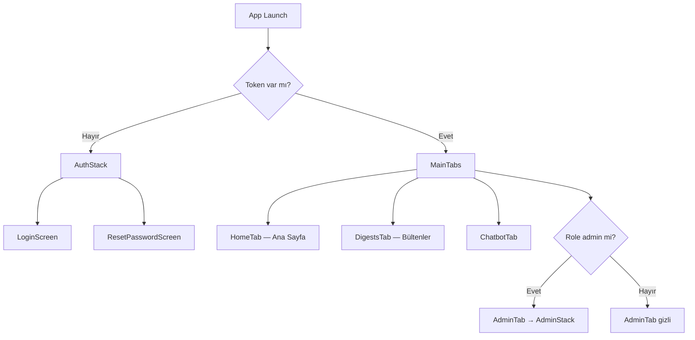
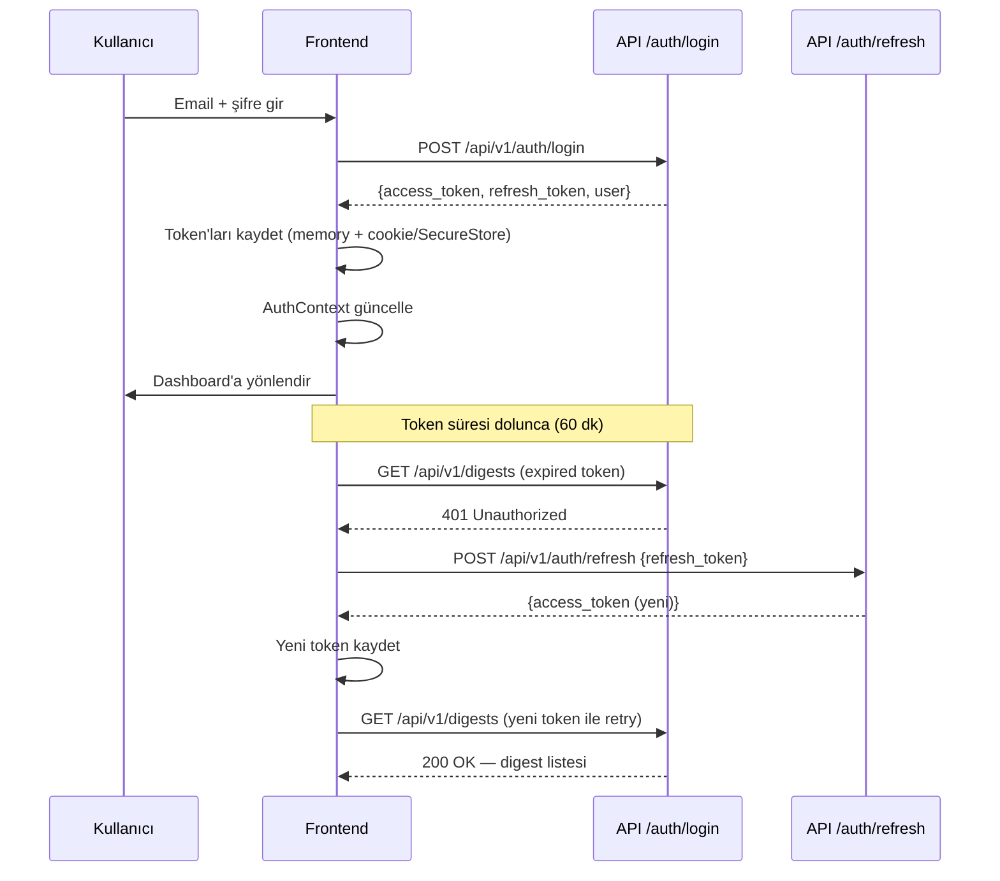

# 05 — Frontend Spesifikasyonu

> **Platform:** YıldızHolding Global Intelligence Platform (YGIP)
> **Kapsam:** Next.js web dashboard, React Native mobil uygulama, ortak API client katmanı — MVP-0 implementasyon detayı

---

## 1. Genel Mimari

Frontend iki bağımsız uygulama olarak geliştirilir:

- **Web dashboard** (`/apps/web/`): Next.js 14+ App Router. SSR destekli, responsive tasarım. Masaüstü ve tablet kullanımı öncelikli.
- **Mobil uygulama** (`/apps/mobile/`): React Native (Expo managed workflow). iOS + Android tek codebase. Enterprise dağıtım — Apple Enterprise Program + Android MDM. App Store ve Google Play'e çıkılmaz.

Her iki uygulama aynı FastAPI backend'e (`/api/v1/`) bağlanır. Ortak kod (API client, type tanımları, validation schema'ları) `/packages/shared/` altında yaşar. React bileşenleri paylaşılmaz — her platform kendi UI toolkit'ini kullanır.

### SSR vs CSR Karar Mantığı

Next.js App Router'da varsayılan Server Component'tir. Client Component yalnızca şu durumlarda kullanılır:

- Kullanıcı etkileşimi gerektiren bileşenler (form, buton click handler, modal)
- Browser API'si gerektiren bileşenler (localStorage, window, navigator)
- React state veya effect kullanan bileşenler (useState, useEffect, useContext)
- Üçüncü parti client-side kütüphaneler (React Query provider, chart kütüphaneleri)

Sayfa seviyesinde karar:

| Sayfa | Render Stratejisi | Gerekçe |
|-------|-------------------|---------|
| Login | Client Component | Form etkileşimi, auth state |
| Ana sayfa (brief) | Server Component + Client hydration | Executive Brief + kompakt teaser |
| Bülten listesi | Server Component + Client hydration | Infinite scroll / load more client-side |
| Digest detay | Server Component | Statik içerik, SEO gereksiz ama SSR hız avantajı |
| Chatbot | Client Component | Gerçek zamanlı mesajlaşma, state yoğun |
| Admin paneli sayfaları | Client Component | Form ağırlıklı, CRUD etkileşimi |

---

## 2. Web Uygulama Klasör Yapısı

```
/apps/web/
    app/                                → Next.js App Router
        layout.tsx                      → Root layout (providers, font, metadata)
        (auth)/                         → Auth layout group (login sayfaları)
            login/page.tsx
            reset-password/[token]/page.tsx
        (dashboard)/                    → Dashboard layout group (auth guard)
            layout.tsx                  → Rol bazlı shell: viewer → PillNav; admin → Sidebar
            page.tsx                    → Ana sayfa (Executive Brief)
            digests/
                page.tsx                → Bülten listesi
                [id]/page.tsx           → Digest detay
            chatbot/page.tsx            → AI Chatbot
            (admin)/                    → Admin route group (role guard — layout değişmez, sidebar kalır)
                users/page.tsx          → Kullanıcı yönetimi
                sources/page.tsx        → Kaynak yönetimi
                prompt-templates/page.tsx
                api-keys/page.tsx       → API key yönetimi + kullanım grafikleri
                notifications/page.tsx  → Bildirim yönetimi + JWT ayarları
                chat-history/page.tsx   → Chatbot sohbet geçmişi
                audit-logs/page.tsx     → Audit log
        api/                            → Next.js API routes (yalnızca proxy gerekirse)
        not-found.tsx                   → 404 sayfası
        error.tsx                       → Global error boundary
    components/
        ui/                             → Atom seviye: Button, Input, Badge, Card, Modal, Skeleton
        layout/                         → Sidebar (admin), PillNav (viewer), UserMenu, AdminTopbar
        digest/                         → DigestCard, DigestDetail, DigestSection
        chatbot/                        → ChatWindow, ChatMessage, ChatInput
        admin/                          → UserTable, SourceForm, PromptEditor, ApiKeyCard, UsageChart
        common/                         → DataTable, PaginatedList, EmptyState, ConfirmDialog, ErrorBoundary, LoadingSkeleton
    lib/
        api-client.ts                   → Axios instance, interceptor'lar
        auth.ts                         → Token yönetimi, login/logout helper
        utils.ts                        → Tarih formatlama, truncate, vb.
        constants.ts                    → Route path'leri, enum eşleştirmeleri
    hooks/
        use-auth.ts                     → AuthContext consumer hook
        use-digests.ts                  → React Query: digest listesi + detay
        use-chatbot.ts                  → React Query mutation: soru gönder
        use-users.ts                    → React Query: kullanıcı CRUD
        use-sources.ts                  → React Query: kaynak CRUD
        use-pagination.ts               → Cursor pagination helper
        use-infinite-scroll.ts          → Infinite scroll trigger
    styles/
        globals.css                     → Tailwind base + custom token'lar
        theme.ts                        → Renk, typography, spacing tanımları
    types/
        api.ts                          → API request/response type'ları
        models.ts                       → Frontend domain model type'ları
    middleware.ts                        → Auth guard, role redirect, CSP header
    next.config.js
    tailwind.config.ts
```

### İsimlendirme Kuralları

- React component dosyaları: `PascalCase.tsx` → `DigestCard.tsx`, `UserTable.tsx`
- Hook dosyaları: `kebab-case.ts` → `use-digests.ts`, `use-auth.ts`
- Utility / lib dosyaları: `kebab-case.ts` → `api-client.ts`, `auth.ts`
- Type dosyaları: `kebab-case.ts` → `api.ts`, `models.ts`
- Next.js route dosyaları: `page.tsx`, `layout.tsx`, `loading.tsx`, `error.tsx` (Next.js convention)
- CSS class'ları: Tailwind utility class'ları kullanılır, custom class yazılmaz (istisnai durumlarda `kebab-case`)

---

## 3. Mobil Uygulama Klasör Yapısı

```
/apps/mobile/
    app.config.ts                       → Expo config (app name, version, bundle ID)
    App.tsx                             → Root: providers + navigation container
    src/
        screens/
            auth/
                LoginScreen.tsx
                ResetPasswordScreen.tsx
            dashboard/
                HomeScreen.tsx          → Executive Brief + teaser
                DigestsScreen.tsx       → Bülten listesi
                DigestDetailScreen.tsx
                ChatbotScreen.tsx
            admin/
                UsersScreen.tsx
                SourcesScreen.tsx
                PromptTemplatesScreen.tsx
                ApiKeysScreen.tsx
                NotificationsScreen.tsx
                ChatHistoryScreen.tsx
                AuditLogsScreen.tsx
        components/
            ui/                         → Button, Input, Badge, Card, Modal
            layout/                     → TabBar, Header, SafeAreaWrapper
            digest/                     → DigestCard, DigestDetail, DigestSection
            chatbot/                    → ChatBubble, ChatInput
            admin/                      → UserRow, SourceForm, UsageChart
            common/                     → FlatListPaginated, EmptyState, LoadingSkeleton, ErrorView
        navigation/
            RootNavigator.tsx           → Auth check → AuthStack | MainStack
            AuthStack.tsx               → Login, ResetPassword
            MainTabs.tsx                → Home, Bültenler, Chatbot (viewer); + Yönetim (admin)
            AdminStack.tsx              → Admin ekranları stack
        lib/
            api-client.ts              → Shared API client (packages/shared re-export)
            auth.ts                     → SecureStore token yönetimi
            notifications.ts            → FCM token alma, izin isteme
            utils.ts
        hooks/                          → Web ile paralel hook'lar (use-digests, use-auth, vb.)
        styles/
            theme.ts                    → Renk, typography, spacing (React Native StyleSheet)
        types/                          → Shared types re-export
```

### Dağıtım Modeli

Mobil uygulama public store'lara çıkmaz. Dağıtım kanalları:

- **iOS:** Apple Enterprise Program sertifikası ile `.ipa` oluşturulur. MDM (Mobile Device Management) üzerinden hedef cihazlara push edilir. OTA (Over The Air) güncelleme Expo Updates ile sağlanır.
- **Android:** Enterprise `.apk` / `.aab` üretilir. MDM üzerinden dağıtılır veya dahili dağıtım portalından indirilir.

Expo EAS Build kullanılır. CI/CD pipeline (GitHub Actions) her release branch'inde otomatik build tetikler.

---

## 4. Routing ve Navigasyon

### Rol Bazlı Navigasyon Shell'i

`(dashboard)/layout.tsx` auth sonrası `user.role` ile iki ayrı shell render eder. **İkisi aynı anda mount edilmez.**

| Rol | Shell bileşenleri | İçerik alanı |
|-----|-------------------|--------------|
| `viewer` | `PillNav` + `UserMenu` | Tam genişlik (`w-full`, sidebar offset yok) |
| `admin` | `Sidebar` + `AdminTopbar` (mobil) + `UserMenu` (sidebar altında) | `ml-[260px]` (mockup ile uyumlu) |

**PillNav** (viewer): React Bits pattern; `next/link`; `gsap` animasyonları (`prefers-reduced-motion` ile devre dışı). Sabit `items`:

```typescript
const VIEWER_NAV_ITEMS = [
  { label: "Ana Sayfa", href: "/" },
  { label: "Bültenler", href: "/digests" },
  { label: "AI Chatbot", href: "/chatbot" },
] as const;
```

`/digests/[id]` rotasında `activeHref="/digests"` kullanılır.

**Sidebar** (admin): Mockup (`Docs/YGIP_screen_reference_mockup.html`) — Ana Menü (Ana Sayfa, Bültenler, AI Chatbot) + Yönetim (`/admin/*`). Viewer'da `Sidebar` import edilmez (ayrı layout branch veya dynamic import guard).

### Web Route Yapısı

| Route | Sayfa | Erişim | Guard |
|-------|-------|--------|-------|
| `/login` | Login | Public | Giriş yapmışsa `/` redirect |
| `/reset-password/[token]` | Şifre sıfırlama | Public | Token geçerliliği backend'de kontrol |
| `/` | Ana sayfa — Günün özeti (Executive Brief) | Authenticated | Auth guard |
| `/digests` | Bülten listesi | Authenticated | Auth guard |
| `/digests/[id]` | Digest detay | Authenticated | Auth guard |
| `/chatbot` | AI Chatbot | Authenticated | Auth guard |
| `/admin/users` | Kullanıcı yönetimi | Admin | Auth + Role guard |
| `/admin/sources` | Kaynak yönetimi | Admin | Auth + Role guard |
| `/admin/prompt-templates` | Prompt şablon yönetimi | Admin | Auth + Role guard |
| `/admin/api-keys` | API key yönetimi | Admin | Auth + Role guard |
| `/admin/notifications` | Bildirim yönetimi + JWT ayarları | Admin | Auth + Role guard |
| `/admin/pipeline` | Pipeline izleme (kokpit) — Faz 6.1 | Admin | Auth + Role guard |
| `/admin/pipeline/[id]` | Pipeline run detayı (canlı timeline) — Faz 6.1 | Admin | Auth + Role guard |
| `/admin/content-archive` | İçerik Arşivi — işlenmiş haber gezgini — Faz 6.2 | Admin | Auth + Role guard |
| `/admin/keywords` | Keyword Takibi — kategori keyword + rating yönetimi — Faz 6.3 | Admin | Auth + Role guard |
| `/admin/chat-history` | Chatbot sohbet geçmişi | Admin | Auth + Role guard |
| `/admin/audit-logs` | Audit log | Admin | Auth + Role guard |

### Auth Guard (Next.js Middleware)

```typescript
// middleware.ts
import { NextResponse } from "next/server";
import type { NextRequest } from "next/server";

const PUBLIC_PATHS = ["/login", "/reset-password"];
const ADMIN_PATHS = ["/admin"];

export function middleware(request: NextRequest) {
  const { pathname } = request.nextUrl;
  const token = request.cookies.get("access_token")?.value;

  // Public sayfalara giriş yapmış kullanıcı → dashboard'a yönlendir
  if (PUBLIC_PATHS.some((p) => pathname.startsWith(p)) && token) {
    return NextResponse.redirect(new URL("/", request.url));
  }

  // Korumalı sayfalara token yoksa → login'e yönlendir
  if (!PUBLIC_PATHS.some((p) => pathname.startsWith(p)) && !token) {
    return NextResponse.redirect(new URL("/login", request.url));
  }

  // Admin sayfalarına role kontrolü (JWT decode ile)
  if (ADMIN_PATHS.some((p) => pathname.startsWith(p))) {
    const role = decodeTokenRole(token);
    if (role !== "admin") {
      return NextResponse.redirect(new URL("/", request.url));
    }
  }

  // CSP ve güvenlik header'ları ekle
  const response = NextResponse.next();
  response.headers.set("X-Content-Type-Options", "nosniff");
  response.headers.set("X-Frame-Options", "DENY");
  response.headers.set("Strict-Transport-Security", "max-age=31536000; includeSubDomains");
  return response;
}
```

Token decode işlemi middleware'de yalnızca role claim kontrolü için yapılır — signature verification backend'in sorumluluğundadır. Middleware'deki kontrol UI-level guard'dır; asıl yetkilendirme her API isteğinde backend guard'ı tarafından sağlanır.

### Mobil Navigasyon Yapısı



React Navigation kullanılır:
- `NavigationContainer` → `RootNavigator`
- Auth durumuna göre `AuthStack` veya `MainTabs` render edilir.
- `MainTabs`: Bottom tab — Ana Sayfa, Bültenler, Chatbot; admin ise ek **Yönetim** tab'ı.
- `AdminStack`: Stack navigator. Admin ekranları arasında geçiş.
- Yönetim tab'ı viewer kullanıcılara gösterilmez — tab bar'dan tamamen çıkarılır.

---

## 5. State Management

### Server State — React Query (TanStack Query)

Tüm API verisi React Query ile yönetilir. Client-side cache, background refetch, optimistic update ve error retry otomatik sağlanır.

**Query Key Convention:**

```typescript
// Tutarlı, öngörülebilir key yapısı
const queryKeys = {
  digests: {
    all: ["digests"] as const,
    list: (cursor?: string) => ["digests", "list", cursor] as const,
    detail: (id: number) => ["digests", "detail", id] as const,
  },
  users: {
    all: ["users"] as const,
    list: (cursor?: string) => ["users", "list", cursor] as const,
    detail: (id: number) => ["users", "detail", id] as const,
  },
  sources: {
    all: ["sources"] as const,
    list: (params: SourceListParams) => ["sources", "list", params] as const,
  },
  chatHistory: {
    all: ["chat-history"] as const,
    list: (userId?: number) => ["chat-history", "list", userId] as const,
  },
  auditLogs: {
    all: ["audit-logs"] as const,
    list: (params: AuditLogParams) => ["audit-logs", "list", params] as const,
  },
  apiKeys: {
    all: ["api-keys"] as const,
    usage: (keyId: number, range: string) => ["api-keys", "usage", keyId, range] as const,
  },
  settings: {
    all: ["settings"] as const,
  },
};
```

**Cache Invalidation Stratejisi:**

| Operasyon | Invalidation |
|-----------|-------------|
| Yeni kullanıcı oluştur | `queryKeys.users.all` invalidate |
| Kaynak ekle/sil | `queryKeys.sources.all` invalidate |
| Digest manuel tetikle | `queryKeys.digests.all` invalidate |
| Chatbot soru gönder | Mutation — cache'e optimistic append |
| Sistem ayarı güncelle | `queryKeys.settings.all` invalidate |
| API key ekle/sil | `queryKeys.apiKeys.all` invalidate |

**React Query Provider Konfigürasyonu:**

```typescript
const queryClient = new QueryClient({
  defaultOptions: {
    queries: {
      staleTime: 5 * 60 * 1000,      // 5 dakika — veri taze sayılır
      gcTime: 30 * 60 * 1000,         // 30 dakika — cache'te tutulur
      retry: 2,                        // 2 retry (401 hariç)
      refetchOnWindowFocus: true,      // Tab'a dönünce refetch
      refetchOnReconnect: true,        // Bağlantı gelince refetch
    },
    mutations: {
      retry: 0,                        // Mutation'lar retry etmez
    },
  },
});
```

401 hatası alan query retry etmez — token refresh interceptor'a düşer.

### Client State — React Context

Hafif, lokal UI state için React Context kullanılır. Redux veya Zustand eklenmez — uygulama okuma ağırlıklıdır, karmaşık client state yoktur.

**AuthContext:**

```typescript
interface AuthContextValue {
  user: User | null;
  isAuthenticated: boolean;
  isAdmin: boolean;
  login: (email: string, password: string) => Promise<void>;
  logout: () => Promise<void>;
  isLoading: boolean;
}

const AuthContext = createContext<AuthContextValue | null>(null);

export function useAuth() {
  const context = useContext(AuthContext);
  if (!context) throw new Error("useAuth must be used within AuthProvider");
  return context;
}
```

AuthProvider app root'ta sarılır. Login sonrası user bilgisi context'e yazılır, logout'ta temizlenir. Token refresh başarısızsa logout tetiklenir.

Context kapsamı bunlarla sınırlıdır: auth state ve tema. Diğer tüm veri (digest listesi, kullanıcılar, kaynaklar) React Query ile yönetilir.

---

## 6. API Client Katmanı

Web ve mobil aynı API client modülünü kullanır. Modül `/packages/shared/api-client/` altında yaşar ve her iki uygulamaya import edilir.

### Axios Instance

```typescript
import axios from "axios";
import type { AxiosInstance, InternalAxiosRequestConfig, AxiosError } from "axios";

function createApiClient(baseURL: string, tokenStore: TokenStore): AxiosInstance {
  const client = axios.create({
    baseURL,
    timeout: 30000,
    headers: { "Content-Type": "application/json" },
  });

  // Request interceptor — JWT ekleme
  client.interceptors.request.use((config: InternalAxiosRequestConfig) => {
    const token = tokenStore.getAccessToken();
    if (token) {
      config.headers.Authorization = `Bearer ${token}`;
    }
    return config;
  });

  // Response interceptor — token refresh
  client.interceptors.response.use(
    (response) => response,
    async (error: AxiosError) => {
      const originalRequest = error.config;
      if (error.response?.status === 401 && !originalRequest._retry) {
        originalRequest._retry = true;
        try {
          const newToken = await refreshAccessToken(tokenStore);
          originalRequest.headers.Authorization = `Bearer ${newToken}`;
          return client(originalRequest);
        } catch {
          tokenStore.clearTokens();
          // Login sayfasına yönlendir
          window.location.href = "/login"; // Web
          // navigation.reset({routes: [{name: "Login"}]}); // Mobil
          return Promise.reject(error);
        }
      }
      return Promise.reject(normalizeError(error));
    }
  );

  return client;
}
```

### TokenStore Arayüzü

```typescript
interface TokenStore {
  getAccessToken(): string | null;
  setAccessToken(token: string): void;
  getRefreshToken(): string | null;
  setRefreshToken(token: string): void;
  clearTokens(): void;
}
```

Platform-spesifik implementasyonlar:

- **Web:** Access token memory'de (değişken), refresh token `httpOnly` cookie olarak saklanır. `localStorage` kullanılmaz — XSS riski.
- **Mobil:** `expo-secure-store` kullanılır. iOS Keychain, Android EncryptedSharedPreferences üzerinde güvenli depolama.

### Error Normalization

Backend'den gelen hata yanıtları tutarlı client-side formata dönüştürülür:

```typescript
interface ApiError {
  code: string;
  message: string;
  details: Record<string, unknown>;
  statusCode: number;
}

function normalizeError(error: AxiosError): ApiError {
  if (error.response?.data?.error) {
    const e = error.response.data.error;
    return {
      code: e.code,
      message: e.message,
      details: e.details || {},
      statusCode: error.response.status,
    };
  }
  // Network hatası veya timeout
  return {
    code: "NETWORK_ERROR",
    message: "Sunucuya bağlanılamadı. İnternet bağlantınızı kontrol edin.",
    details: {},
    statusCode: 0,
  };
}
```

---

## 7. Kimlik Doğrulama Akışı (Frontend)

### Login Akışı



### Token Refresh Cycle

Access token süresi varsayılan 60 dakikadır (admin panelinden ayarlanabilir). Refresh token süresi varsayılan 30 gündür.

Refresh akışı:
1. API isteği 401 döner.
2. Interceptor refresh token ile `POST /api/v1/auth/refresh` çağırır.
3. Başarılıysa yeni access token alınır, orijinal istek retry edilir.
4. Refresh token da expired ise tüm token'lar temizlenir, kullanıcı login ekranına yönlendirilir.

Eşzamanlı isteklerde token refresh yalnızca bir kez tetiklenir. Diğer istekler refresh tamamlanana kadar bekler (promise queue pattern):

```typescript
let refreshPromise: Promise<string> | null = null;

async function refreshAccessToken(tokenStore: TokenStore): Promise<string> {
  if (refreshPromise) return refreshPromise;

  refreshPromise = (async () => {
    try {
      const response = await axios.post(`${BASE_URL}/api/v1/auth/refresh`, {
        refresh_token: tokenStore.getRefreshToken(),
      });
      const newToken = response.data.access_token;
      tokenStore.setAccessToken(newToken);
      return newToken;
    } finally {
      refreshPromise = null;
    }
  })();

  return refreshPromise;
}
```

### Logout

Logout işlemi:
1. `POST /api/v1/auth/logout` çağrılır (backend refresh token'ı invalidate eder).
2. Client-side token'lar temizlenir (memory + cookie/SecureStore).
3. React Query cache temizlenir (`queryClient.clear()`).
4. AuthContext sıfırlanır.
5. Login ekranına yönlendirilir.

### Şifre Sıfırlama

Self-servis "şifremi unuttum" yoktur. Admin, admin panelinden kullanıcı için reset link tetikler. Kullanıcı mail'deki linke tıklar → `/reset-password/[token]` sayfası açılır → yeni şifre girer → `POST /api/v1/auth/reset-password` ile şifre güncellenir. Token tek kullanımlık ve 24 saat geçerlidir.

---

## 8. Veri Çekme Pattern'leri

### React Query Hook'ları

Her domain alanı için özel hook yazılır. Hook'lar API client'ı sarar, type safety sağlar ve loading/error state'leri yönetir.

**Digest Listesi (Infinite Scroll):**

```typescript
export function useDigests() {
  return useInfiniteQuery({
    queryKey: queryKeys.digests.list(),
    queryFn: async ({ pageParam }) => {
      const response = await apiClient.get<PaginatedResponse<Digest>>("/digests", {
        params: { cursor: pageParam, limit: 20 },
      });
      return response.data;
    },
    initialPageParam: undefined as string | undefined,
    getNextPageParam: (lastPage) => lastPage.next_cursor ?? undefined,
  });
}
```

**Canlı izleme (polling) — Pipeline Run (Faz 6.1):**

Çalışan bir kaynağın durumu sunucu tarafında ilerlediğinde (pipeline run), React Query `refetchInterval` ile koşullu polling kullanılır. Terminal duruma ulaşınca polling kendini durdurur — sonsuz istek yok.

```typescript
export function usePipelineRun(runId: string) {
  return useQuery({
    queryKey: queryKeys.pipeline.run(runId),
    queryFn: async () => (await apiClient.get<PipelineRunDetail>(`/pipeline/runs/${runId}`)).data,
    // running/pending iken 3 sn'de bir; terminal statüde durur
    refetchInterval: (query) => {
      const status = query.state.data?.status;
      return status === "running" || status === "pending" ? 3000 : false;
    },
  });
}
```

Liste ekranı (S-ADMIN-PIPELINE) aynı koşullu yaklaşımı 5 sn aralıkla uygular: listede en az bir `running`/`pending` run varsa poll eder, hepsi terminal ise durur.

**Digest Detay:**

```typescript
export function useDigestDetail(id: number) {
  return useQuery({
    queryKey: queryKeys.digests.detail(id),
    queryFn: async () => {
      const response = await apiClient.get<Digest>(`/digests/${id}`);
      return response.data;
    },
    enabled: !!id,
  });
}
```

**Chatbot Mutation:**

```typescript
export function useChatbotAsk() {
  const queryClient = useQueryClient();
  return useMutation({
    mutationFn: async (question: string) => {
      const response = await apiClient.post<ChatResponse>("/chatbot/ask", { question });
      return response.data;
    },
    onSuccess: () => {
      queryClient.invalidateQueries({ queryKey: queryKeys.chatHistory.all });
    },
  });
}
```

**Kullanıcı CRUD (Admin):**

```typescript
export function useCreateUser() {
  const queryClient = useQueryClient();
  return useMutation({
    mutationFn: async (data: CreateUserRequest) => {
      const response = await apiClient.post<User>("/users", data);
      return response.data;
    },
    onSuccess: () => {
      queryClient.invalidateQueries({ queryKey: queryKeys.users.all });
    },
  });
}
```

### Loading / Error / Empty State Handling

Her veri çekme noktasında üç durum ele alınır:

```tsx
function DigestList() {
  const { data, isLoading, isError, error, fetchNextPage, hasNextPage } = useDigests();

  if (isLoading) return <DigestListSkeleton />;
  if (isError) return <ErrorView message={error.message} onRetry={() => refetch()} />;
  if (!data?.pages[0]?.items.length) return <EmptyState message="Henüz rapor bulunmuyor." />;

  return (
    <>
      {data.pages.flatMap((page) =>
        page.items.map((digest) => <DigestCard key={digest.id} digest={digest} />)
      )}
      {hasNextPage && <InfiniteScrollTrigger onVisible={fetchNextPage} />}
    </>
  );
}
```

Skeleton component'ler gerçek layout'u taklit eder — içerik boyutlarıyla eşleşen gri bloklar. CLS (Cumulative Layout Shift) engellenir.

### Cursor Pagination Hook

```typescript
export function useCursorPagination<T>(queryKey: readonly unknown[], endpoint: string) {
  return useInfiniteQuery<PaginatedResponse<T>>({
    queryKey,
    queryFn: async ({ pageParam }) => {
      const response = await apiClient.get<PaginatedResponse<T>>(endpoint, {
        params: { cursor: pageParam, limit: 20 },
      });
      return response.data;
    },
    initialPageParam: undefined as string | undefined,
    getNextPageParam: (lastPage) => lastPage.next_cursor ?? undefined,
  });
}
```

Admin tablolarında (kullanıcılar, kaynaklar, audit loglar) sayfa bazlı görüntüleme yerine "daha fazla yükle" butonu kullanılır. Digest listesinde infinite scroll (scroll bottom tetikli otomatik fetch) kullanılır.

---

## 9. Form Yönetimi

React Hook Form + Zod validation kombinasyonu tüm formlarda kullanılır.

### Genel Pattern

```typescript
import { useForm } from "react-hook-form";
import { zodResolver } from "@hookform/resolvers/zod";
import { z } from "zod";

const createUserSchema = z.object({
  email: z.string().email("Geçerli bir e-posta adresi girin."),
  full_name: z.string().min(2, "Ad soyad en az 2 karakter olmalı."),
  role: z.enum(["admin", "viewer"]),
  password: z
    .string()
    .min(8, "Şifre en az 8 karakter olmalı.")
    .regex(/[A-Z]/, "En az 1 büyük harf gerekli.")
    .regex(/[0-9]/, "En az 1 rakam gerekli."),
});

type CreateUserForm = z.infer<typeof createUserSchema>;

function UserCreateForm() {
  const { mutate, isPending } = useCreateUser();
  const {
    register,
    handleSubmit,
    formState: { errors },
    reset,
  } = useForm<CreateUserForm>({
    resolver: zodResolver(createUserSchema),
  });

  const onSubmit = (data: CreateUserForm) => {
    mutate(data, {
      onSuccess: () => {
        reset();
        toast.success("Kullanıcı oluşturuldu.");
      },
      onError: (error) => {
        toast.error(error.message);
      },
    });
  };

  return (/* form JSX */);
}
```

### Validation Kuralları

Zod schema'ları frontend'de tanımlanır. Backend Pydantic validation ile aynı kuralları uygular — çift katmanlı doğrulama. Frontend validation kullanıcı deneyimi için (anında geri bildirim), backend validation güvenlik için (client bypass'ı engelleme).

| Alan | Frontend (Zod) | Backend (Pydantic) |
|------|---------------|--------------------|
| Email | `z.string().email()` | `EmailStr` |
| Şifre | min 8, 1 büyük harf, 1 rakam | Aynı regex |
| URL (kaynak) | `z.string().url()` | `HttpUrl` |
| Rol | `z.enum(["admin", "viewer"])` | `Literal["admin", "viewer"]` |

### Admin Panel Formları

| Form | Alanlar | Özel Davranış |
|------|---------|--------------|
| Kullanıcı oluşturma | email, full_name, role, password | Şifre politikası göstergesi |
| Kaynak ekleme | name, type (select), url/config, active toggle | Type'a göre dinamik alan (RSS: URL, Email: sender address, Gov: endpoint) |
| Prompt şablon düzenleme | title, body (textarea — monospace font), digest_type | Önceki versiyonu readonly göster, diff görünümü |
| API key ekleme | provider (Groq/Gemini), key (masked input) | Eklendikten sonra key gösterilmez, yalnızca son 4 karakter |
| Sistem ayarları | JWT access/refresh süreleri, bildirim zamanlaması, embedding model seçimi | Değişiklik anında uygulanmaz — kaydet butonu ile onay |

---

## 10. Bildirim Entegrasyonu (Mobil)

### FCM Token Alma ve Kayıt

```typescript
import * as Notifications from "expo-notifications";
import { apiClient } from "../lib/api-client";

async function registerForPushNotifications(): Promise<void> {
  const { status } = await Notifications.requestPermissionsAsync();
  if (status !== "granted") return;

  const tokenData = await Notifications.getExpoPushTokenAsync({
    projectId: Constants.expoConfig.extra.eas.projectId,
  });

  // Backend'e kaydet
  await apiClient.post("/notifications/fcm-token", {
    token: tokenData.data,
    platform: Platform.OS, // "ios" | "android"
  });
}
```

Token alma uygulama her açıldığında çalışır. Backend mevcut token varsa günceller, yoksa yeni kayıt oluşturur.

### Push Notification Handling

Üç durum ele alınır:

```typescript
// Foreground — uygulama açıkken
Notifications.setNotificationHandler({
  handleNotification: async () => ({
    shouldShowAlert: true,
    shouldPlaySound: true,
    shouldSetBadge: true,
  }),
});

// Uygulama açıkken bildirime tıklama
const responseListener = Notifications.addNotificationResponseReceivedListener((response) => {
  const data = response.notification.request.content.data;
  if (data.digest_id) {
    navigation.navigate("DigestDetail", { id: data.digest_id });
  }
});

// Uygulama kapalıyken bildirime tıklama (cold start)
const lastNotification = await Notifications.getLastNotificationResponseAsync();
if (lastNotification?.notification.request.content.data.digest_id) {
  // Initial route'u DigestDetail olarak ayarla
}
```

### Deep Linking

Push notification payload'ında `digest_id` varsa, tıklama kullanıcıyı doğrudan ilgili digest detay ekranına yönlendirir. Payload yapısı:

```json
{
  "notification": {
    "title": "Yeni FMCG Raporu Hazır",
    "body": "Haftalık FMCG bülteni yayınlandı."
  },
  "data": {
    "type": "digest_ready",
    "digest_id": "142"
  }
}
```

---

## 11. UI Bileşen Mimarisi

Atomic design prensibi uygulanır. Bileşenler karmaşıklık seviyesine göre organize edilir:

### Atom Bileşenler (`components/ui/`)

Tekil, yeniden kullanılabilir, state'siz UI elemanları:

| Bileşen | Açıklama | Varyantlar |
|---------|----------|-----------|
| `Button` | Tıklanabilir aksiyon | `primary`, `secondary`, `danger`, `ghost`; `sm`, `md`, `lg`; `loading` state |
| `Input` | Metin girişi | `text`, `email`, `password` (göster/gizle toggle); `error` state |
| `Badge` | Durum etiketi | `success`, `warning`, `error`, `info`, `neutral` |
| `Card` | İçerik kartı | `default`, `outlined`, `elevated` |
| `Modal` | Diyalog penceresi | `sm`, `md`, `lg`; `onClose`, `onConfirm` callback |
| `Skeleton` | Yükleme placeholder | `text`, `circle`, `rect`; `width`, `height` props |
| `Select` | Dropdown seçim | `options[]`, `value`, `onChange` |
| `Toggle` | Açma/kapama | `checked`, `onChange`, `disabled` |
| `Textarea` | Çok satırlı giriş | `rows`, `maxLength`, `monospace` (prompt editor için) |

### Organism Bileşenler (`components/common/`)

Birden fazla atom/molecule birleştiren, belirli bir iş fonksiyonu sunan bileşenler:

| Bileşen | Açıklama |
|---------|----------|
| `DataTable` | Sıralama, filtreleme destekli tablo. Admin listeleri için |
| `PaginatedList` | Cursor-based "daha fazla yükle" destekli liste |
| `EmptyState` | İkon + mesaj + aksiyon butonu. Veri yokken gösterilir |
| `ErrorBoundary` | React error boundary. Hata durumunda fallback UI gösterir |
| `ErrorView` | API hatası gösterimi. Hata mesajı + retry butonu |
| `LoadingSkeleton` | Sayfa bazlı skeleton layout (DigestListSkeleton, UserTableSkeleton vb.) |
| `ConfirmDialog` | Tehlikeli aksiyonlarda onay modalı (kullanıcı silme, kaynak silme) |
| `SearchInput` | Debounced arama girişi (300ms debounce) |
| `Toast` | Başarı/hata bildirim toast'ı. Sağ üstte, 3 saniye sonra otomatik kapanır |

### Layout Bileşenleri (`components/layout/`)

| Bileşen | Rol | Açıklama |
|---------|-----|----------|
| `PillNav` | viewer | React Bits pattern; `next/link`; `gsap` (reduced-motion destekli); 3 sabit link |
| `Sidebar` | admin | Navy sidebar; Ana Menü + Yönetim; mockup referansı |
| `UserMenu` | authenticated | Avatar + çıkış |
| `AdminTopbar` | admin (mobil) | Hamburger + sayfa başlığı |

### Responsive Tasarım

**Viewer (PillNav):** Tüm breakpoint'lerde üst navigasyon. Mobilde PillNav hamburger popover. İçerik her zaman tam genişlik.

**Admin (Sidebar):**

| Breakpoint | Genişlik | Davranış |
|-----------|---------|----------|
| `sm` | ≥ 640px | Sidebar overlay (hamburger); `AdminTopbar` görünür |
| `md` | ≥ 768px | Sidebar collapsed (ikon only) |
| `lg` | ≥ 1024px | Sidebar açık, içerik `ml-[260px]` |
| `xl` | ≥ 1280px | Geniş masaüstü content area |

Digest detay progress bar: viewer `left: 0`; admin `left: 260px`.

Mobil uygulama responsive değildir — React Native SafeAreaView + ScrollView ile cihaz boyutuna uyum sağlar. iPhone ve Android farklı ekran boyutları Flexbox layout ile desteklenir.

---

## 12. Erişilebilirlik ve Performans

### Erişilebilirlik

- Tüm interaktif elemanlar semantic HTML kullanır: `<button>`, `<a>`, `<input>`, `<select>`, `<form>`. `<div onClick>` yasaktır.
- Form alanlarında `<label>` zorunludur. Label ve input `htmlFor`/`id` ile bağlanır.
- İkon-only butonlarda `aria-label` zorunludur.
- Renk kontrastı WCAG AA seviyesi hedeflenir (minimum 4.5:1 metin, 3:1 büyük metin).
- Klavye navigasyonu: tüm interaktif elemanlar Tab ile erişilebilir, Enter/Space ile aktive edilebilir, Escape ile modal/dropdown kapatılabilir.
- Focus ring görünür olmalıdır — Tailwind `focus-visible:ring-2` utility kullanılır.
- Mobil: React Native `accessibilityLabel`, `accessibilityRole`, `accessibilityState` prop'ları kullanılır.

### Web Performans Hedefleri

| Metrik | Hedef | Ölçüm |
|--------|-------|-------|
| LCP (Largest Contentful Paint) | < 2.5 saniye | Digest listesi ilk render |
| FID (First Input Delay) | < 100ms | Login buton tıklama yanıtı |
| CLS (Cumulative Layout Shift) | < 0.1 | Skeleton → gerçek içerik geçişi |
| TTI (Time to Interactive) | < 3.5 saniye | Dashboard tam etkileşim |

Optimizasyon teknikleri:

- **Next.js Image:** `next/image` ile otomatik boyutlandırma, lazy loading, WebP format.
- **Code splitting:** Next.js App Router route-bazlı otomatik split. Admin sayfaları viewer'a yüklenmez.
- **Dynamic import:** Ağır bileşenler (chart kütüphanesi, markdown renderer) `next/dynamic` ile lazy load edilir.
- **React Query prefetch:** Digest listesi hover'da sonraki sayfa prefetch eder.
- **Font optimization:** `next/font` ile Google Fonts self-host, layout shift önleme.

### Mobil Performans

- **FlatList:** Tüm listeler React Native `FlatList` ile render edilir — virtualization otomatik. `getItemLayout` tanımlanır (sabit yükseklik öğelerde).
- **Image caching:** `expo-image` kullanılır — disk cache + memory cache.
- **Bundle size:** Metro bundler tree shaking ile kullanılmayan kod çıkarılır. Expo managed workflow gereksiz native modül yüklemez.
- **Hermes engine:** Hermes JavaScript engine aktif — startup süresi ve memory kullanımı optimize.

---

## 13. Güvenlik (Frontend)

### Content Security Policy (CSP)

Next.js middleware'de CSP header'ı set edilir:

```typescript
const cspHeader = [
  "default-src 'self'",
  "script-src 'self' 'unsafe-inline'",       // Next.js inline script'leri için
  "style-src 'self' 'unsafe-inline'",         // Tailwind inline style'ları için
  "img-src 'self' data: https:",              // Haber görselleri harici URL olabilir
  "font-src 'self'",
  "connect-src 'self' https://api.ygip.yildizholding.com",
  "frame-ancestors 'none'",                    // Iframe embed engelle
  "base-uri 'self'",
  "form-action 'self'",
].join("; ");
```

### Diğer Güvenlik Header'ları

| Header | Değer | Amaç |
|--------|-------|------|
| `Strict-Transport-Security` | `max-age=31536000; includeSubDomains` | HTTPS zorunluluğu |
| `X-Content-Type-Options` | `nosniff` | MIME type sniffing engelleme |
| `X-Frame-Options` | `DENY` | Clickjacking koruması |
| `Referrer-Policy` | `strict-origin-when-cross-origin` | Referrer bilgi sızıntısı engelleme |

### XSS Koruması

React JSX otomatik olarak HTML escape uygular. Tehlikeli durumlar:
- `dangerouslySetInnerHTML` kullanılmaz. Digest içeriği structured JSON'dan render edilir, ham HTML enjekte edilmez.
- Kullanıcı girdisi (chatbot sorusu, kaynak adı) her zaman text olarak render edilir.
- URL'ler `<a href>` içinde kullanılmadan önce protocol whitelist kontrolünden geçer (`https://` veya `http://` — `javascript:` yasak).

### Token Storage Güvenliği

| Platform | Access Token | Refresh Token |
|----------|-------------|---------------|
| Web | JavaScript memory (değişken) | `httpOnly`, `Secure`, `SameSite=Strict` cookie |
| iOS | `expo-secure-store` (Keychain) | `expo-secure-store` (Keychain) |
| Android | `expo-secure-store` (EncryptedSharedPreferences) | `expo-secure-store` (EncryptedSharedPreferences) |

Web'de `localStorage` veya `sessionStorage` kullanılmaz — XSS ile okunabilir. Access token memory'de tutulur; sayfa yenilendiğinde kaybolur, refresh token cookie ile otomatik yenilenir.

### Role-Based UI Rendering

Navigasyon shell'i role göre **ayrı component tree** olarak render edilir. Viewer'da `Sidebar` ve admin linkleri DOM'da yoktur; admin'de `PillNav` yoktur.

```tsx
function DashboardLayout({ children }: { children: React.ReactNode }) {
  const { isAdmin } = useAuth();

  if (isAdmin) {
    return (
      <div className="flex min-h-screen">
        <Sidebar />
        <main className="ml-[260px] flex-1">{children}</main>
      </div>
    );
  }

  const pathname = usePathname();
  return (
    <div className="min-h-screen">
      <header className="sticky top-0 z-50 flex items-center justify-between px-4 py-2">
        <PillNav items={VIEWER_NAV_ITEMS} activeHref={pathname} />
        <UserMenu />
      </header>
      <main className="w-full">{children}</main>
    </div>
  );
}
```

Admin `Sidebar` örneği (yalnızca admin layout'ta mount edilir):

```tsx
function Sidebar() {
  return (
    <nav>
      <NavSection label="Ana Menü">
        <NavLink href="/">Ana Sayfa</NavLink>
        <NavLink href="/digests">Bültenler</NavLink>
        <NavLink href="/chatbot">AI Chatbot</NavLink>
      </NavSection>
      <NavSection label="Yönetim">
        <NavLink href="/admin/users">Kullanıcılar</NavLink>
        <NavLink href="/admin/sources">Kaynaklar</NavLink>
        {/* ...diğer admin linkleri */}
      </NavSection>
    </nav>
  );
}
```

Bu UI-level gizlemedir, güvenlik değildir. Asıl yetkilendirme backend guard'ı tarafından sağlanır. Viewer kullanıcı `/admin/*` route'una doğrudan gitmeye çalışırsa middleware redirect eder; API isteği yapsa bile backend `403 Forbidden` döner.

---

## 14. Ortam Konfigürasyonu

### Web (Next.js)

```
# .env.local (development — .gitignore'da)
NEXT_PUBLIC_API_BASE_URL=http://localhost:8000/api/v1
NEXT_PUBLIC_APP_ENV=development

# Production (Vercel/AWS environment variables)
NEXT_PUBLIC_API_BASE_URL=https://api.ygip.yildizholding.com/api/v1
NEXT_PUBLIC_APP_ENV=production
```

`NEXT_PUBLIC_` prefix'li değişkenler client-side bundle'a dahil edilir. Secret değerler (API key vb.) asla `NEXT_PUBLIC_` prefix'i almaz — frontend'de secret tutulmaz.

### Mobil (React Native / Expo)

```typescript
// app.config.ts
export default {
  expo: {
    name: "YGIP",
    slug: "ygip-mobile",
    extra: {
      apiBaseUrl: process.env.API_BASE_URL ?? "http://localhost:8000/api/v1",
      appEnv: process.env.APP_ENV ?? "development",
      eas: { projectId: "..." },
    },
  },
};
```

Expo EAS build profilleri:
- `development`: Expo Dev Client, localhost API.
- `preview`: Internal distribution build, dev API endpoint.
- `production`: Enterprise distribution build, prod API endpoint.

### Feature Flag Pattern

MVP-0'da feature flag altyapısı basit tutulur — `config.ts` içinde sabitler:

```typescript
export const features = {
  chatbotEnabled: true,            // MVP-0'dan itibaren aktif
  alarmNotifications: false,       // MVP-1'de aktif olacak
  mapView: false,                  // MVP-2'de aktif olacak
  premiumDataSources: false,       // MVP-3'te aktif olacak
} as const;
```

Kullanımı:

```tsx
{features.chatbotEnabled && <NavLink href="/chatbot">AI Chatbot</NavLink>}
```

İlerleyen fazlarda bu yapı backend-driven feature flag servisiyle değiştirilebilir. MVP-0 için statik config yeterlidir.
