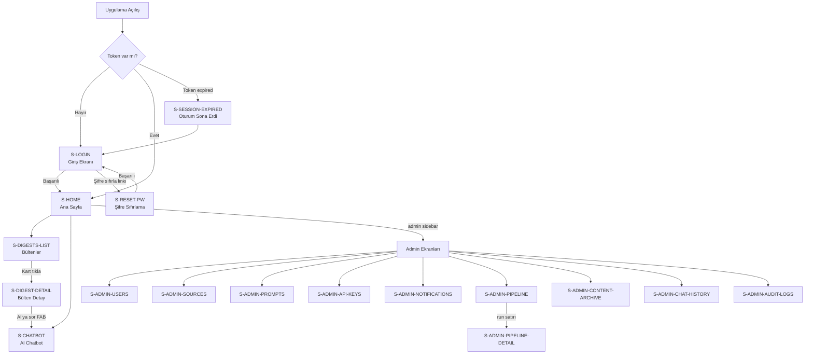

# 06 — Ekran Kataloğu

> **Platform:** YıldızHolding Global Intelligence Platform (YGIP)
> **Kapsam:** MVP-0 tüm ekranlar — web (Next.js) ve mobil (React Native) ortak spesifikasyon
> **Görsel referans:** `Docs/YGIP_screen_reference_mockup.html` — **admin** layout (sol sidebar) ve içerik bileşenleri (Executive Brief, digest kartları, detay) için referans. **Viewer** layout'ta sol sidebar yoktur; üstte `PillNav` kullanılır (bkz. [Rol Bazlı Navigasyon](#rol-bazlı-navigasyon)).

---

## Ekran Haritası



## Layout Tipleri

| Layout | Açıklama | Kullanıldığı Ekranlar | Rol |
|--------|----------|----------------------|-----|
| **Auth** | Tam sayfa, navigasyon yok, ortalanmış kart | S-LOGIN, S-RESET-PW | Herkes (public) |
| **Dashboard-Viewer** | Üstte `PillNav` + tam genişlik içerik; **sol sidebar yok** | S-HOME, S-DIGESTS-LIST, S-DIGEST-DETAIL, S-CHATBOT | `viewer` |
| **Dashboard-Admin** | Sol sidebar (Ana Menü + Yönetim) + içerik alanı (`margin-left: 260px`) | S-HOME, S-DIGESTS-LIST, S-DIGEST-DETAIL, S-CHATBOT, tüm S-ADMIN-* | `admin` |
| **Minimal** | Sadece mesaj + aksiyon butonu, navigasyon yok | S-404, S-500 | Herkes |
| **Modal/Overlay** | Mevcut ekranın üzerinde, arka plan karartılı | S-SESSION-EXPIRED, S-CONFIRM-DIALOG, S-ADMIN-*-CREATE/EDIT formları | Authenticated |

## Rol Bazlı Navigasyon

Navigasyon shell'i JWT `role` claim'ine göre **tamamen farklı** render edilir. İki layout aynı anda görünmez.

| Rol | Shell | Navigasyon öğeleri |
|-----|-------|-------------------|
| **viewer** | `PillNav` (üst, sticky) + sağ üst kullanıcı menüsü (avatar, çıkış) | Ana Sayfa (`/`), Bültenler (`/digests`), AI Chatbot (`/chatbot`) |
| **admin** | Sol `Sidebar` (mockup referansı) | Ana Menü: Ana Sayfa, Bültenler, AI Chatbot · Yönetim: Kullanıcılar, Kaynaklar, Pipeline İzleme, İçerik Arşivi, Bülten Şablonları, API Yönetimi, Bildirimler, Sohbet Geçmişi, Denetim Logu · Altta avatar + rol |

**Güvenlik:** Viewer layout'unda `Sidebar` ve admin route linkleri **DOM'da render edilmez**. Admin layout'unda `PillNav` render edilmez. Backend `/admin/*` guard'ı değişmez.

**Mobil (React Native):** Viewer → bottom tab: Ana Sayfa, Bültenler, Chatbot. Admin → aynı tab'lar + Yönetim tab'ı (veya drawer).

### PillNav (viewer web)

React Bits `PillNav` pattern'i temel alınır; Next.js App Router'a uyarlanır (`next/link`, `usePathname`). Bağımlılık: `gsap` (npm bundle; `prefers-reduced-motion: reduce` → animasyonlar kapalı).

| Prop / davranış | Değer |
|-----------------|-------|
| `items` | Sabit 3 link — admin route içermez |
| Renkler | `theme.ts` YGIP token'ları (navy `baseColor`, altın/beyaz pill varyantları) |
| Konum | `sticky top-0`, tam genişlik header bandı (floating `absolute` değil) |
| Aktif sayfa | `activeHref` = `usePathname()`; `/digests/[id]` iken `activeHref="/digests"` |
| Logo | YGIP yıldız logosu; tıklanınca `/` |
| Metinler | Türkçe, sentence case (uppercase zorunlu değil) |

## Ortak Bileşenler

Authenticated ekranlarda kullanılan paylaşımlı bileşenler (rol bazlı görünürlük notu ile):

| Bileşen | Açıklama | Davranış | Rol |
|---------|----------|----------|-----|
| **Sidebar** | Sol navigasyon (navy). Mockup ile birebir. Üstte YGIP logosu + "Global Intelligence". Ana Menü + Yönetim bölümleri. Altta avatar + isim + rol. Mobilde hamburger → overlay. | Aktif sayfa highlight | **admin only** |
| **PillNav** | Üst yatay pill navigasyon. Logo + 3 link. Mobilde hamburger popover. | `activeHref` ile aktif pill | **viewer only** |
| **UserMenu** | Avatar + çıkış (ve isteğe bağlı profil). | PillNav/Sidebar dışında sağ üst | Authenticated |
| **AdminTopbar** | Admin mobilde: hamburger (sidebar aç) + sayfa başlığı + bildirim ikonu. Masaüstünde sidebar açıkken görünmez. | — | **admin only** |
| **Toast** | Başarı (yeşil) / hata (kırmızı) / bilgi (mavi) bildirimi. Sağ üstte belirir, 3 saniye sonra otomatik kapanır. | Kapatma butonu ile erken kapatılabilir. | Authenticated |
| **ConfirmDialog** | Tehlikeli aksiyonlarda (silme, pasif yapma) onay modalı. Başlık + açıklama + "İptal" + "Onayla" (kırmızı) butonları. | Escape veya dış tıklama ile kapatılır. | Authenticated |
| **EmptyState** | Veri yokken gösterilen bileşen. İkon + mesaj + aksiyon butonu (opsiyonel). | Her liste ekranında ilgili boş durum mesajı farklıdır. | Authenticated |
| **LoadingSkeleton** | Veri yüklenirken gerçek layout'u taklit eden gri bloklar. | Sayfa bazlı: DigestListSkeleton, UserTableSkeleton vb. CLS engellenir. | Authenticated |
| **ErrorView** | API hatası gösterimi. Hata ikonu + mesaj + "Tekrar Dene" butonu. | Retry tıklanınca ilgili React Query refetch tetiklenir. | Authenticated |
| **DataTable** | Sıralama ve filtreleme destekli tablo. Header'da kolon bazlı sort toggle, üstte filtre chip'leri. | Admin listelerinde kullanılır. Cursor-based "Daha fazla yükle" butonu ile pagination. | **admin only** |
| **ReadToggle** | 👁 göz ikonu butonu. Tıklanınca okundu ↔ okunmadı arası geçiş. Okundu: yeşil border + dolgu. Okunmadı: gri border. | Digest kartlarında sağ alt köşede, kompakt listede satır sonunda. Kullanıcı bazlı `user_digest_reads` tablosuna yazılır. | Authenticated |

---

## Grup 1 — Auth Ekranları

---

### S-LOGIN — Giriş Ekranı

**Route:** `/login` · **Layout:** Auth · **Erişim:** Public · **Mobil:** LoginScreen

**Amaç:** Kullanıcının email ve şifre ile sisteme giriş yapması.

**Görsel yapı:**
Tam sayfa, dikey ortalanmış beyaz kart. Üstte YGIP logosu (altın yıldız + "YGIP" + "Global Intelligence Platform" alt başlık). Kart içinde: email input, şifre input (göster/gizle toggle), "Giriş Yap" butonu (primary, tam genişlik), altta küçük "Şifre sıfırlama talebiniz için yöneticinize başvurun" bilgi metni. Arka plan: hafif gradient (navy-900 → navy-800).

**Form alanları:**

| Alan | Tip | Validation | Hata mesajı |
|------|-----|-----------|-------------|
| E-posta | `email` input, autofocus | `z.string().email()` | "Geçerli bir e-posta adresi girin." |
| Şifre | `password` input, göster/gizle toggle | `z.string().min(1)` | "Şifre alanı boş bırakılamaz." |

**State'ler:**

| State | Görünüm |
|-------|---------|
| Varsayılan | Boş form, "Giriş Yap" butonu aktif |
| Yükleniyor | Buton disabled, spinner gösterir, input'lar disabled |
| Hata — geçersiz kimlik | Form üstünde kırmızı banner: "E-posta veya şifre hatalı." Input'lar temizlenmez. |
| Hata — hesap pasif | Kırmızı banner: "Hesabınız pasif durumda. Yöneticinize başvurun." |
| Hata — rate limit | Kırmızı banner: "Çok fazla deneme. Lütfen X saniye bekleyin." Buton disabled, geri sayım gösterilir. |
| Hata — ağ | Kırmızı banner: "Sunucuya bağlanılamadı. İnternet bağlantınızı kontrol edin." |

**API mapping:**
- Form submit → `POST /api/v1/auth/login` `{ email, password }`
- Başarılı → access_token memory'e, refresh_token httpOnly cookie'ye (web) / SecureStore'a (mobil), AuthContext güncellenir, `/` adresine redirect
- Başarısız → ilgili hata state'i gösterilir

**Edge case'ler:**
- Giriş yapmış kullanıcı `/login`'e gelirse → otomatik `/` redirect (middleware guard).
- Enter tuşu form submit tetikler.
- Şifre alanında yapıştırma (paste) izinlidir.
- Caps Lock açıksa şifre alanı altında "Caps Lock açık" uyarısı gösterilir.

---

### S-RESET-PW — Şifre Sıfırlama

**Route:** `/reset-password/[token]` · **Layout:** Auth · **Erişim:** Public (geçerli token ile) · **Mobil:** ResetPasswordScreen

**Amaç:** Admin tarafından gönderilen tek kullanımlık link ile yeni şifre belirleme.

**Görsel yapı:**
S-LOGIN ile aynı layout (tam sayfa, ortalanmış kart). Kart içinde: "Yeni Şifre Belirle" başlık, yeni şifre input, şifre tekrar input, şifre politikası göstergesi (min 8 karakter, 1 büyük harf, 1 rakam — her kural karşılandıkça yeşile döner), "Şifreyi Güncelle" butonu.

**Form alanları:**

| Alan | Tip | Validation | Hata mesajı |
|------|-----|-----------|-------------|
| Yeni şifre | `password`, göster/gizle | min 8, 1 büyük harf, 1 rakam | İlgili kural kırmızı kalır |
| Şifre tekrar | `password` | İlk alan ile eşleşme | "Şifreler eşleşmiyor." |

**State'ler:**

| State | Görünüm |
|-------|---------|
| Token doğrulanıyor | Skeleton kart, spinner |
| Token geçerli | Form gösterilir |
| Token geçersiz/expired | Hata kartı: "Bu şifre sıfırlama linki geçersiz veya süresi dolmuş. Yöneticinizden yeni bir link talep edin." + "Giriş Sayfasına Dön" butonu |
| Başarılı | Yeşil başarı kartı: "Şifreniz güncellendi." + "Giriş Yap" butonu (3 saniye sonra otomatik redirect) |

**API mapping:**
- Sayfa yüklendiğinde → `POST /api/v1/auth/validate-reset-token` `{ token }` — token geçerliliği kontrol
- Form submit → `POST /api/v1/auth/reset-password` `{ token, new_password }` — şifre güncelleme
- Başarılı → login sayfasına redirect

---

### S-SESSION-EXPIRED — Oturum Sona Erdi

**Render:** Modal overlay · **Layout:** Mevcut sayfa üzerinde · **Tetikleyici:** Token refresh başarısız (refresh token expired)

**Amaç:** Kullanıcıyı oturumunun sona erdiği konusunda bilgilendirmek ve login'e yönlendirmek.

**Görsel yapı:**
Arka plan karartılı overlay üzerinde ortalanmış küçük beyaz kart. Kilit ikonu + "Oturumunuz Sona Erdi" başlık + "Güvenliğiniz için oturumunuz otomatik olarak sonlandırıldı. Devam etmek için yeniden giriş yapın." açıklama + "Giriş Yap" butonu (primary, tam genişlik).

**Davranış:**
- Modal kapanmaz (X butonu yok, dış tıklama kapatmaz, Escape çalışmaz) — tek çıkış "Giriş Yap" butonu.
- Tıklanınca AuthContext temizlenir, React Query cache temizlenir, `/login` adresine redirect.
- Mobilde aynı davranış: overlay modal, tek buton.

---

### S-404 — Sayfa Bulunamadı

**Route:** Eşleşmeyen tüm route'lar · **Layout:** Minimal · **Erişim:** Herkes

**Görsel yapı:**
Tam sayfa, dikey ortalanmış. Büyük "404" sayısı (light gray, çok büyük font), altında "Aradığınız sayfa bulunamadı" mesajı, altında "Ana Sayfaya Dön" butonu (primary).

**Davranış:**
- Giriş yapmış kullanıcı → "Ana Sayfaya Dön" butonu `/` adresine yönlendirir.
- Giriş yapmamış kullanıcı → "Giriş Sayfasına Dön" butonu `/login` adresine yönlendirir (auth durumuna göre buton metni değişir).

---

### S-500 — Sistem Hatası

**Render:** Next.js `error.tsx` global error boundary · **Layout:** Minimal · **Erişim:** Herkes

**Görsel yapı:**
Tam sayfa, dikey ortalanmış. Uyarı ikonu (kırmızı), "Bir şeyler yanlış gitti" başlık, "Teknik bir sorun yaşanıyor. Lütfen daha sonra tekrar deneyin." açıklama, "Tekrar Dene" butonu (sayfayı yeniler) + "Ana Sayfaya Dön" butonu.

**Davranış:**
- "Tekrar Dene" → `window.location.reload()` çağırır.
- Development modunda hata detayı (stack trace) küçük fontla gösterilir; production'da gizlenir.
- React error boundary yakalar — component tree crash'i tüm sayfayı çökertmez, bu ekran gösterilir.

---

## Grup 2 — Viewer Ekranları

> **Layout:** `viewer` → `Dashboard-Viewer` (PillNav). `admin` → aynı ekran içerikleri `Dashboard-Admin` (sidebar) ile gösterilir.
>
> S-HOME, S-DIGESTS-LIST ve S-DIGEST-DETAIL içerik bileşenleri için `Docs/YGIP_screen_reference_mockup.html` referans alınır (admin sidebar layout). Viewer'da içerik tam genişliktir.

---

### S-HOME — Ana Sayfa

**Route:** `/` · **Layout:** Dashboard-Viewer (viewer) / Dashboard-Admin (admin) · **Erişim:** Authenticated · **Mobil:** HomeScreen

**Amaç:** Kullanıcının güncel durumu 10 saniyede kavraması: bugün ne bilmem gerekiyor, Yıldız'ı etkileyen öne çıkan gelişmeler neler. Bülten listesinin tamamı **S-DIGESTS-LIST** (`/digests`) ekranındadır.

**Görsel yapı — yukarıdan aşağıya:**

#### 1. Executive Brief (Günün Özeti)

Ekranın en üstünde koyu navy gradient kart. Tam genişlik, köşeleri yuvarlatılmış (radius-xl). Sağ üst köşede dekoratif altın radial gradient.

İçerik yapısı:
- **Header satırı:** ⭐ ikon + "GÜNÜN ÖZETİ" label (gold, uppercase, küçük font) + sağda tarih/saat ("16 Haziran 2026, Pazartesi — 09:15")
- **Özet paragraf:** 2-4 cümle. Beyaz metin, önemli sayılar ve gelişmeler altın renkte (`.hl` class) vurgulanmış.
- **İstatistik bandı:** Alt kenarda ince border-top ile ayrılmış. 4 metrik yan yana: kaynak sayısı, yeni bülten sayısı, işlenen haber sayısı, Yıldız etkili gelişme sayısı.

Veri kaynağı: `GET /api/v1/briefs/today` → `{ summary, stats, generated_at }`

Mobil farklılık: İstatistik bandı 2x2 grid.

#### 2. Okunmamış Bülten Özeti (kompakt)

En fazla **3 okunmamış** digest için küçük teaser kartları (tek satır başlık + tip badge). Kart tıklanınca detay sayfasına gider.

Section footer: "Tüm bültenleri gör →" linki → `/digests` (PillNav'da Bültenler aktif olur).

API: `GET /api/v1/digests?is_read=false&limit=3`

#### 3. Chatbot Kısayolu

Sayfanın altında beyaz kart: AI ikon + text input + gönder. Enter/gönder → `/chatbot?q=...` yönlendirmesi. Inline yanıt gösterilmez.

#### State'ler

| State | Görünüm |
|-------|---------|
| Yükleniyor | Executive Brief skeleton + en fazla 3 küçük kart skeleton |
| Veri yok | Executive Brief yerine bilgi kartı + EmptyState |
| Günün özeti henüz üretilmedi | Brief alanında "Günün özeti hazırlanıyor..." |
| Ağ hatası | ErrorView + "Tekrar Dene" |

---

### S-DIGESTS-LIST — Bültenler

**Route:** `/digests` · **Layout:** Dashboard-Viewer / Dashboard-Admin · **Erişim:** Authenticated · **Mobil:** DigestsScreen (tab: Bültenler)

**Amaç:** Tüm haftalık bültenlerin listelenmesi, okundu/okunmadı takibi ve detaya geçiş.

**Görsel yapı — yukarıdan aşağıya:**

#### 1. Sayfa başlığı

"H1: Bültenler" + isteğe bağlı filtre chip'leri (tümü / Türk Medyası / FMCG / Strateji).

#### 2. Yeni Bültenler Bölümü

Section header: "Yeni Bültenler" + okunmamış sayı badge'i + ince gri çizgi.

**3 büyük digest kartı** dikey sıra (tek kolon, tam genişlik). Her kart:

**Kart üst (tıklanabilir → `/digests/[id]`):**
- Digest tipi badge (FMCG yeşil, Strateji amber, Türk Medyası mavi; emoji + tip adı)
- Başlık (h3, bold), teaser (2-3 cümle), meta: tarih · kaynak sayısı · bölüm sayısı

**Kart alt — Yıldız Etki Analizi (varsayılan görünür):**
- gold-50 bant, "YILDIZ HOLDİNG İÇİN ETKİ" label, `digest.yildiz_impact_summary` paragrafı

**ReadToggle:** Sağ alt 👁; okunmadı → sol 3px altın border + sağ üst altın nokta. Okundu → yeşil border.

API: `GET /api/v1/digests?limit=20` · `POST/DELETE /api/v1/digests/{id}/read`

Sıralama: `is_read=false` üstte büyük kart; `published_at desc`.

#### 3. Önceki Bültenler Bölümü

Kompakt liste: tip badge, başlık (truncate), tarih, ReadToggle. İlk 10 okunmuş + "Daha fazla yükle" (cursor pagination).

#### State'ler

| State | Görünüm |
|-------|---------|
| Yükleniyor | 3 digest kart skeleton + liste skeleton |
| Veri yok | EmptyState: "Henüz bülten yok" |
| Ağ hatası | ErrorView |

---

### S-DIGEST-DETAIL — Bülten Detay

**Route:** `/digests/[id]` · **Layout:** Dashboard-Viewer / Dashboard-Admin · **Erişim:** Authenticated · **Mobil:** DigestDetailScreen

**Amaç:** Yöneticinin bülteni 3-5 dakikada taraması, ilgilendiği bölüme drill-down etmesi, Yıldız etkisini anlaması ve isterse haberleri derinlemesine analiz ettirmesi.

**Görsel yapı — yukarıdan aşağıya:**

#### 1. Progress Bar

Sayfanın en üstünde 3px scroll progress çubuğu. Altın gradient dolgu.

**Konum (rol bazlı):**
- **viewer:** `left: 0; right: 0` (tam genişlik, sidebar yok)
- **admin:** `left: 260px; right: 0` (sidebar offset)

Hesaplama: `(window.scrollY / (document.scrollHeight - window.innerHeight)) * 100`

#### 2. Geri Navigasyon

Sol üstte "← Bültenler" link butonu → `/digests`. PillNav'da **Bültenler** aktif kalır.

#### 3. İki Kolonlu Layout

Sol kolon (200px, sticky): İçindekiler navigasyonu.
Sağ kolon (flex): İçerik alanı.

Mobilde tek kolon: İçindekiler üstte horizontal scrollable chip/tab olarak gösterilir.

#### 4. İçindekiler (TOC) — Sol Kolon

Sticky pozisyonda (scroll ederken sabit kalır, top: 24px).

Başlık: "İÇİNDEKİLER" (gri, uppercase, küçük font).

Her bölüm bir tıklanabilir satır:
- Sol kenarında 2px transparent border (aktif olunca altın renk).
- Bölüm adı (küçük font, gri; aktif olunca koyu navy, bold).
- Yıldız etkisi olan bölümlerin adının solunda 6px altın nokta (impact-dot) gösterilir.

Scroll spy: Kullanıcı sayfayı scroll ettikçe viewport'a giren bölümün TOC satırı otomatik active olur. Tıklayınca smooth scroll ile ilgili bölüme gider.

#### 5. Hero Kartı — İçerik Alanı Üstü

Beyaz kart, büyük border-radius. İçerik:
- Digest tipi badge (renkli).
- **Başlık** (h1, 22px, extra bold). Bültenin ana başlığı.
- **Dönem bilgisi:** "9 – 15 Haziran 2026 · 38 kaynaktan derlendi · 5 bölüm"
- **Bülten Özeti kutusu (haftalık):** Açık gri arka plan, sol kenarında 3px altın border. Üstte "ÖZET" label (altın). Editör LLM'in ürettiği haftalık özet (`digests.summary`). Yönetici zamanı kısıtlıysa sadece bunu okuyup çıkabilir.
- **İstatistik satırı:** Kaynak sayısı, haber sayısı, Yıldız etkili sayısı, oluşturulma zamanı.

API mapping: `GET /api/v1/digests/{id}` → tam digest objesi (sections array dahil).

#### 6. Bölüm Kartları (Tekrarlayan Yapı)

Her bölüm ayrı bir beyaz kart. Kartlar dikey sıralı, aralarında 16px boşluk. Her kartın `id` attribute'u var (scroll spy ve anchor link için).

Bölüm kartı iç yapısı:

**a) Bölüm başlığı:** Solda gri numara ("01"), yanında başlık (bold, 16px).

**b) Bölüm özeti:** 2-3 cümle, gri metin. Bölümün ana mesajını özetler.

**c) Yıldız Etki Kutusu (bölüm seviyesi — varsa, default görünür):**
Altın arka planlı (gold-50) kutu, altın border. Sol üstte ★ ikon. "YILDIZ HOLDİNG İÇİN ETKİ" label. 2-3 cümle somut, aksiyon odaklı analiz. Bu kutu bölüm LLM çağrısında `impact_prompt` ile yazılır, her bölüm için ayrı. Veri: `section.impact_note` (null ise kutu render edilmez).

**d) Haber kartları (collapse/expand):**

Her haber ayrı bir kart. Varsayılan: collapsed (yalnızca başlık ve kaynak görünür). İlk haber expanded olarak açılır.

Collapsed görünüm:
- Sol kenarında ▶ genişletme ikonu (tıklayınca 90° döner).
- Haber başlığı (bold, 13.5px).
- Kaynak adı (mavi, bold) + yayın tarihi (gri).

Expanded görünüm (collapse alanına ek):
- AI özet paragrafı (1-3 cümle). Haberin AI tarafından üretilmiş özeti.
- "Kaynağa git ↗" linki (mavi, dış link — yeni sekmede açılır).
- **"★ Yıldız'ı nasıl etkiler?" butonu** (altın border, küçük). Tıklanmadıkça LLM çağrısı yapılmaz. Tıklanınca:
  1. Butonun altında altın kutu belirir, "Analiz ediliyor..." typing animasyonu gösterilir.
  2. Backend'e `POST /api/v1/digests/news-impact` `{ processed_item_id }` gönderilir (tek **global** prompt; rate-limit 20/dk).
  3. LLM yanıtı gelince typing animasyonu yerine analiz metni gösterilir. Sonuç kalıcılaştırılmaz.
  4. Tekrar tıklayınca kutu kapanır/açılır (toggle). LLM tekrar çağrılmaz — ilk yanıt cache'lenir (React Query mutation cache, `processed_item_id` key'i ile).

Mobil farklılık: Aynı collapse/expand mantığı. Haber kartları tam genişlik.

#### 7. Chatbot FAB (Floating Action Button)

Sağ altta sabit 52px yuvarlak buton. Navy gradient arka plan, altın ✦ sembol. Yalnızca digest detail sayfasında görünür (home'da chatbot quick input zaten var).

Tıklayınca `/chatbot` sayfasına navigate. Opsiyonel: digest context'ini chatbot'a taşıma (query param: `?digest_id=142`), böylece chatbot bu bülteni bağlam olarak kullanır.

#### 8. Alt Navigasyon

Sayfa sonunda ince gri border-top üzerinde üç link: "← Önceki Bülten" (varsa), "Bültenler" (ortada → `/digests`), "Sonraki Bülten →" (varsa).

#### State'ler

| State | Görünüm |
|-------|---------|
| Yükleniyor | Hero skeleton + 3 bölüm skeleton kartı |
| Digest bulunamadı | 404 sayfasına redirect |
| Ağ hatası | ErrorView |
| Yıldız analizi yükleniyor (haber bazlı) | Haber kartı içinde altın kutu, typing animasyonu |
| Yıldız analizi hatası | Altın kutu içinde: "Analiz şu anda yapılamıyor. Daha sonra tekrar deneyin." |

---

### S-CHATBOT — AI Chatbot

**Route:** `/chatbot` · **Layout:** Dashboard-Viewer / Dashboard-Admin · **Erişim:** Authenticated · **Mobil:** ChatbotScreen

**Amaç:** Kullanıcının platform veritabanındaki tüm içerik üzerinde serbest soru sorması ve AI destekli yanıt alması.

**Görsel yapı:**

Tam yükseklik mesajlaşma arayüzü (nav shell altında kalan alanı doldurur — viewer: PillNav altı; admin: sidebar sağı). Üç bölüm:

**a) Mesaj alanı (scrollable, flex-grow):**
Sohbet baloncukları halinde mesajlar. Kullanıcı mesajları sağda (navy arka plan, beyaz metin), AI yanıtları solda (beyaz arka plan, gri border). Her AI yanıtının altında kaynak referansları listesi (varsa): kaynak adı (tıklanabilir link), yayın tarihi, relevance score badge.

Boş durum (henüz mesaj yoksa): Ortada AI sembolü + "YGIP AI Asistan" başlık + "Platform veritabanındaki tüm içerik üzerinde soru sorabilirsiniz." açıklama + 3-4 örnek soru chip'i ("Kakao fiyatları neden düştü?", "Son hafta hangi regülasyon değişiklikleri oldu?", "FMCG sektöründe M&A aktivitesi nasıl?"). Chip'lere tıklayınca soru otomatik gönderilir.

**b) Input alanı (altta sabit):**
Sol tarafta text input (tam genişlik, placeholder: "Sorunuzu yazın..."), sağda gönder butonu (navy daire). Enter ile gönderim. Shift+Enter yeni satır.

**c) AI yanıt akışı:**
Soru gönderildiğinde:
1. Kullanıcı mesajı anında sağda baloncuk olarak görünür.
2. Solda AI baloncuğu belirir, typing animasyonu ("...") gösterilir.
3. Yanıt gelince typing yerine metin + kaynak referansları gösterilir.
4. Yanıt altında küçük gri metin: kullanılan token sayısı (opsiyonel, admin'e görünür).

**Query parameter entegrasyonu:**
- `/chatbot?q=Kakao+fiyatları` → sayfa açıldığında soru otomatik gönderilir.
- `/chatbot?digest_id=142` → sistem prompt'una ilgili digest context eklenir, "Bu bülten hakkında sorular sorabilirsiniz" bilgi mesajı gösterilir.

**API mapping:**
- Soru gönder → `POST /api/v1/chatbot/ask` `{ question }` → `{ answer, sources: [{ title, url, published_at, relevance_score }], token_used }`
- Her soru/yanıt backend'de `chat_history` tablosuna otomatik yazılır.

**State'ler:**

| State | Görünüm |
|-------|---------|
| Boş sohbet | Örnek sorular ile karşılama ekranı |
| Yanıt bekleniyor | Typing animasyonu, input disabled, gönder butonu disabled |
| Yanıt geldi | AI baloncuğu + kaynak referansları |
| Hata | AI baloncuğu içinde kırmızı metin: "Yanıt üretilemedi. Lütfen tekrar deneyin." + "Tekrar Dene" butonu (aynı soruyu yeniden gönderir) |
| Rate limit | Toast: "Çok fazla soru gönderildi. Lütfen biraz bekleyin." |

**Mobil farklılık:** Tam ekran mesajlaşma deneyimi. Input alanı keyboard açıldığında yukarı kayar (KeyboardAvoidingView). Kaynak referansları tıklanabilir chip'ler halinde (in-app browser ile açılır).

---

### S-EMPTY-STATES — Boş Durum Ekranları

Her liste ekranında veri yokken gösterilen özelleştirilmiş boş durum bileşenleri. EmptyState bileşeni kullanılır: ikon + başlık + açıklama + aksiyon butonu (opsiyonel).

| Ekran | İkon | Başlık | Açıklama | Aksiyon |
|-------|------|--------|----------|---------|
| S-HOME (brief yok) | 📊 | Günün özeti hazırlanıyor | Özet kısa süre içinde oluşturulacak. | — |
| S-DIGESTS-LIST (digest yok) | 📊 | Henüz bülten yok | İlk bülten planlanan zamanda otomatik oluşturulacak. | — |
| S-CHATBOT (sohbet boş) | ✦ | YGIP AI Asistan | Platform veritabanındaki tüm içerik üzerinde soru sorabilirsiniz. | Örnek soru chip'leri |
| S-ADMIN-USERS | 👥 | Henüz kullanıcı eklenmemiş | İlk kullanıcıyı oluşturarak başlayın. | "Kullanıcı Oluştur" butonu |
| S-ADMIN-SOURCES | 📡 | Henüz kaynak eklenmemiş | Veri toplamaya başlamak için ilk kaynağınızı ekleyin. | "Kaynak Ekle" butonu |
| S-ADMIN-NEWSLETTERS | ✏️ | Henüz bülten şablonu yok | AI'ın bülten üretebilmesi için en az bir bülten şablonu gerekli. | "Yeni Bülten" butonu |
| S-ADMIN-API-KEYS | 🔑 | Henüz API key eklenmemiş | AI servislerinin çalışması için en az bir API key gerekli. | "API Key Ekle" butonu |
| S-ADMIN-CHAT-HISTORY | 💬 | Henüz sohbet geçmişi yok | Kullanıcılar chatbot'u kullandıkça sohbet geçmişi burada görünecek. | — |
| S-ADMIN-AUDIT-LOGS | 📋 | Henüz denetim kaydı yok | Sistem olayları otomatik olarak burada loglanacak. | — |
| S-ADMIN-NOTIFICATIONS | 🔔 | Bildirim ayarları yapılandırılmamış | Mail alıcı listesi ve JWT parametrelerini ayarlayın. | "Ayarları Düzenle" butonu |
| S-ADMIN-PIPELINE | ⚙️ | Henüz pipeline çalıştırması yok | İlk veri toplama sürecini başlatarak pipeline'ı izlemeye başlayın. | "Yeni Pipeline Başlat" butonu |
| S-ADMIN-CONTENT-ARCHIVE | 📰 | Henüz işlenmiş içerik yok | Pipeline tamamlandığında processor'dan geçen haberler burada listelenecek. | — |
| S-ADMIN-KEYWORDS | 🏷️ | Henüz keyword eklenmemiş | Kategori bazlı takip için ilk keyword'ünüzü ekleyin (havuz boşken tüm relevance skorları 0 olur). | "Keyword Ekle" butonu |

---

### S-LOADING-SKELETONS — Yükleme İskeletleri

Her ekranın gerçek layout'unu taklit eden skeleton bileşenleri. Gri (#E5E7EB) bloklar hafif shimmer animasyonu ile. CLS (Cumulative Layout Shift) sıfır hedeflenir — skeleton boyutları gerçek içerik boyutlarıyla eşleşir.

| Ekran | Skeleton yapısı |
|-------|----------------|
| S-HOME | Navy gradient kart skeleton (exec brief boyutunda) + 3 adet digest kart skeleton (badge placeholder + 2 satır title + 3 satır teaser + meta satırı + impact bant) |
| S-DIGEST-DETAIL | Hero kart skeleton (badge + title + period + tldr kutusu) + 3 bölüm kart skeleton (title + 2 satır summary + 2 news item placeholder) |
| S-CHATBOT | Ortada AI sembol skeleton + 3 chip placeholder |
| S-ADMIN-USERS | Tablo header skeleton + 5 satır skeleton (avatar daire + 3 kolon metin) |
| S-ADMIN-SOURCES | Tablo header skeleton + 5 satır skeleton (badge + 2 kolon metin + status toggle) |
| S-ADMIN-API-KEYS | 3 adet key kart skeleton (provider badge + maskelenmiş key satırı + metrik placeholder) |
| S-ADMIN-AUDIT-LOGS | Tablo header skeleton + 10 satır skeleton (zaman + event badge + 2 kolon metin) |
| S-ADMIN-PIPELINE | Filtre bandı skeleton + 6 satır skeleton (zaman + tip badge + 4 aşamalı step göstergesi placeholder + durum badge) |
| S-ADMIN-PIPELINE-DETAIL | Üst bilgi kartı skeleton + 4 aşama kartı skeleton (ikon daire + sayaç placeholder'ları) |
| S-ADMIN-CONTENT-ARCHIVE | Filtre bandı skeleton (4 dropdown + tarih input) + 8 satır skeleton (başlık + badge + skor + chip placeholder) |
| S-ADMIN-KEYWORDS | Filtre bandı skeleton (kategori dropdown + arama input) + 10 satır skeleton (tr/en metin + kategori-rating chip placeholder'ları + işlem) |

Skeleton bileşenleri `LoadingSkeleton` wrapper'ı altında sayfa bazlı export edilir: `DigestListSkeleton`, `DigestDetailSkeleton`, `ChatbotSkeleton`, `UserTableSkeleton`, `SourceTableSkeleton`, `ApiKeysSkeleton`, `AuditLogSkeleton`.

---

## Grup 3 — Admin: Kullanıcı & Kaynak Yönetimi

---

### S-ADMIN-USERS — Kullanıcı Yönetimi

**Route:** `/admin/users` · **Layout:** Dashboard-Admin · **Erişim:** Admin only · **Mobil:** UsersScreen

**Amaç:** Tüm platform kullanıcılarını listelemek, yeni kullanıcı oluşturmak, mevcut kullanıcıları düzenlemek veya pasif yapmak.

**Görsel yapı:**

Sayfa başlığı: "Kullanıcı Yönetimi" + sağ üstte "Kullanıcı Oluştur" butonu (primary).

Altında DataTable bileşeni:

| Kolon | Genişlik | İçerik |
|-------|---------|--------|
| Kullanıcı | flex | Avatar (initials) + tam ad + email (alt satırda gri) |
| Rol | 100px | Badge: `admin` (navy) veya `viewer` (gri) |
| Durum | 100px | Yeşil nokta + "Aktif" veya gri nokta + "Pasif" |
| Son Giriş | 120px | Relatif zaman ("2 saat önce", "3 gün önce") veya "Hiç giriş yapmadı" |
| Oluşturulma | 120px | Tarih (DD.MM.YYYY) |
| İşlem | 80px | ••• menü butonu → Düzenle, Pasif Yap / Aktif Yap |

Filtreleme: Rol dropdown (Tümü / Admin / Viewer), Durum dropdown (Tümü / Aktif / Pasif).
Arama: İsim veya email üzerinde debounced arama (300ms).

API mapping: `GET /api/v1/users?role=&status=&search=&cursor=&limit=20`

**İşlem menüsü (••• tıklayınca dropdown):**
- "Düzenle" → S-ADMIN-USER-EDIT modal açılır.
- "Pasif Yap" → ConfirmDialog: "Bu kullanıcının erişimi kapatılacak. Devam etmek istiyor musunuz?" → Onay sonrası `PUT /api/v1/users/{id}` `{ is_active: false }` → Toast: "Kullanıcı pasif yapıldı." → Tablo yenilenir.
- (Pasif kullanıcıda) "Aktif Yap" → `PUT /api/v1/users/{id}` `{ is_active: true }` → Toast: "Kullanıcı aktif edildi."

Admin kendi hesabını pasif yapamaz — menüde "Pasif Yap" gizlenir.

---

### S-ADMIN-USER-CREATE — Kullanıcı Oluşturma

**Render:** Modal overlay · **Tetikleyici:** "Kullanıcı Oluştur" butonu

**Form alanları:**

| Alan | Tip | Validation | Hata mesajı |
|------|-----|-----------|-------------|
| E-posta | email input | `z.string().email()` | "Geçerli bir e-posta adresi girin." |
| Ad Soyad | text input | `z.string().min(2)` | "Ad soyad en az 2 karakter olmalı." |
| Rol | select: Admin / Viewer | Zorunlu | "Rol seçimi zorunludur." |
| Şifre | password input | min 8, 1 büyük harf, 1 rakam | İlgili kural kırmızı kalır |

Şifre alanı altında politika göstergesi: üç kural satır halinde listelenir, karşılanan kurallar yeşil tik alır.

Footer: "İptal" (ghost buton) + "Oluştur" (primary buton).

API mapping: `POST /api/v1/users` `{ email, full_name, role, password }` → Başarılı: modal kapanır, Toast "Kullanıcı oluşturuldu", tablo yenilenir. Hata (409 email çakışması): form üstünde "Bu e-posta adresi zaten kullanılıyor."

---

### S-ADMIN-USER-EDIT — Kullanıcı Düzenleme

**Render:** Modal overlay · **Tetikleyici:** İşlem menüsünde "Düzenle"

S-ADMIN-USER-CREATE ile aynı form, farklar:
- Email alanı readonly (disabled, gri arka plan). Email değiştirilemez.
- Şifre alanı opsiyonel: boş bırakılırsa mevcut şifre korunur. "Yeni şifre belirle" checkbox'ı tıklanınca şifre alanı açılır.
- Footer: "İptal" + "Güncelle" (primary).

API mapping: `PUT /api/v1/users/{id}` `{ full_name, role, password? }`

---

### S-ADMIN-SOURCES — Kaynak Yönetimi

**Route:** `/admin/sources` · **Layout:** Dashboard-Admin · **Erişim:** Admin only · **Mobil:** SourcesScreen

**Amaç:** Platform veri kaynaklarını yönetmek: ekleme, düzenleme, aktif/pasif yapma, sağlık durumunu izleme.

**Görsel yapı:**

Sayfa başlığı: "Kaynak Yönetimi" + sağ üstte "Kaynak Ekle" butonu (primary).

Filtre bandı: Tip dropdown (Tümü / RSS / Email / API / Gov) + Durum dropdown (Tümü / Aktif / Pasif / Hatalı) + Arama input.

Altında DataTable:

| Kolon | Genişlik | İçerik |
|-------|---------|--------|
| Kaynak | flex | Kaynak adı (bold) + URL/endpoint (alt satırda gri, truncate) |
| Tip | 90px | Badge: RSS (mavi), Email (mor), API (turuncu), Gov (yeşil) |
| Kategori | 100px | Etiketler: macro, fmcg, finance, strategy, regulatory (küçük chip'ler) |
| Durum | 80px | Toggle switch (aktif/pasif) |
| Sağlık | 60px | Renkli nokta: yeşil (sorunsuz), sarı (retry yaşandı), kırmızı (başarısız) |
| Güvenilirlik | 80px | 0-10 arası sayı + mini bar göstergesi |
| Son Çekim | 120px | Relatif zaman |
| İşlem | 80px | ••• menü → Düzenle, Sil |

**Sağlık göstergesi detayı:** Renkli noktaya hover yapınca tooltip: "Son 24 saat: 96 başarılı, 0 hata" (yeşil) veya "Son 24 saat: 90 başarılı, 6 retry, 2 başarısız — Son hata: Connection timeout (14:32)" (kırmızı).

**Toggle switch davranışı:** Tıklayınca anında `PUT /api/v1/sources/{id}` `{ is_active: toggle }` gönderilir. Optimistic update — başarısızsa geri alınır ve Toast hata gösterilir.

**Toplu işlem:** Tablo başında checkbox ile çoklu seçim. Seçim yapılınca üstte aksiyon bandı belirir: "Seçilenleri Aktif Yap" / "Seçilenleri Pasif Yap" butonları.

**Sil işlemi:** ConfirmDialog: "'{kaynak adı}' kaynağı silinecek. Toplanan makaleler silinmez. Devam etmek istiyor musunuz?" → `DELETE /api/v1/sources/{id}`

API mapping: `GET /api/v1/sources?type=&status=&search=&cursor=&limit=20`

---

### S-ADMIN-SOURCE-CREATE — Kaynak Ekleme

**Render:** Modal overlay · **Tetikleyici:** "Kaynak Ekle" butonu

**Tip seçimi (1. adım):** Modal açıldığında ilk olarak kaynak tipi seçilir. 4 kart halinde: RSS/Atom, E-posta Newsletter, Resmi Kaynak, REST API (MVP-1 etiketi ile). Kart tıklanınca ilgili form açılır.

**RSS/Atom formu:**

| Alan | Tip | Validation |
|------|-----|-----------|
| Kaynak adı | text | Zorunlu, min 2 karakter |
| Feed URL | url input | `z.string().url()`, zorunlu |
| Tarama aralığı | select: 5dk / 15dk / 30dk / 60dk | Varsayılan: 15dk |
| Güvenilirlik ağırlığı | slider 0-10 | Varsayılan: 5 |
| Kategori etiketleri | multi-select chip: macro, fmcg, finance, strategy, regulatory | En az 1 zorunlu |

**E-posta Newsletter formu:**

| Alan | Tip | Validation |
|------|-----|-----------|
| Gönderici adı | text | Zorunlu |
| Gönderici e-posta | email input | Zorunlu, email formatı |
| Beklenen sıklık | select: Günlük / Haftalık / Aylık | Bilgi amaçlı |
| Güvenilirlik ağırlığı | slider 0-10 | Varsayılan: 5 |
| Kategori etiketleri | multi-select chip | En az 1 zorunlu |

**Resmi Kaynak (Gov) formu:**

| Alan | Tip | Validation |
|------|-----|-----------|
| Kaynak adı | text | Zorunlu |
| Endpoint URL | url input | Zorunlu |
| Parse formatı | select: HTML / XML / JSON | Zorunlu |
| Tarama aralığı | select: 15dk / 30dk / 60dk | Varsayılan: 30dk |
| Ingest modu | select: Tüm makaleler (`all`) / Keyword filtreli (`filtered`) | Domain-specific kaynaklar: `all`; geniş kaynaklar: `filtered` (`Docs/04` §8.3) |
| Varsayılan kategori | select: macro / fmcg / finance / strategy / … | `default_category`; ingest_mode `all` kaynaklarda routing |
| Kategori etiketleri | multi-select chip | En az 1 zorunlu |

Footer: "İptal" + "Kaydet" (primary).

Kaynak ekleme sonrası backend URL'ye test çekimi yapar. Başarısızsa uyarı Toast'ı: "Kaynak eklendi ancak ilk bağlantı denemesi başarısız oldu. Lütfen URL'yi kontrol edin." Kaynak yine de eklenir (admin daha sonra düzeltebilir).

API mapping: `POST /api/v1/sources` `{ name, type, config: { feed_url, ingest_mode, default_category, ... }, polling_interval_minutes, category, target_phase }`

---

### S-CONFIRM-DIALOG — Onay Diyaloğu

**Render:** Modal overlay · **Kullanıldığı yerler:** Kullanıcı pasif yapma, kaynak silme, API key silme, prompt aktifleştirme

**Görsel yapı:**
Küçük beyaz modal (max-width 420px). Üstte uyarı ikonu (sarı/kırmızı — işleme göre). Başlık (bold). Açıklama paragrafı (gri). Alt satırda: "İptal" (ghost buton, sol) + "Onayla" / "Sil" / "Pasif Yap" (kırmızı buton, sağ — aksiyon tipine göre etiket değişir).

**Davranış:**
- Escape tuşu veya overlay tıklama → İptal (modal kapanır, işlem yapılmaz).
- "Onayla" butonu tıklanınca → ilgili API çağrısı tetiklenir, buton loading state'e geçer, başarılı olunca modal kapanır ve Toast gösterilir.
- Butonlar click sonrası disabled olur (çift tıklama koruması).

---

## Grup 4 — Admin: AI & İçerik Yönetimi

---

### S-ADMIN-NEWSLETTERS — Bülten Şablonu Yönetimi (Faz 6.5)

**Route:** `/admin/prompt-templates` (route korunur) · **Layout:** Dashboard-Admin · **Erişim:** Admin only · **Sidebar etiketi:** "Bülten Şablonları"

**Amaç:** Admin'in **serbest bülten** + **sınırsız bölüm** ve tüm prompt'ları **tek ekrandan** yönetmesi. Düz prompt şablonu yönetiminin (eski S-ADMIN-PROMPTS/PROMPT-EDIT) yerini alır.

**Liste görünümü:** Sayfa başlığı "Bülten Şablonları" + "Yeni Bülten" butonu. Kart/satır listesi: bülten adı (bold) + slug + bölüm sayısı + durum (Aktif/Pasif) + min skor + son güncelleme. Satır tıklanınca tek-ekran editöre geçilir.

**Tek-ekran editör (S-ADMIN-NEWSLETTER-EDIT):**

Üst — **Bülten alanları:**

| Alan | Tip | Açıklama |
|------|-----|----------|
| Bülten adı | text input | TR UI adı |
| Slug | text input | Serbest tanımlayıcı (benzersiz); düzenlemede salt-okunur |
| Bülten açıklaması | textarea | Editör LLM çağrısına gider |
| İçerik tarih aralığı | number input (gün) | Kaç gün geriye haber LLM'e verilir (`date_range_days`) |
| Min içerik skoru | number input 0–100 | LLM'e giden içeriklerin min skoru (varsayılan 50) |
| Bülten özet system prompt | textarea (monospace) | Editör çağrısı |
| Bülten özet user prompt | textarea (monospace) | Editör çağrısı; değişkenler `{newsletter_name}`, `{newsletter_description}`, `{date_range}`, `{sections}`, `{articles}` |
| Model tercihi | select | Varsayılan / groq / gemini |

Alt — **Bölümler** (dinamik liste; "Bölüm Ekle" ile sınırsız; sürükle/sırala; sil):

Her bölüm kartı:
| Alan | Tip | Açıklama |
|------|-----|----------|
| Bölüm adı | text input | Örn "Yıldız ve Rakipleri" |
| Bölüm özet system prompt | textarea (monospace) | Bölüm özet çağrısı |
| Bölüm özet user prompt | textarea (monospace) | Değişkenler `{section_name}`, `{newsletter_name}`, `{date_range}`, `{articles}` |
| Yıldız Holding için etki prompt | textarea (monospace) | Bölüm özet çağrısına gider; `impact_note` üretir |

**Footer:** "İptal" + "Kaydet" (primary). Kaydetme ConfirmDialog (prompt production'a alma onayı).

**Değişken yardımı:** Form altında kullanılabilir placeholder listesi + kopyala butonu (editör vs bölüm değişkenleri ayrı gösterilir).

**API mapping:** Liste `GET /newsletter-templates` · Oluştur `POST /newsletter-templates` · Güncelle `PUT /newsletter-templates/{id}` (bölümler replace) · Sil `DELETE /newsletter-templates/{id}`.

> **Global anlık etki prompt'u** ("Yıldız'ı nasıl etkiler?") bu ekranda değil; sistem ayarlarında (`newsletter_impact_system_prompt`, `newsletter_impact_user_prompt`) tek kez tanımlanır.

---

### S-ADMIN-API-KEYS — API Key Yönetimi

**Route:** `/admin/api-keys` · **Layout:** Dashboard-Admin · **Erişim:** Admin only · **Mobil:** ApiKeysScreen

**Amaç:** LLM ve embedding API key'lerini yönetmek, token kullanımını izlemek, maliyet kontrolü sağlamak.

**Görsel yapı — üç bölüm:**

#### Bölüm 1: Key Listesi

Sayfa başlığı: "API Key Yönetimi" + "API Key Ekle" butonu (primary).

Key'ler kart formatında (grid, 2 kolon). Her kart:
- **Üst bant:** Provider logosu/badge (Groq mavi, Gemini mor, OpenAI yeşil, Cohere turuncu) + etiket adı + ••• menü (Düzenle, Sil).
- **Maskelenmiş key:** `••••••••••a4Bf` (son 4 karakter görünür). Kopyala butonu yok (güvenlik).
- **Durum:** Aktif/pasif toggle switch.
- **Öncelik sırası:** Round-robin'deki sıra numarası. Sürükle-bırak ile değiştirilebilir.
- **Hızlı metrikler:** Bu ayki token kullanımı (sayı + mini progress bar — aylık limit varsa limite göre doluluk), son kullanım zamanı.
- **Alarm durumu:** Aylık limit belirlenmişse ve %80+ kullanılmışsa sarı uyarı banner, %95+ kırmızı.

**Key ekleme modalı:**

| Alan | Tip | Validation |
|------|-----|-----------|
| Provider | select: Groq / Gemini / OpenAI / Cohere | Zorunlu |
| API Key | password input (yapıştır odaklı) | Zorunlu, min 10 karakter |
| Etiket | text input | Opsiyonel ("Ana Groq hesabı" gibi) |
| Aylık token limiti | number input | Opsiyonel, 0 = limitsiz |

Ekleme sonrası backend test çağrısı yapar. Geçersiz key → uyarı Toast: "Key eklendi ancak doğrulama başarısız. Lütfen kontrol edin."

#### Bölüm 2: Token Kullanım Dashboard'u

Key listesinin altında tam genişlik dashboard alanı.

**Zaman serisi grafik (ana grafik):**
- Çizgi grafik. X ekseni: tarih. Y ekseni: token sayısı.
- Provider bazında renk ayrımı (Groq mavi, Gemini mor).
- Zaman aralığı seçici: Son 7 gün / Son 30 gün / Son 90 gün.
- Hover'da tooltip: tarih + provider + prompt tokens + completion tokens + toplam.

**Fonksiyon bazlı kırılım (pasta grafik):**
- Küçük pasta/donut grafik. Dilimler: Digest Üretimi, Chatbot, Article Enrichment, Günlük Özet, Test Çağrıları.
- Her dilim etiketli yüzde ve token sayısı.

**Key bazlı kırılım tablosu:**

| Kolon | İçerik |
|-------|--------|
| Key | Provider badge + etiket |
| Toplam Token (30 gün) | Sayı |
| Çağrı Sayısı | Sayı |
| Ortalama Token/Çağrı | Sayı |
| Hata Oranı | % (429/503 sayısı / toplam çağrı) |
| Tahmini Maliyet | USD (provider fiyatlandırma tablosu × token) |

**Trend göstergesi:** Sayfanın üstünde küçük kartlar halinde: bu haftanın toplam token kullanımı, geçen haftaya göre değişim (yeşil ↓ azalış, kırmızı ↑ artış, yüzde).

#### Bölüm 3: Round-Robin Durum Monitörü

Küçük durum kartı: "Aktif provider sırası: 1. Groq (Ana) → 2. Gemini (Yedek)" şeklinde sıra gösterimi. Son çağrının hangi provider'a gittiği. Herhangi bir key kota/hata durumundaysa kırmızı uyarı.

Tüm key'ler başarısızsa tam genişlik kırmızı banner: "Tüm LLM provider'lar erişilemez — digest üretimi ve chatbot devre dışı."

API mapping:
- Key listesi: `GET /api/v1/api-keys`
- Key ekleme: `POST /api/v1/api-keys` `{ provider, key, label, monthly_token_limit }`
- Kullanım metrikleri: `GET /api/v1/api-keys/usage?range=30d&group_by=day`
- Fonksiyon kırılımı: `GET /api/v1/api-keys/usage?range=30d&group_by=function`

---

### S-ADMIN-CHAT-HISTORY — Sohbet Geçmişi

**Route:** `/admin/chat-history` · **Layout:** Dashboard-Admin · **Erişim:** Admin only · **Mobil:** ChatHistoryScreen

**Amaç:** Kullanıcıların chatbot'a sorduğu soruları ve aldığı yanıtları incelemek.

**Görsel yapı:**

Sayfa başlığı: "Sohbet Geçmişi".

Filtre bandı: Kullanıcı dropdown (tüm kullanıcılar listesi) + Tarih aralığı picker (başlangıç — bitiş) + Arama (soru metninde).

DataTable:

| Kolon | Genişlik | İçerik |
|-------|---------|--------|
| Kullanıcı | 140px | Avatar + isim |
| Soru | flex | Soru metni (truncate, max 2 satır) |
| Tarih | 120px | Tarih + saat |
| Token | 80px | Kullanılan token sayısı |
| İşlem | 60px | "Detay" butonu |

"Detay" tıklayınca S-CHAT-DETAIL-MODAL açılır.

API mapping: `GET /api/v1/chat-history?user_id=&date_from=&date_to=&search=&cursor=&limit=20`

---

### S-CHAT-DETAIL-MODAL — Sohbet Detay

**Render:** Modal overlay (geniş, max-width 640px) · **Tetikleyici:** Chat history tablosunda "Detay"

**Görsel yapı:**
Modal başlığı: kullanıcı adı + tarih/saat.

İçerik: Mesajlaşma formatında soru (sağda, navy baloncuk) ve yanıt (solda, beyaz baloncuk). Yanıtın altında kaynak referansları listesi (varsa): kaynak adı, URL (tıklanabilir link), yayın tarihi.

Alt bilgi: "Kullanılan token: 1.247" gri metin.

Footer: "Kapat" butonu.

API mapping: `GET /api/v1/chat-history/{id}` → `{ user, question, answer, sources, token_used, created_at }`

---

### S-DIGEST-TRIGGER-CONFIRM — Manuel Digest Tetikleme Onayı

**Render:** Modal overlay · **Tetikleyici:** Digest listesinde (admin görünümü) "Manuel Tetikle" butonu

**Görsel yapı:**
ConfirmDialog varyantı. Başlık: "Manuel Bülten Tetikleme". Açıklama: "Seçilen digest tipini şimdi üretmek üzeresiniz. Bu işlem LLM token harcayacak ve bildirim gönderecektir."

Ek alan: Digest tipi seçici (FMCG Haftalık / Strateji Haftalık / Türk Medyası Haftalık / Günlük Özet).

Checkbox: "Bildirim gönder" (varsayılan: checked). Unchecked yapılırsa digest üretilir ama mail/push gönderilmez (test amaçlı).

Footer: "İptal" + "Üret" (primary). "Üret" tıklanınca loading state, backend `POST /api/v1/digests/trigger` `{ digest_type, send_notification }` → başarılı: Toast "Bülten üretimi başlatıldı. Birkaç dakika içinde hazır olacak." Modal kapanır.

---

## Grup 5 — Admin: Sistem Yönetimi

---

### S-ADMIN-NOTIFICATIONS — Bildirim Yönetimi

**Route:** `/admin/notifications` · **Layout:** Dashboard-Admin · **Erişim:** Admin only · **Mobil:** NotificationsScreen

**Amaç:** Mail alıcı listesi, bildirim zamanlaması ve JWT token sürelerini yönetmek.

**Görsel yapı — üç bölüm kartı:**

#### Bölüm 1: Mail Alıcı Listesi

Beyaz kart. Başlık: "Mail Alıcı Listesi" + "Alıcı Ekle" butonu.

Tablo: Kullanıcı adı, email, bildirim tipleri (chip'ler: Digest, Hata Bildirimi — toggle edilebilir), kaldır butonu.

"Alıcı Ekle" tıklayınca mevcut kullanıcılar listesinden seçim dropdown'u. Aynı kullanıcı birden fazla kez eklenemez.

API mapping: `GET /api/v1/notifications/recipients`, `POST /api/v1/notifications/recipients` `{ user_id, types }`, `DELETE /api/v1/notifications/recipients/{id}`

#### Bölüm 2: Bildirim Zamanlaması

Beyaz kart. Başlık: "Bildirim Zamanlaması".

Her digest tipi için ayrı satır:

| Digest Tipi | Gün | Saat | Durum |
|------------|-----|------|-------|
| Strateji Haftalık | Cuma | 18:00 | Aktif toggle |
| Türk Medyası Haftalık | Cumartesi | 10:00 | Aktif toggle |
| FMCG Haftalık | Cumartesi | 12:00 | Aktif toggle |
| Günlük Özet | Her gün | 09:00 | Aktif toggle |

Gün ve saat alanları inline düzenlenebilir (select dropdown). Değişiklik anında kaydedilmez — altta "Değişiklikleri Kaydet" butonu.

API mapping: `GET /api/v1/settings?group=notification_schedule`, `PUT /api/v1/settings` `{ notification_schedule: {...} }`

#### Bölüm 3: JWT ve Oturum Ayarları

Beyaz kart. Başlık: "Oturum Ayarları".

| Ayar | Tip | Varsayılan | Açıklama |
|------|-----|-----------|----------|
| Access token süresi | number input (dakika) | 60 | Min: 5, Max: 1440 |
| Refresh token süresi | number input (gün) | 30 | Min: 1, Max: 365 |

Uyarı metni: "Bu ayarları değiştirmek mevcut oturumları etkilemez. Yeni oturumlar güncel değerlerle oluşturulur."

Footer: "Değişiklikleri Kaydet" butonu. Tıklayınca ConfirmDialog: "JWT sürelerini değiştirmek üzeresiniz. Devam etmek istiyor musunuz?"

API mapping: `PUT /api/v1/settings` `{ jwt_access_token_expire_minutes, jwt_refresh_token_expire_days }`

---

### S-ADMIN-AUDIT-LOGS — Denetim Logu

**Route:** `/admin/audit-logs` · **Layout:** Dashboard-Admin · **Erişim:** Admin only · **Mobil:** AuditLogsScreen

**Amaç:** Sistem olaylarını kronolojik olarak görüntülemek, filtrelemek ve incelemek.

**Görsel yapı:**

Sayfa başlığı: "Denetim Logu".

Filtre bandı: Olay tipi multi-select (USER_LOGIN, USER_CREATED, SOURCE_CREATED, DIGEST_GENERATED, COLLECTION_ERROR, vb.) + Kullanıcı dropdown + Tarih aralığı picker.

DataTable:

| Kolon | Genişlik | İçerik |
|-------|---------|--------|
| Zaman | 140px | Tarih + saat (DD.MM.YYYY HH:mm) |
| Olay | 160px | Event type badge (renkli: yeşil başarı, mavi bilgi, kırmızı hata) + okunabilir etiket |
| Kullanıcı | 120px | Actor kullanıcı adı (sistem olayları için "Sistem") |
| Hedef | flex | Target type + target ID + açıklama (örn: "Kullanıcı: ali@yildiz.com", "Kaynak: Bloomberg HT RSS") |
| Detay | 60px | Genişletme ikonu (▶) |

Satır genişletme (expand): Tıklayınca satırın altında JSONB payload'u formatted olarak gösterilir. Örnek:
```
{
  "email": "ali@yildiz.com",
  "role": "viewer",
  "previous_role": "admin"
}
```

Sayfalama: Cursor-based, "Daha fazla yükle" butonu. Varsayılan sıralama: en yeni üstte.

Aktif tabloda 90 günlük veri gösterilir. 90 gün öncesi arşivlenmiş — filtre bandında "Arşiv verisi S3'te saklanmaktadır" bilgi notu.

API mapping: `GET /api/v1/audit-logs?event_types=&user_id=&date_from=&date_to=&cursor=&limit=50`

---

### S-ADMIN-PIPELINE — Pipeline İzleme (Süreç Kokpiti)

**Route:** `/admin/pipeline` · **Layout:** Dashboard-Admin · **Erişim:** Admin only · **Mobil:** — (web-only, MVP-0) · **Faz:** 6.1

**Amaç:** `collect → ingest → process → digest` pipeline'ını ve bülten güncellemesini manuel tetiklemek; tetiklemelerin tarihsel listesini, durumunu ve sonucunu izlemek. Hata/aksaklık durumunda detay ekranına (S-ADMIN-PIPELINE-DETAIL) giriş noktası.

**Görsel yapı:**

Sayfa başlığı: "Pipeline İzleme" + sağ üstte iki primary buton: "Yeni Pipeline Başlat" (→ S-ADMIN-PIPELINE-TRIGGER) ve "Bülten Güncelle" (→ S-DIGEST-TRIGGER-CONFIRM varyantı, `digest_update`).

Filtre bandı: Tip dropdown (Tümü / Collect Pipeline / Bülten Güncelleme) + Durum dropdown (Tümü / Bekliyor / Çalışıyor / Tamamlandı / Kısmi / Başarısız / İptal).

DataTable (run geçmişi):

| Kolon | Genişlik | İçerik |
|-------|---------|--------|
| Başlangıç | 140px | Tarih + saat (DD.MM.YYYY HH:mm) |
| Tip | 130px | Badge: Collect Pipeline (mavi) / Bülten Güncelleme (mor) |
| Kaynaklar | 140px | Kaynak tipi chip'leri (RSS / E-posta / Resmi / Tümü); `digest_update` için "—" |
| Durum | 110px | Durum badge: Bekliyor (gri), Çalışıyor (mavi, pulse), Tamamlandı (yeşil), Kısmi (sarı), Başarısız (kırmızı), İptal (gri) |
| İlerleme | 160px | 4 aşamalı mini step göstergesi (Toplama→Ingest→İşleme→Bülten) — tamamlanan yeşil, çalışan mavi pulse, hatalı kırmızı, atlanan gri |
| Süre | 80px | `finished_at - started_at`; çalışırken canlı sayaç |
| İşlem | 60px | Satıra tıkla → S-ADMIN-PIPELINE-DETAIL |

**Canlı güncelleme:** Sayfada `running`/`pending` run varken liste 5 sn'de bir otomatik yenilenir (polling); tüm run'lar terminal durumdaysa polling durur (`Docs/05` §8).

**Tetikleme butonu davranışı:** Çalışan bir `collect_pipeline` varken "Yeni Pipeline Başlat" tıklanırsa API `409 PIPELINE_ALREADY_RUNNING` döner → Toast: "Halihazırda çalışan bir pipeline var. Bitmesini bekleyin."

API mapping: `GET /api/v1/pipeline/runs?run_type=&status=&cursor=&limit=20`

**Boş durum:** Henüz pipeline çalıştırması yok → bkz. S-EMPTY-STATES.

---

### S-ADMIN-PIPELINE-TRIGGER — Yeni Pipeline Tetikleme

**Render:** Modal overlay · **Tetikleyici:** S-ADMIN-PIPELINE "Yeni Pipeline Başlat" butonu

**Görsel yapı:**

Başlık: "Yeni Pipeline Başlat". Açıklama: "Seçilen kaynaklardan veri toplama → işleme → bülten üretim süreci başlatılır. İşlem birkaç dakika sürebilir."

Kaynak seçimi (checkbox grubu): **Resmi Kaynaklar** (gov), **RSS**, **E-posta** (email), ve **Tümü** (hepsini seçer). En az bir seçim zorunlu; "Tümü" işaretliyken diğerleri devre dışı.

Footer: "İptal" + "Başlat" (primary). "Başlat" tıklanınca loading; `POST /api/v1/pipeline/runs` `{ run_type: "collect_pipeline", source_types: [...] }` → 202: modal kapanır, S-ADMIN-PIPELINE-DETAIL'e yönlendirilir (yeni run id). Hata `409` → modal içinde uyarı banner.

**Not:** "Bülten Güncelle" akışı bu modalı kullanmaz; mevcut **S-DIGEST-TRIGGER-CONFIRM** varyantı ile `run_type: "digest_update"` tetiklenir (digest tipi + bildirim seçimi).

---

### S-ADMIN-PIPELINE-DETAIL — Pipeline Run Detayı

**Route:** `/admin/pipeline/[id]` · **Layout:** Dashboard-Admin · **Erişim:** Admin only · **Faz:** 6.1

**Amaç:** Tek bir run'ın aşama aşama (collect/ingest/process/digest) gerçek-zamanlı durumunu, sayaçlarını, sürelerini ve hata teşhis bilgisini göstermek.

**Görsel yapı:**

Üst bilgi kartı: Run tipi badge + genel durum badge + tetikleyen kullanıcı + başlangıç/bitiş + toplam süre. `stats` özet bandı: Toplanan / Ingest / İşlenen / (varsa) Üretilen Bülten linki.

**Aşama timeline'ı** (dikey stepper, `sequence` sırasında — Toplama → Ingest → İşleme → Bülten):

Her aşama kartı:
- Aşama adı + durum ikonu (✓ yeşil tamamlandı / ⟳ mavi pulse çalışıyor / ✕ kırmızı hata / ⊘ gri atlandı / ○ gri bekliyor)
- Sayaçlar: Giren / Çıkan / Hatalı (`items_in` / `items_out` / `items_failed`)
- Süre (`started_at`–`finished_at`)
- Kaynak bazlı kırılım (collect aşamasında `detail`'den: "RSS: 60 ✓ · Resmi: 24 ✓ · E-posta: 1 ✕")
- Hata varsa: kırmızı **hata teşhis paneli** — `error_message` tam metin + (varsa) Lambda request id / SQS detay; "Denetim loguna git" linki (ilgili `system.error` audit kaydı).

**Canlı izleme:** Run `running`/`pending` iken sayfa `GET /pipeline/runs/{id}`'i 3 sn'de bir poll eder; terminal durumda (`completed`/`partial`/`failed`/`cancelled`) polling durur (`Docs/05` §8).

**Aksiyonlar:** Run `running`/`pending` ise sağ üstte "İptal Et" butonu → ConfirmDialog → `POST /pipeline/runs/{id}/cancel`. Terminal durumda buton gizli.

API mapping: `GET /api/v1/pipeline/runs/{id}` · `POST /api/v1/pipeline/runs/{id}/cancel`

**Not (digest_update):** Bu run tipinde yalnızca "Bülten" aşaması koşar; collect/ingest/process aşamaları `atlandı` (⊘) gösterilir.

---

### S-ADMIN-CONTENT-ARCHIVE — İçerik Arşivi

**Route:** `/admin/content-archive` · **Layout:** Dashboard-Admin · **Erişim:** Admin only · **Mobil:** — (web-only, MVP-0) · **Faz:** 6.2

**Amaç:** Processor'dan geçmiş tüm haber içeriklerini kaynak, tarih, relevance skoru, keyword'ler, kategori ve bülten kullanım geçmişiyle birlikte listelemek. Gate'i geçemeyen (`processed_items` oluşmamış) kayıtlar **görünmez**.

**Görsel yapı:**

Sayfa başlığı: "İçerik Arşivi" + alt açıklama: "Processor'dan geçmiş haber içeriklerini filtreleyin ve inceleyin."

**Filtre bandı** (audit log kalıbı — filtre değişince liste sıfırlanır):

| Filtre | UI | API param |
|--------|-----|-----------|
| Kaynak | Dropdown (aktif kaynaklar) | `source_id` |
| Schema | Dropdown: Tümü / Haber (`news`) | `schema_category` — MVP-0'da yalnızca `news` dolu; diğer schema'lar rezerve |
| Kategori | Dropdown: Tümü / macro / fmcg / finance / … | `content_category` |
| Yayın tarihi | Başlangıç + bitiş date input | `published_from`, `published_to` |
| Min skor | 0–100 slider veya number (API'ye 0–1 normalize) | `min_score` |
| Keyword | Metin input | `topic` |
| Başlık arama | Metin input (min 2 karakter) | `q` |
| Bülten kullanımı | Dropdown: Tümü / Kullanıldı / Kullanılmadı | `has_digest` |

**DataTable:**

| Kolon | Genişlik | İçerik |
|-------|---------|--------|
| Başlık | flex | Tıklanabilir → detay drawer; max 2 satır ellipsis |
| Kaynak | 140px | `source_name` |
| Yayın | 110px | `published_at` (DD.MM.YYYY) veya "—" |
| Skor | 80px | `relevance_score` yüzde badge (örn. %82) |
| Keyword'ler | 180px | `topics` chip listesi (max 3 + "+N") |
| Kategori | 120px | `content_category` label (Makroekonomi, Finans, …); alt badge `Haber` (`schema_category=news`) |
| Bültenler | 160px | `digest_usages` link chip'leri veya "—" |
| İşlem | 60px | "Detay" butonu → drawer |

**Pagination:** Cursor tabanlı "Daha fazla yükle" butonu (`has_more` false ise gizli). Sayfa başına varsayılan 20 kayıt. Otomatik sonsuz scroll yok (API yükü kontrolü).

**Detay drawer** (sağdan slide-over, `640px` max genişlik):

- Başlık, kaynak, yayın/işlenme tarihleri, skor, kategori badge'leri
- Keyword chip'leri (`topics`)
- Tam metin (`clean_content`) — scrollable
- Bölüm: "Bültenlerde kullanım" — liste (`digest_title`, dönem, section); her satır `/digests/{id}` link
- `chunk_count` bilgi satırı (RAG parça sayısı)

API mapping:
- Liste: `GET /api/v1/admin/processed-items?…`
- Detay: `GET /api/v1/admin/processed-items/{id}?schema_category=…`

**Boş durum:** Filtre yokken kayıt yok → bkz. S-EMPTY-STATES. Filtre varken sonuç yok → "Filtrelere uygun içerik bulunamadı." + "Filtreleri temizle" linki.

**Güvenlik:** Viewer layout'ta sidebar linki render edilmez; doğrudan URL → middleware redirect. Backend `403` zorunlu.

---

### S-ADMIN-KEYWORDS — Keyword Takibi

**Route:** `/admin/keywords` · **Layout:** Dashboard-Admin · **Erişim:** Admin only · **Mobil:** — (web-only, MVP-0) · **Faz:** 6.3

**Amaç:** Kategori bazlı içerik takibinde kullanılan keyword havuzunu yönetmek. Her keyword'ün Türkçe + İngilizce yüzeyi ve bir veya daha fazla kategoride 1–10 önem rating'i vardır. Bu havuz processor'ın kategori seçimini ve relevance skorunu doğrudan belirler (`Docs/04` §8.4).

**Kategoriler (sabit 6):** Makroekonomi (`macro`), Finans (`finance`), FMCG (`fmcg`), Strateji (`strategy`), Jeopolitik (`geopolitical`), Regülasyon (`regulatory`). TR etiket UI'da, EN kod değeri API'de.

**Görsel yapı:**

Sayfa başlığı: "Keyword Takibi" + alt açıklama: "Kategori bazlı keyword havuzunu ve önem derecelerini yönetin." + sağ üstte "Keyword Ekle" primary buton.

**Filtre bandı:**

| Filtre | UI | API param |
|--------|-----|-----------|
| Kategori | Dropdown: Tümü / Makroekonomi / Finans / FMCG / Strateji / Jeopolitik / Regülasyon | `category` |
| Arama | Metin input (tr/en, min 2 karakter) | `q` |
| Durum | Dropdown: Tümü / Aktif / Pasif | `is_active` |

**DataTable:**

| Kolon | Genişlik | İçerik |
|-------|---------|--------|
| Türkçe | flex | `term_tr` |
| İngilizce | flex | `term_en` |
| Kategoriler + Rating | 320px | Kategori chip'leri; her chip "Finans · 6" formatında, rating'e göre renk yoğunluğu |
| Durum | 90px | Aktif (yeşil) / Pasif (gri) badge |
| İşlem | 110px | "Düzenle" → S-ADMIN-KEYWORD-EDIT modal; "Sil" → S-CONFIRM-DIALOG |

**Pagination:** Offset tabanlı (havuz küçük); sayfa başına 50, "Önceki/Sonraki" veya sayfa numaraları.

**Boş durum:** bkz. S-EMPTY-STATES (S-ADMIN-KEYWORDS).

API mapping: `GET /api/v1/admin/keywords?…`, `DELETE /api/v1/admin/keywords/{id}`.

**Güvenlik:** Viewer sidebar'da link görmez; doğrudan URL → middleware redirect; backend `403`.

---

### S-ADMIN-KEYWORD-CREATE / S-ADMIN-KEYWORD-EDIT — Keyword Formu

**Render:** Modal overlay · **Tetikleyici:** "Keyword Ekle" (create) veya satır "Düzenle" (edit) · **Erişim:** Admin only

**Form alanları:**

| Alan | Bileşen | Kural |
|------|---------|-------|
| Türkçe terim | Text input | Zorunlu, 1–120 karakter (`term_tr`) |
| İngilizce terim | Text input | Zorunlu, 1–120 karakter (`term_en`) |
| Aktif | Toggle | Varsayılan açık (`is_active`) |
| Kategori rating'leri | Tekrarlı satır editörü | En az 1 kategori; her satır: kategori dropdown + rating (1–10 sayı/slider). Aynı kategori iki kez seçilemez. |

**Kategori rating editörü:** 6 kategorinin her biri için checkbox + aktifleştirilince 1–10 rating girişi (varsayılan 5). "Bir keyword birden çok kategoride farklı rating alabilir" mantığı: birden fazla kategori işaretlenebilir, her biri kendi rating'ini taşır.

**Aksiyonlar:** Footer "İptal" + "Kaydet" (primary). Kaydet → `POST` (create) / `PUT` (edit). Başarı → modal kapanır, liste yenilenir, toast.

**Hatalar:**
- Duplicate `term_tr`/`term_en` → `409 KEYWORD_DUPLICATE` → form içinde alan altı uyarı: "Bu terim zaten kayıtlı."
- En az 1 kategori seçilmemiş veya rating 1–10 dışı → inline validation (submit engellenir).

**Edit farkları:** `categories` tam set olarak gönderilir (PUT replace semantiği); kaldırılan kategori chip'i silinir.
