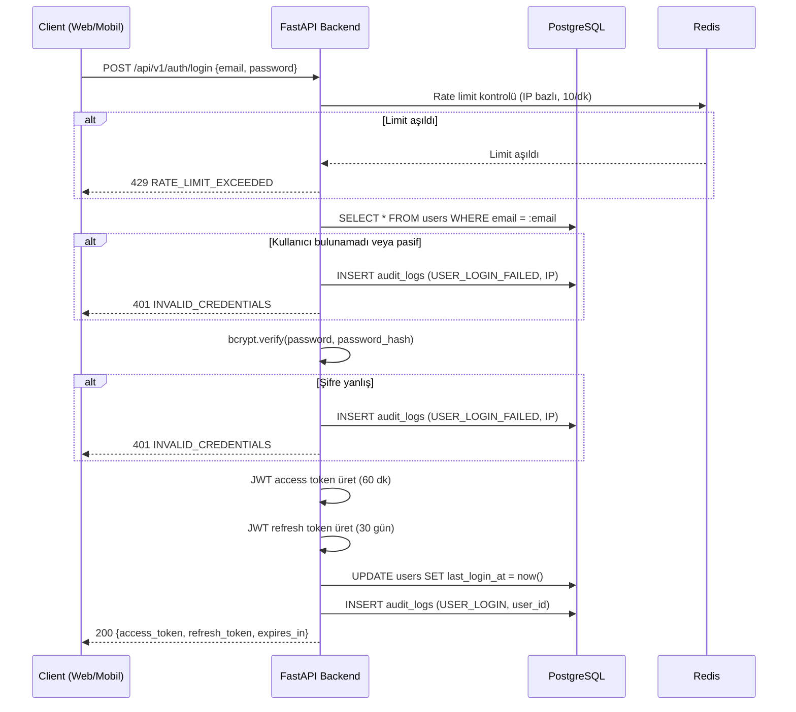
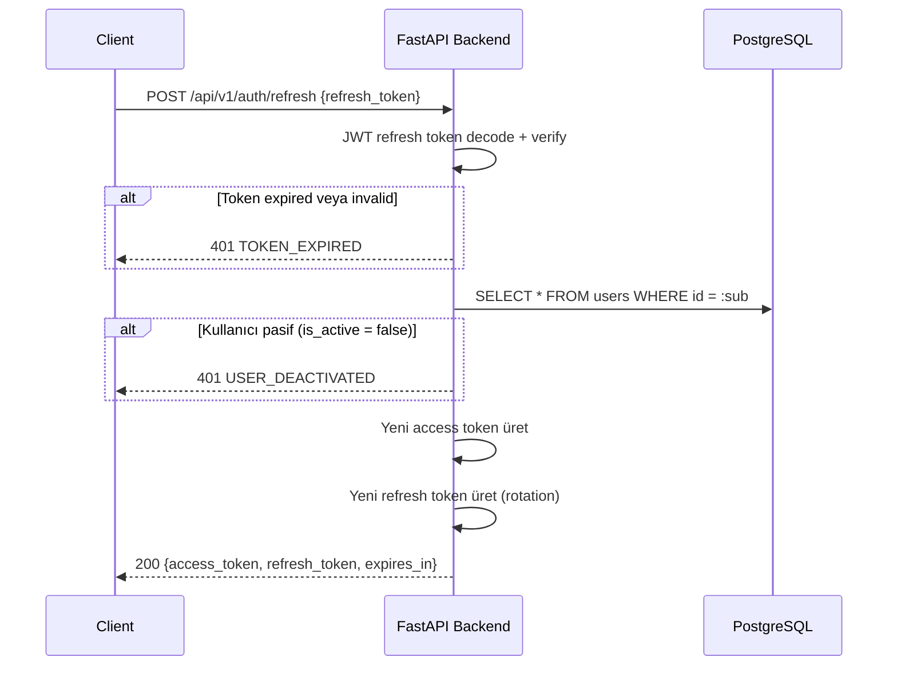

# 07 — Güvenlik Uygulama Dokümanı

> **Platform:** YıldızHolding Global Intelligence Platform (YGIP)
> **Kapsam:** Kimlik doğrulama, yetkilendirme, token yönetimi, şifre politikası, API güvenliği, secret yönetimi, audit log, KVKK, frontend güvenliği — MVP-0 implementasyon detayı

---

## 1. Güvenlik Genel Bakış

YGIP, ~20-30 dahili kullanıcıya (üst yönetim) hizmet veren tek kiracılı kurumsal bir platformdur. Dışa açık bir servis değildir; kullanıcı tabanı küçük ve kontrollüdür. Bu profil güvenlik tasarımını şekillendirir:

**Hedef güvenlik seviyesi:** OWASP ASVS Level 1. Kişisel veri işlenmediğinden (platform haber/makale verisini toplar, kullanıcılardan yalnızca email ve isim tutar) ileri düzey güvenlik kontrolleri (MFA, field-level encryption, HSM) MVP-0'da kapsam dışıdır.

**Tehdit profili:**

| Tehdit | Olasılık | Etki | Mitigasyon Katmanı |
|--------|----------|------|-------------------|
| Yetkisiz erişim (dış) | Orta | Yüksek | HTTPS + JWT + RBAC + rate limiting |
| Yetkisiz yetki yükseltme (iç) | Düşük | Yüksek | RBAC guard, JWT claim, audit log |
| API key sızıntısı (LLM) | Orta | Orta | AWS Secrets Manager, DB encryption |
| SQL injection | Düşük | Kritik | ORM parametrik sorgu, raw SQL yasak |
| XSS | Düşük | Orta | React escape, CSP header, input validation |
| Brute force login | Orta | Orta | Rate limiting (10 req/dk auth), account lockout yok (kullanıcı sayısı düşük) |
| Session hijacking | Düşük | Yüksek | httpOnly cookie, SameSite=Strict, kısa access token ömrü |

**Güvenlik katmanları:**

```
Ağ         → HTTPS zorunlu, HTTP→HTTPS redirect
Transport  → TLS 1.2+ (AWS ALB/CloudFront managed)
Auth       → Email + şifre, JWT access + refresh token
AuthZ      → RBAC (admin/viewer), endpoint-level guard
Input      → Pydantic validation, ORM parametrik sorgu
Rate       → Redis sliding window (IP + User ID bazlı)
Header     → HSTS, CSP, X-Content-Type-Options, X-Frame-Options
Secret     → AWS Secrets Manager (prod), .env (dev)
Audit      → Tüm state-changing operasyonlar loglanır
Archive    → 90 gün aktif, sonra S3 arşiv
```

---

## 2. Kimlik Doğrulama Akışı

Kimlik doğrulama email + şifre ile yapılır. Self-servis kayıt yoktur; tüm kullanıcılar admin tarafından oluşturulur. Web ve mobil uygulama aynı auth akışını kullanır.

### 2.1 Login Akışı



Login yanıtında kullanıcı bilgileri de döner: `user_id`, `email`, `full_name`, `role`. Client bu bilgiyi local state'te tutar.

Başarısız login denemelerinde hata mesajı generic tutulur: `"Geçersiz e-posta veya şifre."` Email'in var olup olmadığı açığa vurulmaz.

### 2.2 Token Refresh Akışı



Refresh token rotation uygulanır: her refresh işleminde yeni bir refresh token üretilir, eski token geçersiz olur. Bu, çalınmış refresh token'ın yeniden kullanılma penceresini daraltır.

### 2.3 Logout Akışı

```
POST /api/v1/auth/logout
Authorization: Bearer {access_token}
```

Logout işleminde:
1. Client tarafında access ve refresh token'lar silinir (web: cookie clear, mobil: SecureStore temizle).
2. Audit log kaydı yazılır (`USER_LOGOUT`).
3. Server-side token revocation MVP-0'da uygulanmaz — access token kısa ömürlü (60 dk), expire olana kadar geçerli kalır. Refresh token rotation, çalınmış token riskini minimize eder.

### 2.4 Pasif Kullanıcı Davranışı

Admin bir kullanıcıyı `is_active = false` yaptığında:
- Mevcut access token süresi dolana kadar geçerli kalır (en fazla 60 dk).
- Refresh token yenilenemez — refresh isteğinde `401 USER_DEACTIVATED` döner.
- Dolayısıyla pasif yapılan kullanıcı en geç 60 dk içinde sistemden düşer.
- Acil erişim engelleme gerekiyorsa JWT_SECRET_KEY rotasyonu yapılır (tüm kullanıcıları etkiler — son çare).

---

## 3. JWT Token Yönetimi

### 3.1 Token Yapısı

**Access token payload:**

```json
{
  "sub": "550e8400-e29b-41d4-a716-446655440000",
  "role": "admin",
  "email": "ceo@yildizholding.com",
  "iat": 1718520000,
  "exp": 1718523600,
  "type": "access"
}
```

**Refresh token payload:**

```json
{
  "sub": "550e8400-e29b-41d4-a716-446655440000",
  "iat": 1718520000,
  "exp": 1721112000,
  "type": "refresh"
}
```

Refresh token'da `role` ve `email` claim'i bulunmaz — yalnızca kimlik doğrulama için kullanılır, yetkilendirme için kullanılmaz.

### 3.2 Token Süreleri

| Token | Varsayılan Süre | Yapılandırma |
|-------|----------------|-------------|
| Access token | 60 dakika | `system_settings` → `jwt_access_token_minutes` |
| Refresh token | 30 gün | `system_settings` → `jwt_refresh_token_days` |

Token süreleri admin paneli "Bildirim Yönetimi" sayfasından düzenlenebilir. Değişiklik yapıldığında:
- Yeni süre yalnızca yeni üretilen token'lara uygulanır.
- Mevcut geçerli token'lar expire tarihine kadar çalışmaya devam eder.
- Değişiklik `audit_logs` tablosuna yazılır (`SETTINGS_UPDATED`).

### 3.3 JWT Üretim ve Doğrulama

```python
import jwt
from datetime import datetime, timedelta, timezone

def create_access_token(user_id: str, role: str, email: str) -> str:
    expire_minutes = get_setting("jwt_access_token_minutes", default=60)
    payload = {
        "sub": str(user_id),
        "role": role,
        "email": email,
        "iat": datetime.now(timezone.utc),
        "exp": datetime.now(timezone.utc) + timedelta(minutes=expire_minutes),
        "type": "access",
    }
    return jwt.encode(payload, settings.JWT_SECRET_KEY, algorithm="HS256")

def decode_jwt(token: str) -> dict:
    try:
        return jwt.decode(token, settings.JWT_SECRET_KEY, algorithms=["HS256"])
    except jwt.ExpiredSignatureError:
        raise UnauthorizedException("Token süresi dolmuş.")
    except jwt.InvalidTokenError:
        raise UnauthorizedException("Geçersiz token.")
```

JWT algoritması `HS256` (HMAC-SHA256). Asimetrik imzalama (RS256) MVP-0'da gerekmez — tek servis token'ı hem üretir hem doğrular.

`JWT_SECRET_KEY` en az 256-bit (32 byte) uzunluğunda, kriptografik olarak güvenli rastgele string olarak üretilir. Üretim komutu: `openssl rand -base64 32`.

---

## 4. Şifre Politikası ve Yönetimi

### 4.1 Şifre Kuralları

| Kural | Değer |
|-------|-------|
| Minimum uzunluk | 8 karakter |
| Büyük harf zorunlu | En az 1 |
| Rakam zorunlu | En az 1 |
| Özel karakter | Zorunlu değil |
| Maksimum uzunluk | 128 karakter (bcrypt limiti) |

Şifre doğrulama Pydantic validator ile yapılır:

```python
from pydantic import field_validator

class SetPasswordRequest(BaseModel):
    password: str

    @field_validator("password")
    @classmethod
    def validate_password(cls, v: str) -> str:
        if len(v) < 8:
            raise ValueError("Şifre en az 8 karakter olmalıdır.")
        if not any(c.isupper() for c in v):
            raise ValueError("Şifre en az 1 büyük harf içermelidir.")
        if not any(c.isdigit() for c in v):
            raise ValueError("Şifre en az 1 rakam içermelidir.")
        return v
```

### 4.2 Hash Mekanizması

Şifreler bcrypt algoritması ile hash'lenir. Minimum cost factor: 12.

```python
from passlib.context import CryptContext

pwd_context = CryptContext(schemes=["bcrypt"], deprecated="auto", bcrypt__rounds=12)

def hash_password(plain: str) -> str:
    return pwd_context.hash(plain)

def verify_password(plain: str, hashed: str) -> bool:
    return pwd_context.verify(plain, hashed)
```

Şifre plain-text olarak hiçbir zaman loglanmaz, hata mesajına eklenmez veya API yanıtında döndürülmez. `password_hash` alanı hiçbir API response schema'sında bulunmaz.

### 4.3 Şifre Sıfırlama Akışı

Self-servis şifre sıfırlama yoktur. Şifre sıfırlama admin tarafından tetiklenir:

1. Admin, admin panelinden hedef kullanıcı için "Şifre sıfırlama linki gönder" butonuna tıklar.
2. Sistem kriptografik olarak güvenli rastgele token üretir (`secrets.token_urlsafe(32)`).
3. Token bcrypt ile hash'lenerek `password_reset_tokens` tablosuna yazılır. Geçerlilik: 24 saat.
4. Kullanıcının email adresine şifre sıfırlama linki gönderilir: `https://ygip.yildizholding.com/reset-password?token={raw_token}`.
5. Kullanıcı linke tıklar → yeni şifre formu açılır → yeni şifreyi girer.
6. Backend token'ı doğrular (hash karşılaştırma + süre kontrolü + `used_at IS NULL`), şifreyi günceller.
7. Token `used_at` alanı doldurulur — tekrar kullanılamaz.
8. Audit log kaydı yazılır: `PASSWORD_RESET_INITIATED` (tetikleme) ve `PASSWORD_RESET_COMPLETED` (tamamlama).

Geçersiz veya süresi dolmuş token ile yapılan isteklerde generic hata mesajı döner: `"Geçersiz veya süresi dolmuş link."` Token'ın var olup olmadığı açığa vurulmaz.

---

## 5. Yetkilendirme (RBAC)

### 5.1 Rol Tanımları

| Rol | Kod | Açıklama |
|-----|-----|----------|
| Yönetici | `admin` | Tüm endpoint'lere tam erişim. Kullanıcı yönetimi, kaynak yönetimi, prompt düzenleme, API key yönetimi, audit log görüntüleme, sistem ayarları |
| Görüntüleyici | `viewer` | Salt okuma erişimi. Dashboard, digest görüntüleme, chatbot kullanımı |

Rol ataması yalnızca admin tarafından yapılır. Kullanıcı kendi rolünü değiştiremez.

### 5.2 Guard Pattern

Yetki kontrolü FastAPI `Depends()` mekanizması ile router seviyesinde uygulanır. Her API isteğinde JWT'den rol claim'i okunur ve guard fonksiyonunda kontrol edilir:

```python
def require_role(role: UserRole):
    def guard(current_user: User = Depends(get_current_user)) -> User:
        if current_user.role != role and current_user.role != UserRole.ADMIN:
            raise ForbiddenException("Bu işlem için yetkiniz yok.")
        return current_user
    return guard

require_admin = require_role(UserRole.ADMIN)
require_authenticated = get_current_user  # Rol fark etmez, login yeterli
```

Admin rolü tüm endpoint'lere erişir — `require_admin` guard'ına takılmaz. Viewer rolü `require_admin` guard'ı olan endpoint'lerde `403 Forbidden` alır.

JWT claim'deki rol runtime'da yeterliliği sağlar. Ek cache mekanizması veya DB lookup gerekmez — kullanıcı sayısı düşük (~30) olduğundan her istekte token claim'i yeterlidir.

### 5.3 Endpoint Yetki Matrisi

| Endpoint Grubu | Endpoint | admin | viewer |
|---------------|----------|:-----:|:------:|
| **Auth** | `POST /auth/login` | ✅ | ✅ |
| | `POST /auth/refresh` | ✅ | ✅ |
| | `POST /auth/logout` | ✅ | ✅ |
| **Kullanıcı** | `GET /users` | ✅ | ❌ |
| | `POST /users` | ✅ | ❌ |
| | `PUT /users/{id}` | ✅ | ❌ |
| | `DELETE /users/{id}` | ✅ | ❌ |
| | `GET /users/me` | ✅ | ✅ |
| | `PUT /users/me/password` | ✅ | ✅ |
| **Kaynak** | `GET /sources` | ✅ | ❌ |
| | `POST /sources` | ✅ | ❌ |
| | `PUT /sources/{id}` | ✅ | ❌ |
| | `DELETE /sources/{id}` | ✅ | ❌ |
| **Prompt** | `GET /prompt-templates` | ✅ | ❌ |
| | `PUT /prompt-templates/{id}` | ✅ | ❌ |
| **API Key** | `GET /api-keys` | ✅ | ❌ |
| | `POST /api-keys` | ✅ | ❌ |
| | `DELETE /api-keys/{id}` | ✅ | ❌ |
| | `GET /api-keys/usage` | ✅ | ❌ |
| **Digest** | `GET /digests` | ✅ | ✅ |
| | `GET /digests/{id}` | ✅ | ✅ |
| | `POST /digests/trigger` | ✅ | ❌ |
| **Chatbot** | `POST /chatbot/ask` | ✅ | ✅ |
| | `GET /chatbot/history` | ✅ | ❌ |
| | `GET /chatbot/history/me` | ✅ | ✅ |
| **Bildirim** | `GET /notifications/preferences` | ✅ | ❌ |
| | `PUT /notifications/preferences/{id}` | ✅ | ❌ |
| | `POST /notifications/fcm-token` | ✅ | ✅ |
| **Audit** | `GET /audit-logs` | ✅ | ❌ |
| **Ayarlar** | `GET /settings` | ✅ | ❌ |
| | `PUT /settings/{key}` | ✅ | ❌ |
| **Sağlık** | `GET /health` | — | — |
| | `GET /ready` | — | — |

`—` = auth gerektirmez (public endpoint).

Kural: Yeni endpoint eklendiğinde bu matris güncellenir. Guard tanımlanmamış endpoint production'a alınamaz — code review'da kontrol edilir.

---

## 6. API Güvenliği

### 6.1 HTTPS Zorunluluğu

Tüm API iletişimi HTTPS üzerinden yapılır. HTTP istekleri otomatik olarak HTTPS'e yönlendirilir. TLS 1.2+ zorunludur; TLS 1.0 ve 1.1 kabul edilmez. TLS termination AWS ALB veya CloudFront seviyesinde yapılır — uygulama katmanı plain HTTP dinler, ALB'den gelen `X-Forwarded-Proto` header'ına güvenir.

### 6.2 Input Validation

Tüm API endpoint'lerinde request body doğrulaması Pydantic schema ile yapılır. Geçersiz giriş `422 VALIDATION_ERROR` döner.

```python
class CreateUserRequest(BaseModel):
    email: EmailStr
    full_name: str = Field(min_length=2, max_length=255)
    password: str = Field(min_length=8, max_length=128)
    role: UserRole = UserRole.VIEWER
```

Doğrulama kuralları:
- Email formatı `EmailStr` ile kontrol edilir.
- String alanlar `min_length` / `max_length` ile sınırlandırılır.
- Enum alanlar (`role`, `source_type`, `digest_type`) yalnızca tanımlı değerleri kabul eder.
- JSONB alanlar (config, payload) Pydantic nested model ile yapılandırılır.
- Path parametreleri (`{id}`) UUID formatında doğrulanır.

### 6.3 SQL Injection Koruması

Tüm veritabanı erişimi SQLAlchemy ORM parametrik sorguları ile yapılır. Raw SQL yasaktır. ORM parametrik sorgu kullanıldığında SQL injection riski ortadan kalkar — kullanıcı girdisi parametre olarak bağlanır, SQL string'ine interpolate edilmez.

Tek istisna: pgvector extension yükleme (`CREATE EXTENSION IF NOT EXISTS vector`) ve enum type oluşturma migration'larında `op.execute()` kullanılır. Bu sorgular kullanıcı girdisi içermez.

### 6.4 Rate Limiting

Redis sliding window counter ile uygulanır. Her istek IP adresi veya User ID bazında sayılır.

| Endpoint Kategorisi | Limit | Anahtar | Gerekçe |
|--------------------|-------|---------|---------|
| Auth (`/api/v1/auth/*`) | 10 req/dk | IP adresi | Brute force koruması |
| Chatbot (`/api/v1/chatbot/ask`) | 20 req/dk | User ID | LLM API maliyeti koruması |
| Genel (diğer tüm) | 100 req/dk | User ID | Genel koruma |
| Sağlık (`/health`, `/ready`) | Limitsiz | — | Monitoring erişimi |

Limit aşıldığında `429 Too Many Requests` döner, `Retry-After` header'ı saniye cinsinden bekleme süresi içerir.

Rate limit sayaçları Redis'te `rl:{endpoint_category}:{key}` pattern'i ile saklanır. TTL, window süresine eşittir (60 saniye). Redis erişilemezse rate limiting devre dışı kalır — servis kesintisi yerine güvenlik kontrolü geçici olarak gevşer (fail-open). Bu durum `WARNING` seviyesinde loglanır.

### 6.5 Pagination (DoS Koruması)

Tüm liste endpoint'leri cursor-based pagination kullanır. Maksimum `limit` değeri 100'dür. Client `limit > 100` gönderirse `100` olarak override edilir. Bu, tek istekte tüm veriyi çekmeye çalışan sorguları engeller.

### 6.6 Request ID Tracking

Her gelen isteğe UUID4 formatında `X-Request-ID` header'ı atanır. İstek zaten bu header ile geldiyse mevcut değer korunur. Request ID tüm log satırlarında, hata yanıtlarında ve downstream servis çağrılarında taşınır. Hata debug ve audit trail için kritiktir.

---

## 7. HTTP Güvenlik Başlıkları ve CORS

### 7.1 HTTP Güvenlik Başlıkları

Next.js middleware'de (`/apps/web/middleware.ts`) tanımlanır:

| Header | Değer | Açıklama |
|--------|-------|----------|
| `Strict-Transport-Security` | `max-age=31536000; includeSubDomains` | HSTS — tarayıcıyı HTTPS'e zorlar (1 yıl) |
| `X-Content-Type-Options` | `nosniff` | MIME type sniffing engelleme |
| `X-Frame-Options` | `DENY` | Clickjacking koruması — iframe'e gömülme yasak |
| `X-XSS-Protection` | `0` | Tarayıcı XSS filtresi kapalı (CSP daha güvenilir) |
| `Referrer-Policy` | `strict-origin-when-cross-origin` | Referer bilgisi sızıntı kontrolü |
| `Permissions-Policy` | `camera=(), microphone=(), geolocation=()` | Gereksiz tarayıcı API'lerini devre dışı bırak |

### 7.2 Content Security Policy (CSP)

```
Content-Security-Policy:
  default-src 'self';
  script-src 'self' 'unsafe-inline' 'unsafe-eval';
  style-src 'self' 'unsafe-inline';
  img-src 'self' data: https:;
  font-src 'self';
  connect-src 'self' https://api.ygip.yildizholding.com;
  frame-src 'none';
  object-src 'none';
  base-uri 'self';
  form-action 'self';
```

`unsafe-inline` ve `unsafe-eval` Next.js SSR/hydration mekanizması için gereklidir. MVP-1'de nonce-based CSP'ye geçiş değerlendirilir.

### 7.3 CORS Politikası

FastAPI `CORSMiddleware` ile uygulanır:

| Parametre | Production | Development |
|-----------|-----------|-------------|
| `allow_origins` | `["https://ygip.yildizholding.com"]` | `["http://localhost:3000"]` |
| `allow_credentials` | `true` | `true` |
| `allow_methods` | `["GET", "POST", "PUT", "DELETE", "PATCH"]` | Aynı |
| `allow_headers` | `["*"]` | Aynı |
| `max_age` | `600` (10 dk preflight cache) | Aynı |

Wildcard origin (`*`) hiçbir ortamda kullanılmaz. `allow_credentials: true` olduğu sürece wildcard zaten spec gereği çalışmaz.

Yeni frontend domain eklendiğinde (örneğin staging ortamı) `CORS_ORIGINS` environment variable'ına eklenir; kod değişikliği gerekmez.

---

## 8. Secret Yönetimi

### 8.1 Ortam Bazlı Strateji

| Secret Tipi | Development | Production |
|------------|------------|-----------|
| JWT_SECRET_KEY | `.env` dosyası | AWS Secrets Manager |
| DATABASE_URL | `.env` dosyası | AWS Secrets Manager |
| REDIS_URL | `.env` dosyası | AWS Secrets Manager |
| AWS erişim key'leri | `.env` dosyası | IAM Role (EC2/Lambda instance role) |
| LLM API key'leri | DB (`api_keys.encrypted_key`) | DB (`api_keys.encrypted_key`) |
| SES gönderim adresi | `.env` dosyası | AWS Secrets Manager |
| FCM service account | `.env` dosyası | AWS Secrets Manager |

### 8.2 Kurallar

- `.env` dosyası `.gitignore`'da bulunur — repository'ye commit edilemez.
- `.env.example` dosyası tüm environment variable isimlerini (değersiz) listeler ve repository'de tutulur. Yeni env var eklendiğinde `.env.example` güncellenir.
- Production ortamında `.env` dosyası kullanılmaz. Tüm secret'lar AWS Secrets Manager'dan yüklenir.
- `JWT_SECRET_KEY` en az 256-bit (32 byte) uzunluğundadır. Üretim: `openssl rand -base64 32`.
- Agent (Cursor/Claude Code) `.env` veya secrets dosyasına API key yazamaz — kullanıcı onayı gerektirir.

### 8.3 LLM API Key Şifreleme

Admin panelinden eklenen LLM API key'leri (Groq, Gemini) veritabanında şifrelenerek saklanır (`api_keys.encrypted_key`).

**Production:** AWS KMS envelope encryption kullanılır.
1. KMS'te YGIP için dedicated bir CMK (Customer Master Key) oluşturulur.
2. API key eklendiğinde: KMS `GenerateDataKey` → data key ile AES-256-GCM şifreleme → encrypted data key + ciphertext DB'ye yazılır.
3. API key okunduğunda: KMS `Decrypt` → data key → ciphertext çözülür → plain API key LLM client'a verilir.
4. Plain API key hiçbir zaman loglanmaz veya API yanıtında döndürülmez. Admin panelinde yalnızca `key_alias` ve durumu gösterilir.

**Development:** Local symmetric key ile AES-256-GCM şifreleme yapılır. Key `.env` dosyasında `ENCRYPTION_KEY` olarak tutulur. Bu, production KMS entegrasyonunun dev ortamında lightweight yedeğidir.

---

## 9. Audit Log

### 9.1 Loglanacak Olaylar

| Event Type | Tetikleyen | Actor |
|-----------|-----------|-------|
| `user.login` | Başarılı login | Kullanıcı |
| `user.login_failed` | Başarısız login (IP loglanır) | Sistem (IP payload'da) |
| `user.logout` | Logout | Kullanıcı |
| `user.created` | Admin kullanıcı oluşturma | Admin |
| `user.updated` | Kullanıcı güncelleme (rol, isim, aktiflik) | Admin |
| `user.deactivated` | Kullanıcı pasif yapma | Admin |
| `source.created` | Kaynak ekleme | Admin |
| `source.updated` | Kaynak güncelleme | Admin |
| `source.deleted` | Kaynak silme | Admin |
| `prompt_template.updated` | Prompt şablon değiştirme | Admin |
| `api_key.created` | LLM API key ekleme | Admin |
| `api_key.deleted` | LLM API key silme | Admin |
| `digest.started` | Digest üretimi başladı | Sistem (cron) |
| `digest.completed` | Digest başarıyla üretildi | Sistem |
| `digest.failed` | Digest üretimi başarısız | Sistem |
| `settings.updated` | Sistem ayarı değiştirildi | Admin |
| `password.reset_initiated` | Şifre sıfırlama başlatıldı | Admin |
| `system.error` | Collector 3. retry fail, kritik hata | Sistem |

### 9.2 Tablo Şeması

```sql
CREATE TABLE audit_logs (
    id              UUID PRIMARY KEY DEFAULT gen_random_uuid(),
    event_type      VARCHAR(100) NOT NULL,
    actor_user_id   UUID REFERENCES users(id),
    target_type     VARCHAR(100),
    target_id       UUID,
    payload         JSONB,
    created_at      TIMESTAMPTZ NOT NULL DEFAULT now()
);

CREATE INDEX idx_audit_logs_event_type ON audit_logs (event_type);
CREATE INDEX idx_audit_logs_created_at ON audit_logs (created_at);
CREATE INDEX idx_audit_logs_actor_user_id ON audit_logs (actor_user_id);
```

`actor_user_id` sistem olaylarında (cron trigger, collector hata) `NULL` olur. `payload` JSONB alanı olay tipine göre değişen ek detayları içerir:

- `user.login_failed`: `{"ip": "192.168.1.1", "email_attempted": "test@..."}`
- `source.deleted`: `{"source_name": "HBR Feed", "source_type": "rss"}`
- `settings.updated`: `{"key": "jwt_access_token_minutes", "old_value": 60, "new_value": 120}`
- `digest.completed`: `{"digest_type": "fmcg_weekly", "article_count": 42, "duration_ms": 8500}`

### 9.3 Retention ve Arşivleme

Audit log kayıtları aktif tabloda 90 gün tutulur. Her ayın 1'inde (05:00 TR) çalışan Lambda archiver job'ı:

1. 90 günden eski kayıtları `audit_logs` tablosundan okur.
2. JSON Lines formatında S3'e yazar: `s3://{env}-ygip-archive/audit-logs/{YYYY}/{MM}/audit_{timestamp}.jsonl`.
3. S3 yazma başarılı olduktan sonra kaynak tablodaki kayıtlar batch halinde (1000/batch) silinir.
4. İşlem sonucu yeni bir audit log kaydı olarak yazılır: `system.archive_completed`.

### 9.4 Erişim Kontrolü

Audit log yalnızca `admin` rolüne görünür. Viewer erişimi yoktur. Admin panelinde filtrelenebilir liste olarak sunulur:

- Tarih aralığı filtresi
- Event type filtresi
- Actor (kullanıcı) filtresi
- Target type filtresi

---

## 10. Frontend Güvenliği

### 10.1 Token Storage Stratejisi

**Web (Next.js):**
- Access token: httpOnly, Secure, SameSite=Strict cookie olarak saklanır. JavaScript erişemez — XSS saldırısında token çalınamaz.
- Refresh token: Aynı şekilde httpOnly cookie.
- CSRF koruması: SameSite=Strict cookie + CORS origin kısıtlaması birlikte CSRF riskini ortadan kaldırır.
- Cookie ayarları:

```
Set-Cookie: access_token={jwt}; HttpOnly; Secure; SameSite=Strict; Path=/; Max-Age=3600
Set-Cookie: refresh_token={jwt}; HttpOnly; Secure; SameSite=Strict; Path=/api/v1/auth/refresh; Max-Age=2592000
```

Refresh token cookie'si yalnızca `/api/v1/auth/refresh` path'ine gönderilir — diğer API isteklerinde taşınmaz.

**Mobil (React Native):**
- Access token: `expo-secure-store` (iOS Keychain / Android Keystore) ile saklanır. Plain-text `AsyncStorage` kullanılmaz.
- Refresh token: Aynı şekilde `expo-secure-store`.
- Token'lar `Authorization: Bearer {access_token}` header'ı ile gönderilir.

### 10.2 Role-Based UI Rendering

Frontend, JWT'den çözümlenen `role` bilgisine göre **navigasyon shell'ini** koşullu render eder:

- **`viewer`:** Yalnızca `PillNav` (Ana Sayfa, Bültenler, AI Chatbot). `Sidebar` ve `/admin/*` linkleri DOM'da **yok**.
- **`admin`:** Yalnızca sol `Sidebar` (Ana Menü + Yönetim). `PillNav` DOM'da **yok**.
- Admin-only route'lara (`/admin/*`) viewer erişiminde ana sayfaya redirect.
- Digest tetikleme butonu (`POST /digests/trigger`) viewer'da render edilmez.

Frontend role check'i yalnızca UX amaçlıdır — gerçek güvenlik backend guard'larında sağlanır. Viewer bir admin endpoint'ine doğrudan HTTP isteği gönderirse `403 Forbidden` alır.

### 10.3 XSS Koruması

React varsayılan olarak tüm string çıktıları escape eder — `dangerouslySetInnerHTML` kullanılmaz. Digest içeriği API'den structured JSON olarak gelir ve React bileşenleri ile render edilir; raw HTML inject edilmez.

AI chatbot yanıtları da plain text olarak render edilir. Markdown rendering gerekiyorsa `react-markdown` gibi bir kütüphane kullanılır — bu kütüphaneler HTML sanitization uygular.

### 10.4 Deep Link ve URL Koruması

- Tüm route'lar auth guard altındadır. Token yoksa `/login`'e redirect.
- Path parametreleri (`:id`) UUID formatında validate edilir — geçersiz format `404` döner.
- Query parametreleri üzerinden veri sızıntısı riski yoktur — hassas bilgi (API key, token) URL'de taşınmaz. Tek istisna: şifre sıfırlama token'ı query parameter olarak gelir ve tek kullanımlık + 24 saat ömürlüdür.

---

## 11. KVKK Uyumluluğu

### 11.1 Kapsam Değerlendirmesi

YGIP kişisel veri işlemeyen bir sistemdir. Platform haber, makale, piyasa verisi ve kamuya açık içerikleri toplar. İşlenen veri kamuya açık bilgidir; bireylere ait özel veri değildir.

KVKK kapsamı yalnızca kullanıcı erişim verileriyle sınırlıdır:

| Veri | Tablo | KVKK Kategorisi |
|------|-------|----------------|
| E-posta adresi | `users.email` | Kimlik bilgisi |
| Ad soyad | `users.full_name` | Kimlik bilgisi |
| Son giriş zamanı | `users.last_login_at` | İşlem güvenliği |
| Giriş/çıkış logları | `audit_logs` | İşlem güvenliği |
| Chatbot soruları | `chat_history.question` | Kullanım verisi |
| IP adresi (başarısız login) | `audit_logs.payload` | İşlem güvenliği |

### 11.2 Veri Minimizasyonu

Kullanıcı tablosu minimum attribute ile tutulur: `id`, `email`, `full_name`, `role`, `is_active`, `created_at`, `last_login_at`. Telefon numarası, adres, TC kimlik numarası gibi ek kişisel bilgi toplanmaz.

### 11.3 Veri Saklama ve Silme

- Audit log: 90 gün aktif, sonra S3 arşiv. Arşivdeki veriler yasal yükümlülük süresince tutulur.
- Chat history: Süresiz. Admin talep ettiğinde kullanıcı bazlı temizleme yapılabilir.
- Kullanıcı silme: Kullanıcılar silinmez, `is_active = false` yapılır. KVKK kapsamında silme talebi geldiğinde `email` ve `full_name` alanları anonimleştirilir (`anonymized_{uuid}`), ilişkili `chat_history` ve `audit_logs` kayıtlarındaki `user_id` korunur (yasal zorunluluk).

### 11.4 GDPR Kapsamı

Sistem Türkiye'de çalışır, AB vatandaşlarının kişisel verisi işlenmez. GDPR gerektiren senaryo bulunmaz.

---

## 12. Ortam İzolasyonu ve Güvenlik Sınırları

### 12.1 Namespace İzolasyonu

Aynı AWS hesapta `dev` ve `prod` kaynakları prefix ile ayrılır:

| Kaynak | Dev | Prod |
|--------|-----|------|
| SQS Queue | `ygip-dev-rss-queue` | `ygip-prod-rss-queue` |
| S3 Bucket | `ygip-dev-archive` | `ygip-prod-archive` |
| RDS Instance | `ygip-dev-db` | `ygip-prod-db` |
| Lambda | `ygip-dev-rss-collector` | `ygip-prod-rss-collector` |
| Redis | Ayrı Upstash instance veya `dev:` / `prod:` key prefix | Ayrı instance |
| CloudWatch Log Group | `/ygip/dev/api` | `/ygip/prod/api` |

### 12.2 IAM Sınırları

IAM policy'ler environment-scoped resource ARN'ler ile kısıtlanır:

```json
{
  "Effect": "Allow",
  "Action": "sqs:SendMessage",
  "Resource": "arn:aws:sqs:eu-west-1:123456789:ygip-dev-*"
}
```

Dev Lambda fonksiyonu yalnızca `ygip-dev-*` SQS queue'larına mesaj gönderebilir. Prod kaynaklarına erişim IAM policy tarafından engellenir. Aynı kısıtlama S3, RDS ve diğer servisler için de uygulanır.

### 12.3 RDS Güvenliği

| Ayar | Dev | Prod |
|------|-----|------|
| Instance tipi | t3.micro | t3.micro (MVP-0), t3.small (MVP-1+) |
| DeletionProtection | false | true |
| Backup | Kapalı | Automated daily, 7 gün retention |
| PITR | Kapalı | Aktif (5 dk granularity) |
| MultiAZ | false | false (MVP-0), değerlendirilecek (MVP-1) |
| Public access | false | false |
| Security Group | VPC-internal only | VPC-internal only |

RDS instance'ları public erişime kapalıdır. Yalnızca aynı VPC içindeki Lambda/ECS/EC2 kaynaklarından erişilebilir.

---

*Bu doküman YıldızHolding Global Intelligence Platform mimari kararlarından türetilmiştir. Kararlar değiştiğinde doküman yeniden üretilir.*
